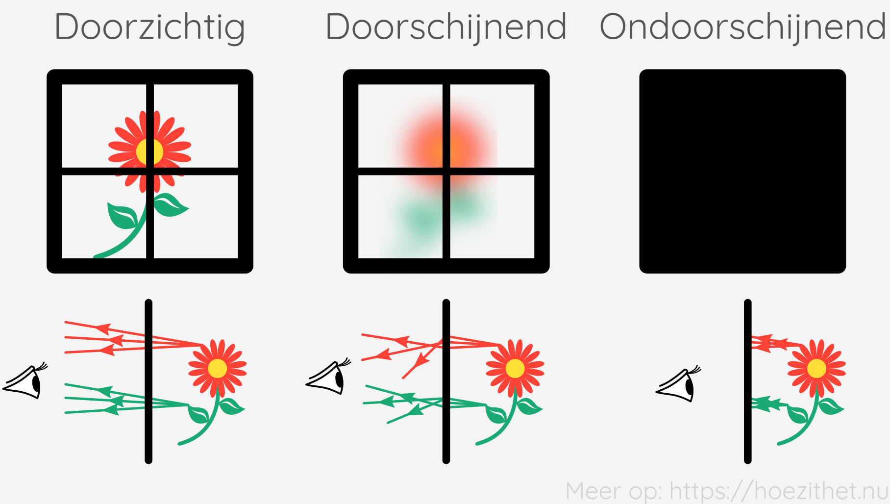

Een [donker lichaam](../lichtbronnen#donkere-lichamen) is een voorwerp dat
van zichzelf geen licht geeft, bijvoorbeeld een bloem. Hoe zo'n donker lichaam
eruit ziet hangt af van welk licht erop invalt en wat er gebeurt met dat
invallend licht. In het algemeen kunnen er drie dingen gebeuren:

1. **Absorptie**: De invallende lichtstralen worden tegengehouden en
   _verdwijnen_ in het voorwerp;
2. **Reflectie**: De invallende lichtstralen worden teruggekaatst, weg van het
   voorwerp;
3. **Doorlaten**: De invallende lichtstralen worden doorgelaten doorheen het
   voorwerp.

Het kan gerust dat een combinatie van die drie fenomenen samen voorkomt bij een
voorwerp.

## Wit licht bevat alle kleuren

De meeste voorwerpen kunnen enkel een bepaalde
kleur hebben als het invallend licht die bepaalde kleur bevat. Een sinaasappel
zal in blauw licht niet meer oranje lijken omdat het invallend blauwe licht
geen oranje bevat.

Heel vaak zal het **invallend licht wit zijn**. Daglicht is een voorbeeld van
wit licht. Het bijzondere aan wit licht is dat het **alle kleuren bevat**. Ook
oranje. Als wit licht invalt op een sinaasappel, zal die er dus wel oranje
uitzien.

## Absorberen

Voorwerpen die er donker uitzien, absorberen veel van het
invallende licht. Dat betekent dat invallende lichtstralen lijken te
_verdwijnen_ in het voorwerp. Wanneer **alle lichtstralen verdwijnen** in het
voorwerp, spreken we over **volledige absorptie** en is het voorwerp
**pikzwart**.

## Reflecteren

We spreken over reflectie wanneer invallend licht weggekaatst
wordt van het voorwerp. Bij een **spiegel** gebeurt die terugkaatsing op een
heel gestructureerde manier. Daardoor blijft de **volgorde van de invallende
lichtstralen behouden** en zie je het gespiegeld voorwerp quasi even duidelijk
als wanneer je er rechtstreeks naar zou kijken. Dit noemen we **gerichte
reflectie**.

De meeste voorwerpen zijn echter **niet spiegelend**. Een wit voorwerp dat niet
spiegelt <Mute>(bijvoorbeeld een wit geverfde muur)</Mute>, weerkaatst alle
invallende stralen maar **verandert de volgorde van de invallende stralen** op
een willekeurige manier. Hierdoor kan je jezelf niet spiegelen in een witte
muur. We spreken dan van **diffuse reflectie**.

## Reflectie + absorptie

Reflectie gaat ook vaak gepaard met absorptie.
**Sommige kleuren van het invallend licht worden gereflecteerd, terwijl andere
kleuren worden geabsorbeerd.**

Een sinaasappel absorbeert vooral de paarse, blauwe, groene,... kleuren van wit
licht en reflecteert voornamelijk de oranje kleuren. Er komen dan oranje
lichtstralen van de sinaasappel waardoor die oranje lijkt te zijn.

## Licht doorlaten

Tenslotte kan een voorwerp ook licht doorlaten. Het meest
alledaagse voorbeeld hiervan is **glas**. **Doorzichtig** glas is glas dat de
**volgorde van de invallende lichtstralen behoudt**. Hierdoor zie je een
voorwerp dat achter doorzichtig glas staat quasi even duidelijk als wanneer je
er rechtstreeks naar zou kijken.

We noemen een voorwerp **doorschijnend** als het lichtstralen
doorlaat, maar de **volgorde van de invallende
lichtstralen verandert**. Hierdoor zie je het voorwerp **wazig**. Een voorbeeld
hiervan is matglas.

Wanneer een voorwerp **helemaal geen licht doorlaat**, noemen we dat voorwerp
**ondoorschijnend**.
