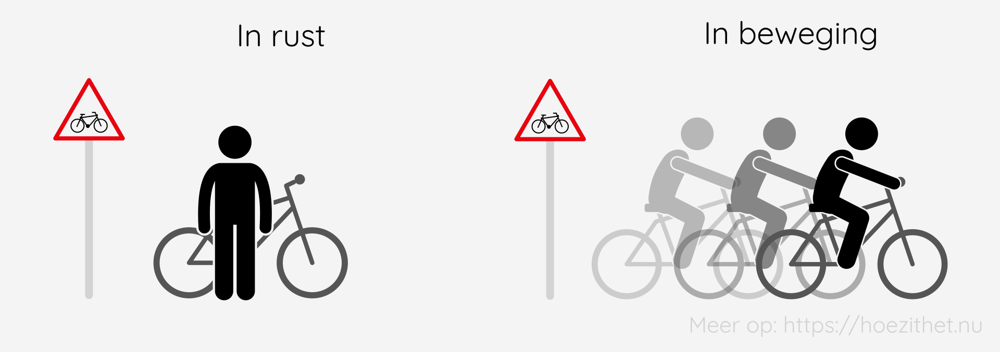

We zijn allemaal in **beweging**. Niet alleen wanneer je fiets of loopt ben je in beweging, maar zelfs wanneer je lui op een stoel zit, beweeg je.

## Een voorwerp in rust en beweging

Wanneer een fietser niet van plaats of stand verandert **ten opzichte van** een verkeersbord, dan is de fietser **in rust** ten opzichte van het verkeersbord.

Als de fietser vervolgens vertrekt en verder weg van het verkeersbord fietst, dan is deze wel **in beweging ten opzichte van** het verkeersbord. Hij **verandert van plaats** ten opzichte van het verkeersbord.

## Een beweging is relatief

Als je wil weten of een voorwerp in beweging is of niet, heb je altijd een ander voorwerp nodig als **referentie**. Zo ben jij, terwijl je stil zit op een stoel, **in rust** ten opzichte van **de aarde**, maar **in beweging** ten opzichte van **de zon**. De aarde draait tenslotte nog steeds rond de zon. ☀️

Dat een beweging relatief is, kan je ook opmerken in het **dagelijkse leven**. Zo is het vaak onduidelijk of jouw trein of de trein naast jou zich in beweging zet. We spreken af om, tenzij anders vermeld, **de aarde als referentie(punt)** te nemen.

## Samengevat

<Attention title="Een beweging">

Een beweging is steeds **relatief**. Op aarde nemen we **het aardoppervlak** steeds als **referentiepunt**. 

Men zegt dat een voorwerp 1 **in beweging** is **ten opzichte van** voorwerp 2, wanneer voorwerp 1 **van plaats of stand verandert** ten opzichte van voorwerp 2. Een voorwerp **in rust** verandert niet van plaats of stand ten opzichte van een ander voorwerp.

</Attention>