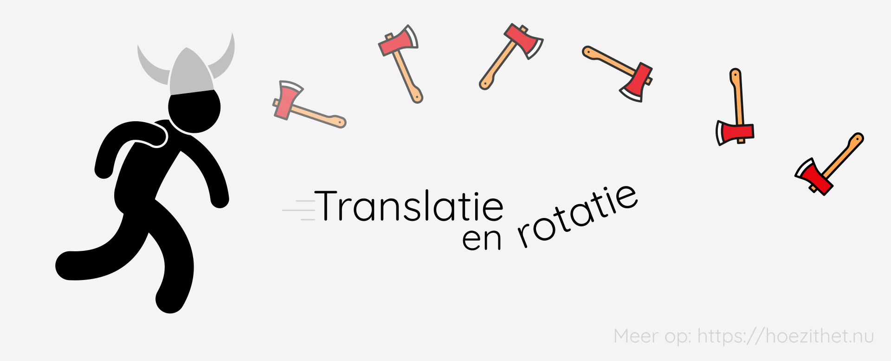

Om het concept *beweging* verder in te delen, maken we onderscheid tussen enkele **soorten bewegingen**. 👇

## Translatie en rotatie
Eerst en vooral maken we een onderscheid tussen een **verandering in plaats** en een **verandering in stand**. Wanneer een voorwerp zich **verplaatst** ten opzichte van een ander voorwerp, spreken we van **translatie**. Wanneer  een voorwerp stilstaat, maar het voorwerp neemt een **andere oriëntatie** aan, dan spreekt men van **rotatie**. Ook een combinatie van beide is mogelijk.

Denk hierbij aan een bijl. We kunnen een bijl verplaatsen (**translatie**), draaien (**rotatie**) of werpen zoals een coole viking (**combinatie**). 🪓

## Rechtlijnige, cirkelvormige en willekeurige beweging
We kunnen een **translatie** nog verder onderverdelen in **rechtlijnige en cirkelvormige** bewegingen. Een **combinatie** van beide noemt men een **willekeurige** beweging. Hiervoor kijken we naar de **baan** van een beweging. Als de baan een **rechte lijn** vormt, is het een **rechtlijnige beweging**. Een **cirkelvormige beweging** heb je wanneer de baan **cirkelvormig** is, zoals bij een reuzenrad. 🎡

## Samengevat
<Attention title="Soorten bewegingen">

Bij een **verandering van stand** spreekt men van een **rotatie**. Wanneer de **plaats verandert**, spreekt men van een **translatie**. Dit kunnen we nog verder onderverdelen in een **rechtlijnige**, **cirkelvormige** of **willekeurige** (combinatie) beweging. We kijken hiervoor naar **de baan** van het voorwerp.
</Attention>