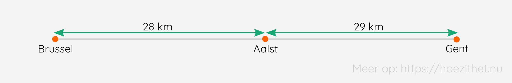
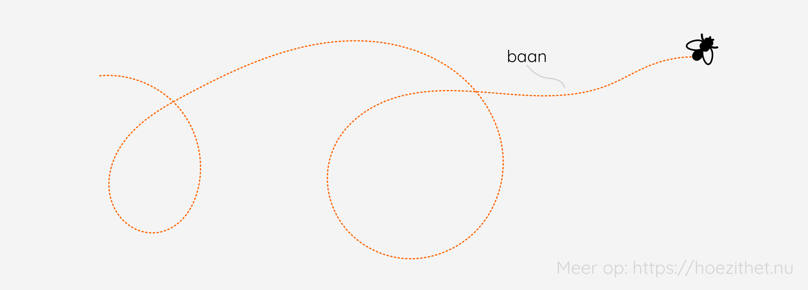

Maria en Dirk willen dit weekend van Brussel naar Gent (57 km) rijden en vervolgens overnachten in Aalst, wat eigenlijk 29 km in de tegengestelde richting is. 

Maria zegt: "We nemen best de trein, want anders moeten we 86 kilometer met de auto **afleggen** en dat is niet goed voor het milieu." Dirk is niet akkoord en zegt: "Onze **verplaatsing** bedraagt slechts 28 km, dus we kunnen best de auto nemen." Wie van beide is juist? 🤔

## De baan van een beweging
Vooraleer we kunnen bepalen wie gelijk heeft, moeten we ons eerst afvragen **waar de beweging zich afspeelt**. Dit doen we doormiddel van de **baan**. In het geval van **Maria** <Mute text="die met de trein wil gaan"/> zal de beweging zich **op de sporen** afspelen. Bij **Dirk** <Mute text="die met de auto wil gaan"/> zal de verplaatsing zich **op de weg** afspelen.

De **baan** is de verzameling van alle punten die een bewegend voorwerp achtereenvolgens aanneemt.

## De afgelegde weg is niet hetzelfde als de verplaatsing
De **afgelegde weg** is de afstand die **werkelijk wordt doorlopen**. **Maria** spreekt ook van **afgelegde weg**. Tussen Brussel en Gent ligt 57 km en tussen Gent en Aalst ligt 29 km. De werkelijk doorlopen afstand is dus de **optelsom van beide**, oftewel 86 kilometer.

**Dirk** heeft het echter niet over afgelegde weg, maar over **verplaatsing**. Dat is het **verschil in positie** van het voorwerp op **twee tijdstippen**. Dirk rekent met **het vertrekpunt** op 0 km en **het eindpunt** op 28 km (van het vertrekpunt). De **verplaatsing** berekenen je vervolgens door het **verschil van beide** te nemen. Je trekt het vertrekpunt van het eindpunt af. **De grootte van de verplaatsing is dan 28 km**.

Zowel Maria als Dirk hebben dus gelijk, elk op hun eigen manier. Het is wel vanzelfsprekend dat **in deze situatie** de **afgelegde weg bruikbaarder** is. De auto vervuilt immers elke afgelegde kilometer. 💨

Als je 's morgens vertrekt in Brussel en 's avonds weer aankomt in Brussel, dan was je **verplaatsing** voor die dag <Mute text="fysisch gesproken"/> dus **0 km**. Je **afgelegde weg** zal **meer** bedragen.

## Samengevat
<Attention title="De baan van een beweging">

De **baan** is de **verzameling van punten** die een bewegend voorwerp achtereenvolgens inneemt. Op de baan kun je de positie van een voorwerp op elk tijdstip weergeven.
</Attention>

<Attention title="De afgelegde weg en verplaatsing">

De **afgelegde weg** is de afstand die **werkelijk wordt doorlopen**.

De **verplaatsing** is het **verschil in positie** van het voorwerp op **twee tijdstippen**.
</Attention>