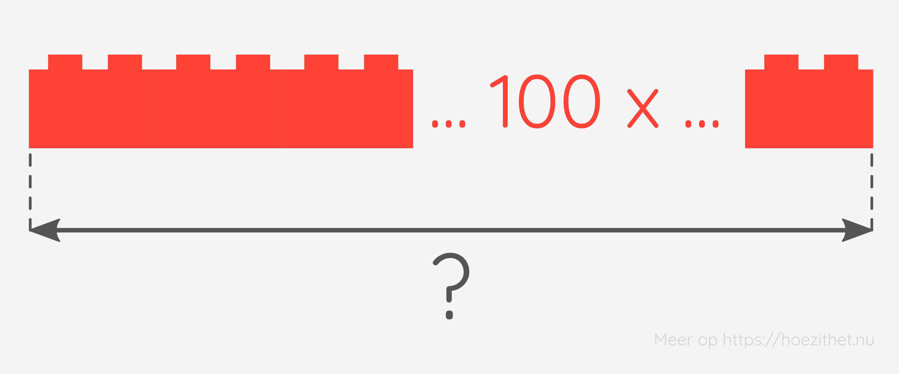

Als we berekeningen doen met metingen, moeten we altijd in ons achterhoofd
houden dat **metingen nooit exact** zijn. Stel dat we bijvoorbeeld een meetlat
naast een LEGO-blokje leggen, en we meten dat de zijde
$1{,}6 \si{ cm}$ is.

Als we 100 zulke blokjes naast elkaar leggen,
hoe lang zal die rij blokjes dan zijn?

Dat lijkt heel eenvoudig, gewoon $100 \cdot 1{,}6 \si{ cm} = 160 \si{ cm}$. We
hebben het blokje echter gemeten met een meetlat die maar tot op $0{,}1 \si{
cm}$ nauwkeurig kan meten. Stel dat we het blokje nu meten met een schuifmaat
die tot op $0{,}01 \si{ cm}$ nauwkeurig kan meten. Nu vinden we dat het blokje
$1{,}58 \si{ cm}$ is.

Als we 100 blokjes naast elkaar zouden leggen, zullen we dus een rij van $158
\si{ cm}$ krijgen, niet $160 \si{ cm}$.

Met **benaderingsregels** kunnen we de onzekerheid van een berekening
uitdrukken. Als we de benaderingsregels toepassen die we straks zullen leren,
krijgen we $1{,}6 \si{ m}$ voor de eerste berekening en $1{,}58 \si{ m}$ voor
de tweede berekening. Het belangrijke hierbij is dat er $1{,}6$ staat en
**niet** $1{,}6\red{0}$.

Met $1{,}6 \si{ m}$ bedoelen we namelijk: "Iets tussen $1{,}55 \si{ m}$ en
$1{,}65 \si{ m}$," en inderdaad, $1{,}58 \si{ m}$
**ligt binnen die foutenmarge**.

Als we bij de eerste berekening $1{,}6\red{0}$ hadden geschreven, zou dat
betekenen: "Iets tussen $1{,}5\red{95} \si{ m}$ en $1{,}6\red{05} \si{ m}$,"
maar
**dat is fout**,
want $1{,}58 \si{ m}$
**ligt buiten die foutenmarge**.

Door na onze berekeningen benaderingsregels toe te passen, zorgen we dat de
uitkomst de juiste **foutenmarge** heeft.

## Afronden na de komma

Voor we de benaderingsregels uit de doeken doen, frissen we nog snel even op
hoe je getallen moet afronden.

-   Rond af naar **boven** als het **volgende cijfer groter of gelijk aan 5** is;
-   Rond af naar **beneden** als het **volgende cijfer kleiner dan 5** is.

Als voorbeeld ronden we $384{,}9503$ af tot een bepaald aantal cijfers na de
komma.

| Voor afronding               | Soort afronding   | Na afronding         | Uitleg                                                                               |
| ---------------------------- | ----------------- | -------------------- | ------------------------------------------------------------------------------------ |
| $384{,}\orange{9}\gold{5}03$ | Op de tienden     | $385{,}\orange{0}$   | $\gold{5} \ge 5$ dus $\orange{9}$ wordt $1\orange{0}$, waardoor de $4$ een $5$ wordt |
| $384{,}9\orange{5}\gold{0}3$ | Op de honderdsten | $384{,}9\orange{5}$  | $\gold{0} \lt 5$ dus $\orange{5}$ blijft $\orange{5}$                                |
| $384{,}95\orange{0}\gold{3}$ | Op de duizendsten | $384{,}95\orange{0}$ | $\gold{3} \lt 5$ dus $\orange{0}$ blijft $\orange{0}$                                |

## Afronden vóór de komma

Soms moeten we ook vóór de komma afronden. Dat kunnen we met behulp van
[machten van 10](machten_van_10). We zullen weer $384{,}9503$ gebruiken als
voorbeeld.

| Voor afronding               | Soort afronding     | Na afronding                                          | Uitleg                                                                                                                               |
| ---------------------------- | ------------------- | ----------------------------------------------------- | ------------------------------------------------------------------------------------------------------------------------------------ |
| $38\orange{4}{,}\gold{9}503$ | Op de eenheden      | $38\orange{5}\cdot 10^0$  of gewoon $38\orange{5}$ | $\gold{9} \ge 5$ dus $\orange{4}$ wordt $\orange{5}$  Vermenigvuldigen met $10^0 = 1$ omdat we afronden op de **een**heden        |
| $3\orange{8}\gold{4}{,}9503$ | Op de tientallen    | $3\orange{8}\cdot 10^1$                               | $\gold{4} \lt 5$ dus $\orange{8}$ blijft $\orange{8}$  Vermenigvuldigen met $10^1 = 10$ omdat we afronden op de **tien**tallen    |
| $\orange{3}\gold{8}4{,}9503$ | Op de honderdtallen | $\orange{4}\cdot 10^2$                                | $\gold{8} \ge 5$ dus $\orange{3}$ wordt $\orange{4}$  Vermenigvuldigen met $10^2 = 100$ omdat we afronden op de **honderd**tallen |

## Optellingen en aftrekkingen

Nadat we berekeningen hebben gedaan, zullen we bijna altijd de
benaderingsregels moeten toepassen. Welke regels we moeten toepassen, hangt af
van de bewerkingen die we hebben gedaan tijdens de berekening.

Voor optellingen en aftrekkingen kijken we naar het aantal cijfers na de komma.
We moeten de uitkomst afronden zodat die hetzelfde aantal cijfers na de komma
heeft als het getal in de berekening met het **minst aantal cijfers na de
komma**.

Neem bijvoorbeeld de berekening

$$
24{,}28 + 9{,}1 - 3{,}35
$$

Deze berekening heeft drie termen:

| Term               | Aantal cijfers na de komma |
| ------------------ | -------------------------- |
| $24{,}\orange{28}$ | 2                          |
| $9{,}\orange{1}$   | 1                          |
| $-3{,}\orange{35}$ | 2                          |

Het kleinste aantal cijfers na de komma is dus 1. Dat betekent dat we de
**uitkomst moeten afronden tot op 1 cijfer na de komma** <Mute>(afronden
op de tienden dus)</Mute>. De uitkomst van de berekening zelf is:

$$
24{,}28 + 9{,}1 - 3{,}33 = 36{,}75
$$

Als we dit vervolgens afronden op de tienden, krijgen we:

$$
36{,}\orange{7}\gold{5} \approx 36{,}\orange{8}
$$

## Vermenigvuldigingen en delingen

Voor vermenigvuldigingen en delingen kijken we naar het [aantal buidende
cijfers](beduidende_cijfers/#aantal-beduidende-cijfers). We moeten de
uitkomst afronden zodat die hetzelfde aantal beduidende cijfers heeft als het
getal in de berekening met het **minst aantal beduidende cijfers**.

Bijvoorbeeld de berekening:

$$
0{,}000247 \cdot 34{,}2 \cdot 9{,}1
$$

Deze berekening heeft drie factoren:

| Factor                     | Aantal beduidende cijfers |
| -------------------------- | ------------------------- |
| $0{,}000\orange{247}$      | 3                         |
| $\orange{34}{,}\orange{2}$ | 3                         |
| $\orange{9}{,}\orange{1}$  | 2                         |

Het kleinste aantal beduidende cijfers is dus 2. Dat betekent dat we de
**uitkomst moeten afronden tot 2 beduidende cijfers**. De uitkomst is:

$$
0{,}000247 \cdot 34{,}2 \cdot 9{,}1 = 0{,}07687134
$$

Deze uitkomst moeten we afronden zodat enkel de eerste 2 beduidende cijfers
overblijven <Mute>($7$ en $6$)</Mute>. We moeten dus afronden op de
duizendsten <Mute>(3 plaatsen na de komma)</Mute>:

$$
0{,}07\orange{6}\gold{8}7134 \approx 0{,}07\orange{7}
$$

## Samengevat

<Attention>

Benaderingsregels

-   De uitkomst van een **optelling of aftrekking** moet hetzelfde **aantal
    cijfers na de komma** hebben als het getal in de berekening met het kleinste
    aantal cijfers na de komma;
-   De uitkomst van een **vermenigvuldiging of deling** moet hetzelfde **aantal
    beduidende cijfers** hebben als het getal in de berekening met het kleinste
    aantal beduidende cijfers.

</Attention>

