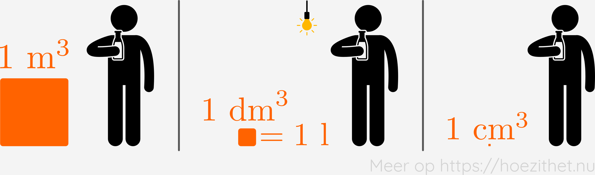

Vaak wordt er gevraagd om een eindresultaat te noteren in [SI-eenheden](intro#si-eenheden-maken-duidelijke-afspraken), terwijl de opgave niet in SI-eenheden gegeven is. Dan is het belangrijk om die eenheden te kunnen omzetten naar de SI-eenheden.

Soms zullen we een eenheid ook omzetten om beter te begrijpen wat ze betekent. Zo kunnen we ons beter voorstellen hoe lang 2 uren duren, eerder dan hoe lang 7200 seconden duren, ondanks dat de seconde de SI-eenheid van tijd is.

Er zijn dus verschillende situaties waarbij we eenheden zullen moeten omzetten. In deze les bespreken we hoe je zulke omzettingen kan doen.

## Van en naar prefixen

In de les over [prefixen](prefixen) zagen we al hoe we eenheden konden omzetten waarvan enkel de prefix verschilde. Hierin zijn drie gevallen te onderscheiden:

1. Het [wegwerken van een prefix](prefixen#prefixen-wegwerken), zoals van $\si{km}$ naar $\si{m}$;
2. Het [toevoegen van een prefix](prefixen#prefixen-toevoegen), zoals van $\si{g}$ naar $\si{kg}$;
3. Het [omzetten van een prefix](prefixen#prefixen-omzetten), zoals van $\si{mg}$ naar $\si{kg}$.

## Tijden omzetten

Het omzetten van tijden is iets lastiger.
Bijvoorbeeld: uren ($\si{h}$) naar seconden ($\si{s}$), minuten ($\si{min}$) naar seconden, seconden naar uren...
Het belangrijkste om te onthouden, weet je waarschijnlijk al:

$$1 \si{ h} = 60 \si{ min}$$
$$1 \si{ min} = 60 \si{ s}$$

Met de voorgaande 2 gelijkheden, kunnen we alle omzettingen tussen uren,
minuten en seconden doen. Hieronder een samenvatting van alle mogelijke
omzettingen. Leer deze omzettingen alsjeblieft **niet uit je hoofd**. Je
vergeet ze vroeg of laat toch. Probeer in de plaats daarvan telkens de **afleiding te
begrijpen** zodat je deze tijdens een toets snel op een kladblad kan hermaken.
Het enige wat je van buiten moet kennen zijn de bovenstaande 2 gelijkheden.

Merk op: we maken gebruik van de [benaderingsregels](benaderingsregels) in de kolom met voorbeelden.

### Van uur naar...

| Van      | Naar       | Afleiding                                                                                                                     | Kort gezegd                | Voorbeeld                                                                                                                            |
| -------- | ---------- | ----------------------------------------------------------------------------------------------------------------------------- | -------------------------- | ------------------------------------------------------------------------------------------------------------------------------------ |
| $\si{h}$ | $\si{min}$ | /                                                                                                                             | $1 \si{ h} = 60 \si{ min}$ | \begin{split}8{,}00 \orange{\si{ h}} &= 8{,}00 \cdot \orange{60 \si{ min}}\\\\\ &= 480 \orange{\si{ min}} \end{split}                |
| $\si{h}$ | $\si{s}$   | \begin{split}1 \si{ h} &= 60 \orange{\si{ min}}\\\\\ &= 60 \cdot \orange{60 \si{ s}}\\\\\ &= 3600 \orange{\si{ s}}\end{split} | $1 \si{ h} = 3600 \si{ s}$ | \begin{split}8{,}00 \orange{\si{ h}} &= 8{,}00 \cdot \orange{3600 \si{ s}} \\\\\ &= 28{,}8 \cdot 10^{3} \orange{\si{ s}} \end{split} |

### Van minuut naar...

| Van        | Naar     | Afleiding                                                                                                                                                                                                                                                                              | Kort gezegd                          | Voorbeeld                                                                                                                                                                   |
| ---------- | -------- | -------------------------------------------------------------------------------------------------------------------------------------------------------------------------------------------------------------------------------------------------------------------------------------- | ------------------------------------ | --------------------------------------------------------------------------------------------------------------------------------------------------------------------------- |
| $\si{min}$ | $\si{h}$ | \begin{split}1 \si{ h} &= 60 \si{ min}\\\\\ &\Updownarrow\\\\\ \frac{1 \si{ h}}{\orange{60}} &= \frac{60 \si{ min}}{\orange{60}}\\\\\ &\Updownarrow\\\\\ \frac{1}{\orange{60}} \si{ h} &= 1 \si{ min} \\\\\ &\Updownarrow\\\\\ 1 \si{ min} &= \frac{1}{\orange{60}} \si{ h}\end{split} | $1 \si{ min} = \frac{1}{60} \si{ h}$ | \begin{split}90{,}0 \orange{\si{ min}} &= 90{,}0 \cdot \orange{\frac{1}{60} \si{ h}}\\\\\ &= \frac{90{,}0}{60} \orange{\si{ h}}\\\\\ &= 1{,}50 \orange{\si{ h}} \end{split} |
| $\si{min}$ | $\si{s}$ | /                                                                                                                                                                                                                                                                                      | $1 \si{ min} = 60 \si{ s}$           | \begin{split}90{,}0 \orange{\si{ min}} &= 90{,}0 \cdot \orange{60 \si{ s}} \\\\\ &= 5{,}40 \cdot 10^{3} \orange{\si{ s}} \end{split}                                        |

### Van seconde naar...

| Van      | Naar       | Afleiding                                                                                                                                                                                                                                                                              | Kort gezegd                          | Voorbeeld                                                                                                                                                                                  |
| -------- | ---------- | -------------------------------------------------------------------------------------------------------------------------------------------------------------------------------------------------------------------------------------------------------------------------------------- | ------------------------------------ | ------------------------------------------------------------------------------------------------------------------------------------------------------------------------------------------ |
| $\si{s}$ | $\si{min}$ | \begin{split}1 \si{ min} &= 60 \si{ s}\\\\\ &\Updownarrow\\\\\ \frac{1 \si{ min}}{\orange{60}} &= \frac{60 \si{ s}}{\orange{60}}\\\\\ &\Updownarrow\\\\\ \frac{1}{\orange{60}} \si{ min} &= 1 \si{ s} \\\\\ &\Updownarrow\\\\\ 1 \si{ s} &= \frac{1}{\orange{60}} \si{ min}\end{split} | $1 \si{ s} = \frac{1}{60} \si{ min}$ | \begin{split}30{,}0 \orange{\si{ s}} &= 30{,}0 \cdot \orange{\frac{1}{60} \si{ min}}\\\\\ &= \frac{30{,}0}{60} \orange{\si{ min}}\\\\\ &= 0{,}500 \orange{\si{ min}} \end{split}           |
| $\si{s}$ | $\si{h}$   | \begin{split}1 \si{ s} &= \frac{1}{60}\orange{\si{ min}} \\\\\ &=\frac{1}{60}\cdot \orange{\frac{1}{60}\si{ h}}\\\\\ &=\frac{1}{\orange{3600}}\si{ h} \end{split}                                                                                                                      | $1 \si{ s} = \frac{1}{3600} \si{ h}$ | \begin{split}30{,}0 \orange{\si{ s}} &= 30{,}0 \cdot \orange{\frac{1}{3600} \si{ h}}\\\\\ &= \frac{30{,}0}{3600} \orange{\si{ h}}\\\\\ &= 8{,}33\cdot 10^{-3} \orange{\si{ h}} \end{split} |

## Snelheden omzetten

Door het omzetten van [prefixen](#van-en-naar-prefixen) te combineren met het
omzetten van [tijden](#tijden-omzetten), kunnen we $\si{km}/\si{h}$ omzetten
naar $\si{m}/\si{s}$ en omgekeerd. Hieronder weer een samenvattende tabel.

| Van              | Naar             | Afleiding                                                                                                                                                                                                                                                                                                                                               | Kort gezegd                                         | Voorbeeld                                                                                                                                                                                                      |
| ---------------- | ---------------- | ------------------------------------------------------------------------------------------------------------------------------------------------------------------------------------------------------------------------------------------------------------------------------------------------------------------------------------------------------- | --------------------------------------------------- | -------------------------------------------------------------------------------------------------------------------------------------------------------------------------------------------------------------- |
| $\si{km}/\si{h}$ | $\si{m}/\si{s}$  | \begin{split} 1 \frac{\blue{\si{k}}\si{m}}{\orange{\si{h}}} &= 1 \cdot \frac{\blue{10^3}\si{ m}}{\orange{3600\si{ s}}}\\\\\ &= \frac{1\cdot \blue{10^3}} {\orange{3600}} \frac{\si{m}}{\si{s}}\\\\\ &= \frac{1}{3{,}6} \frac{\si{m}}{\si{s}} \end{split}                                                                                                | $1 \si{ km}/\si{h} = \frac{1}{3{,}6} \si{m}/\si{s}$ | \begin{split} 30{,}0 \orange{\si{ km}/\si{h}} &= 30{,}0 \cdot \orange{\frac{1}{3{,}6} \si{ m}/\si{s}} \\\\\ &= \frac{30{,}0}{\orange{3{,}6}} \orange{\si{ m}/\si{s}} \\\\\ &= 8{,}33 \si{ m}/\si{s}\end{split} |
| $\si{m}/\si{s}$  | $\si{km}/\si{h}$ | \begin{split} 1 \si{ km}/\si{h} &= \frac{1}{3{,}6} \si{ m}/\si{s}\\\\\ &\Updownarrow\\\\\ \orange{3{,}6}\cdot 1 \si{ km}/\si{h} &= \orange{3{,}6}\cdot \frac{1}{3{,}6} \si{ m}/\si{s}\\\\\ &\Updownarrow\\\\\ \orange{3{,}6} \si{ km}/\si{h} &= 1 \si{ m}/\si{s}\\\\\ &\Updownarrow\\\\\ 1 \si{ m}/\si{s} &= \orange{3{,}6} \si{ km}/\si{h} \end{split} | $1 \si{ m}/\si{s} = 3{,}6 \si{ km}/\si{h}$          | \begin{split} 25{,}0 \orange{\si{ m}/\si{s}} &= 25{,}0 \cdot \orange{3{,}6 \si{ km}/\si{h}} \\\\\ &= 90{,}0 \si{ km}/\si{h} \end{split}                                                                        |

## Volumes omzetten

In het dagelijkse leven drukt men volumes meestal uit in liter ($\si{l}$) of
een afgeleide hiervan (vnl. $\si{ml}$, $\si{cl}$ of $\si{dl}$). De SI-eenheid
voor volume is echter de kubieke meter ($\si{m}^3$). Een omzetting tussen
beiden is niet zo voor de hand liggend. Het belangrijkste dat je moet onthouden
is:

$$1 \si{ l} = 1 \si{ dm}^3$$

Dit kan je als volgt onthouden: beeld je een fles melk in van $1 \si{ l}$.
Stel je nu 3 kubussen voor: een met zijden van $1 \si{ m}$, een met zijden van
$10 \si{ cm}$ en een met zijden van $1 \si{ cm}$. Welke van deze kubussen heeft
ongeveer hetzelfde volume als het melkkarton? Ter illustratie
<Mute text="(de figuur is niet op exacte schaal, maar geeft wel een idee van de groottes)" />:

Je ziet dat de kubus met een zijde van $1 \si{ dm}$
<Mute text="($= 10 \si{ cm}$)" />
ongeveer hetzelfde volume heeft als de fles melk, en inderdaad
$1 \si{ l} = 1 \si{ dm}^3$.

Hiermee kan je dan aan de slag om de omzetting te doen tussen liter en kubieke meter.

| Van        | Naar       | Afleiding                                                                                                                                                                                                                                                                            | Kort gezegd                     | Voorbeeld |
| ---------- | ---------- | ------------------------------------------------------------------------------------------------------------------------------------------------------------------------------------------------------------------------------------------------------------------------------------ | ------------------------------- | --------- |
| $\si{l}$   | $\si{m}^3$ | \begin{split} 1 \si{ l} &= 1 \blue{\si{ d}} \si{m}^3\\\\\ &= 1 \cdot (\blue{10^{-1}}\si{ m})^3\\\\\ &= 1 \cdot (\blue{10^{-1}})^3 \si{ m}^3\\\\\ &= 10^{-3} \si{ m}^3 \end{split}                                                                                                    | $1 \si{ l} = 10^{-3} \si{ m}^3$ |           |
| $\si{m}^3$ | $\si{l}$   | \begin{split} 1 \si{ l} &= 10^{-3} \si{ m}^3 \\\\\ \Updownarrow \\\\\ \orange{10^3} \cdot 1 \si{ l} &= \orange{10^3} \cdot 10^{-3} \si{ m}^3 \\\\\ \Updownarrow \\\\\ \orange{10^3} \si{ l} &= 1 \si{ m}^3 \\\\\ \Updownarrow \\\\\ 1 \si{ m}^3 &= \orange{10^3} \si{ l} \end{split} | $1 \si{ m}^3 = 10^3 \si{ l}$    |           |

## Massadichtheid omzetten

Ten slotte tonen we hoe je de omzetting van $\si{g}/\si{ml}$ naar $\si{kg}/\si{m}^3$ kan doen en omgekeerd.

| Van                | Naar               | Afleiding                                                                                                                                                                                                                                                                                                                                                                                                                                                                                                                  | Kort gezegd                                     | Voorbeeld |
| ------------------ | ------------------ | -------------------------------------------------------------------------------------------------------------------------------------------------------------------------------------------------------------------------------------------------------------------------------------------------------------------------------------------------------------------------------------------------------------------------------------------------------------------------------------------------------------------------- | ----------------------------------------------- | --------- |
| $\si{g}/\si{ml}$   | $\si{kg}/\si{m}^3$ | \begin{split} 1 \frac{\si{g}}{\blue{\si{m}}\orange{\si{l}}} &= 1 \frac{\si{g}}{\blue{10^{-3}}\cdot\orange{10^{-3}\si{ m}^3}}\\\\\ &= \frac{1}{10^{(\blue{-3}) + (\orange{-3})}} \frac{\si{g}}{\si{ m}^3}\\\\\ &= \frac{1}{10^{-6}} \frac{\si{g}}{\si{ m}^3}\\\\\ &= 10^{6} \frac{\si{g}}{\si{ m}^3}\\\\\ &= 10^{6} \frac{\pink{10^{-3}}\cdot\green{10^3}\si{g}}{\si{ m}^3}\\\\\ &= 10^{6}\cdot \pink{10^{-3}}\frac{\green{\si{k}}\si{g}}{\si{ m}^3}\\\\\ &= 10^{3} \frac{\green{\si{k}}\si{g}}{\si{ m}^3}\\\\\ \end{split} | $1\si{ g}/\si{ml} = 10^3 \si{ kg}/\si{m}^3$     |           |
| $\si{kg}/\si{m}^3$ | $\si{g}/\si{ml}$   | \begin{split} 1 \frac{\si{g}}{\si{ml}} &= 10^3 \frac{\si{ kg}}{\si{m}^3}\\\\\ &\Updownarrow \\\\\ \frac{1 \si{ g}/\si{ml}}{\orange{10^3}} &= \frac{10^3 \si{ kg}/\si{m}^3}{\orange{10^3}}\\\\\ &\Updownarrow \\\\\ \frac{1}{\orange{10^3}} \frac{\si{ g}}{\si{ml}} &= 1\frac{\si{kg}}{\si{m}^3}\\\\\ &\Updownarrow \\\\\ 1\frac{\si{kg}}{\si{m}^3} &= \frac{1}{\orange{10^3}} \frac{\si{ g}}{\si{ml}} \\\\\ &\Updownarrow \\\\\ 1\frac{\si{kg}}{\si{m}^3} &= 10^{-3} \frac{\si{ g}}{\si{ml}}\end{split}                    | $1\si{ kg}/\si{m}^3 = 10^{-3} \si{ g}/\si{ml} $ |           |
