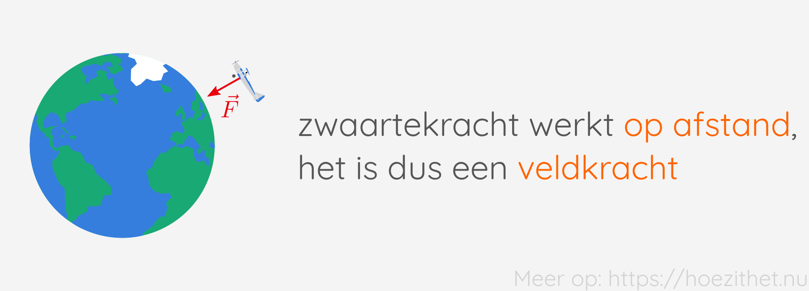
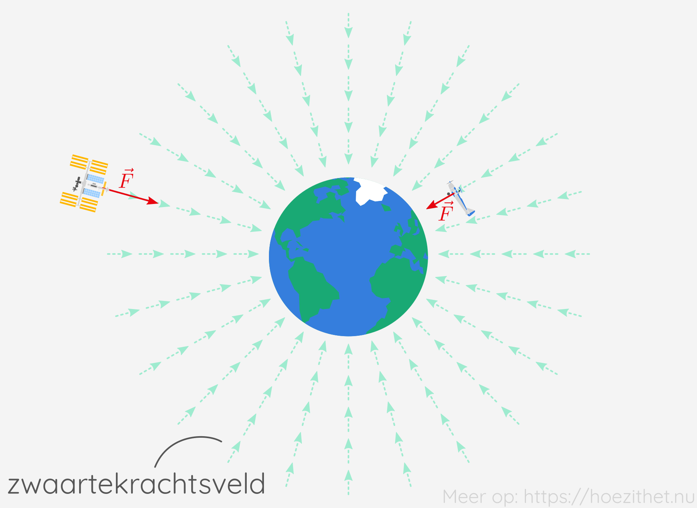
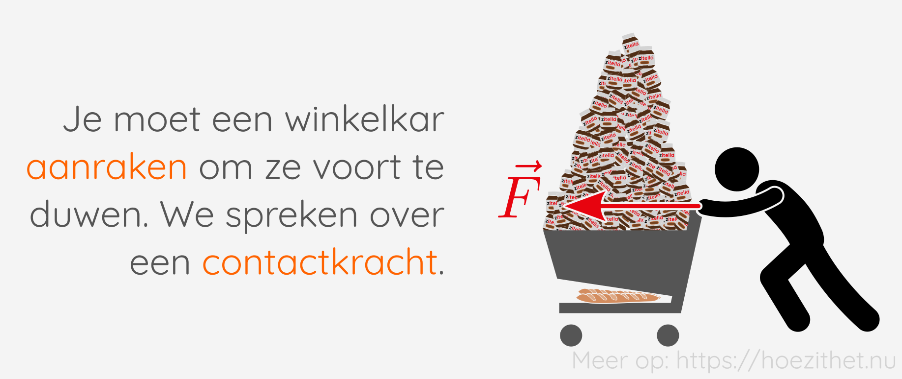
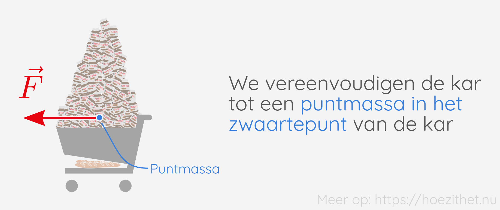

Een van de meest fundamentele [grootheden](../grootheden_eenheden/intro) in de
fysica is **kracht**. Kracht is een maat voor op welke manier er wordt
**geduwd** tegen of **getrokken** aan een voorwerp. Wanneer een kracht inwerkt
op een voorwerp, kan de kracht een **verandering van de snelheid** en/of een
**vervorming** van dat voorwerp tot gevolg hebben. Verandering van snelheid noemen we het **dynamisch effect** van krachten. Vervorming noemen we het **statisch effect** van krachten.

Je komt krachten voortdurend tegen in het dagelijkse leven:

-   Wanneer je vooruit stapt, **duw** je je af tegen de grond;
-   De zwaartekracht **trekt** ons naar beneden waardoor we met de twee voetjes op de
    grond blijven staan;
-   De zwaartekracht van de zon **trekt** aan de aarde waardoor de aarde in een baan
    rond de zon blijft;
-   In de winkel **duw** je de winkelkar vooruit;
-   ...

Het symbool voor de grootheid kracht is $F$ <Mute text="(van het Engelse <em>force</em>)" /> en de
[SI-eenheid](../grootheden_eenheden/intro##si-eenheden-maken-duidelijke-afspraken)
is **de newton** (symbool: $\si{N}$), genoemd naar de bekende natuurkundige
[Isaac Newton](https://nl.m.wikipedia.org/wiki/Isaac_Newton).

| Grootheid    | SI-eenheid        |
| ------------ | ----------------- |
| Kracht ($F$) | newton ($\si{N}$) |

Om je een idee te geven van hoe groot een newton juist is: als je een flesje
water van een halve liter op je hand zet, voel je een kracht van ongeveer
$5\si{ N}$.

## Veld- en contactkrachten

We kunnen een onderscheid maken tussen krachten die op afstand werken en
krachten die enkel werken wanneer er contact is tussen twee voorwerpen.

Wanneer een **kracht op afstand** werkt, spreken we van een **veldkracht**. Een
voorbeeld hiervan is de zwaartekracht. Die werkt namelijk ook wanneer je niet
in contact bent met de aarde, bijvoorbeeld als je in een vliegtuig zit.

We zeggen dat de aarde een **zwaartekrachtsveld** opwekt. Dat betekent dat
voorwerpen die in de buurt van de aarde komen, een trekkende kracht zullen voelen
in de richting van de aarde.

Vaak zal er voor een kracht echter contact nodig zijn tussen twee voorwerpen.
Wanneer je in de winkel een zware kar vooruit moet duwen, bijvoorbeeld, kan
dat niet zonder de winkelkar aan te raken. We spreken dan over een
**contactkracht**.

## Puntmassa

We gaan voor de eenvoud alle voorwerpen voorstellen als **puntmassa**'s. Dat
betekent dat we in gedachte elk voorwerp waar krachten op inwerken gaan
vervangen door een klein puntje dat dezelfde massa heeft als het voorwerp. We
tekenen de puntmassa **in het zwaartepunt van het voorwerp** <Mute text="(lees: 
het midden)" />. De krachten die inwerken op het voorwerp, tekenen we dan ook 
in die puntmassa.

## Samengevat

<Attention title="Kracht">

**Kracht** is een grootheid die beschrijft op welke manier er wordt **geduwd**
tegen of **getrokken** aan een voorwerp. Wanneer een kracht inwerkt
op een voorwerp, kan de kracht een **verandering van de snelheid** en/of een
**vervorming** van dat voorwerp tot gevolg hebben.

</Attention>

<Attention title="Veld- en contactkrachten">

-   Een **veldkracht** is een kracht die **op afstand** werkt en het gevolg is
    van een krachtveld zoals het zwaartekrachtsveld;
-   Een **contactkracht** is een kracht die enkel kan optreden wanneer er **direct
    contact** is tussen twee voorwerpen.

</Attention>
