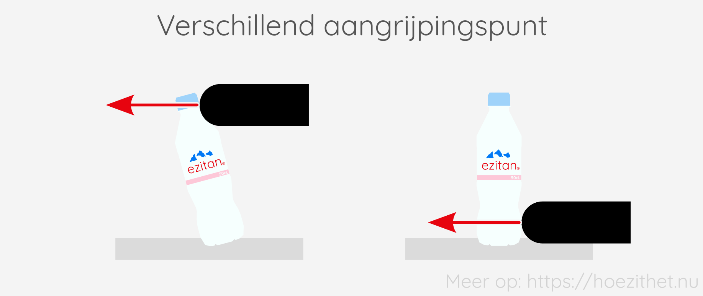
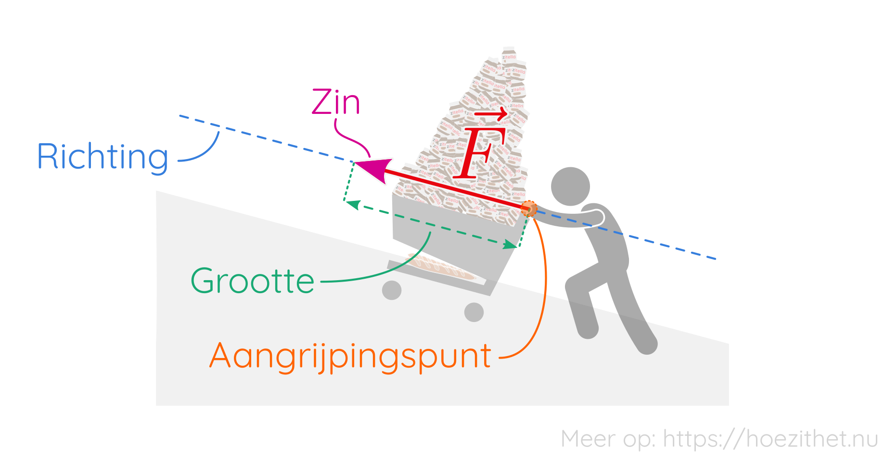

[Kracht](intro) is een maat voor hoe er geduwd of getrokken wordt. Een van
de speciale eigenschappen van de grootheid _kracht_ is dat ze een **vectoriële
grootheid** is.

## Kracht is een vectoriële grootheid

Als je wilt weten wat er met een slee gebeurt als iemand eraan trekt, moet je
niet alleen weten **hoe hard** <Mute>(= grootte)</Mute>, maar ook 
**waarheen** <Mute>(= richting en zin)</Mute> er aan de slee getrokken 
wordt.

Bij een kracht hoort dus zowel een **grootte** <Mute>(hoe hard je trekt
of duwt)</Mute> als een **richting** en **zin** <Mute>(waarheen je trekt of
duwt)</Mute>. Daarom is kracht een [vectoriële
grootheid](/lessen/wiskunde/vector_1/vectoriele_grootheden). In symbolen noteren we een **krachtvector** als een _F_ met een
pijltje boven: $\vec{F}$.

Voor de duidelijkheid gaan we bij krachten soms in de _index_ <Mute>(rechts onderaan)</Mute> aangeven wie of wat de kracht levert en op wie of wat de kracht aangrijpt.

| Schrijf        | Lees                               |
| -------------- | ---------------------------------- |
| $\vec{F}$      | De krachtvector $\vec{F}$          |
| $\vec{F}_{AB}$ | De kracht die _A_ uitoefent op _B_ |

Wanneer Dirk tegen Maria duwt, bijvoorbeeld, zouden we de **kracht van Dirk op Maria** noteren als $\vec{F}_{DM}$.

## Grootte van een kracht

De **grootte** van een krachtvector $\vec{F}$ zegt **hoeveel kracht** er wordt
uitgeoefend, dus hoeveel newton. De grootte van een kracht is **altijd positief**. We noteren de
grootte van $\vec{F}$ als $\norm{\vec{F}}$ of als $F$ <Mute>(merk op:
geen pijltje op de $F$)</Mute>.

| Schrijf          | Lees                     |
| ---------------- | ------------------------ |
| $\norm{\vec{F}}$ | De grootte van $\vec{F}$ |
| $F$              | De grootte van $\vec{F}$ |

Bij het tekenen van een
vector gebruiken we de **lengte van de vector** om de grootte van de kracht aan
te geven.

## Richting en zin van een kracht

De **richting** van $\vec{F}$ zegt **aan welke rechte $\vec{F}$
evenwijdig is**. Bijvoorbeeld: _"verticaal"_, of
_"horizontaal"_, of _"onder een hoek van $15\deg$"_.

De **zin** van $\vec{F}$ zegt **naar welke kant $\vec{F}$ wijst**.
Dat kan bijvoorbeeld _"naar links"_, _"naar rechts"_, of _"naar beneden"_ zijn.

## Aangrijpingspunt van een kracht

Naast een grootte, richting en zin, heeft een krachtvector ook een **aangrijpingspunt**.
Het is namelijk
ook belangrijk om te zeggen **waar de kracht uitgeoefend wordt op het
voorwerp**. Wanneer je tegen de bovenkant duwt van een flesje water dat op
tafel staat, zal het flesje sneller kantelen dan wanneer je tegen de onderkant
van het flesje duwt.

## Samengevat

<Attention title="Vectoriële grootheden">

Een vectoriële grootheid is een grootheid met een **grootte**, een **richting**
en een **zin**.
</Attention>

<Attention title="Kracht is een vector">

Een **krachtvector** $\vec{F}$ heeft **vier eigenschappen**:

1. De **grootte**: hoe groot is de kracht? Notatie: $\norm{\vec{F}}$ of $F$.
2. De **richting**: wat is de richting van de rechte waarmee de krachtvector evenwijdig
   is?
3. De **zin**: naar welke kant gaat de kracht?
4. Het **aangrijpingspunt**: waar wordt de kracht uitgeoefend op het voorwerp?

</Attention>

<Attention title="Schrijfwijze voor krachten">

| Schrijf | Lees |
|---------|------|
|$\vec{F}$| De krachtvector $\vec{F}$ |
|$\norm{\vec{F}}$| De grootte van $\vec{F}$ |
|$F$| De grootte van $\vec{F}$ |
| $\vec{F}_{AB}$ | De kracht die _A_ uitoefent op _B_ |
</Attention>
