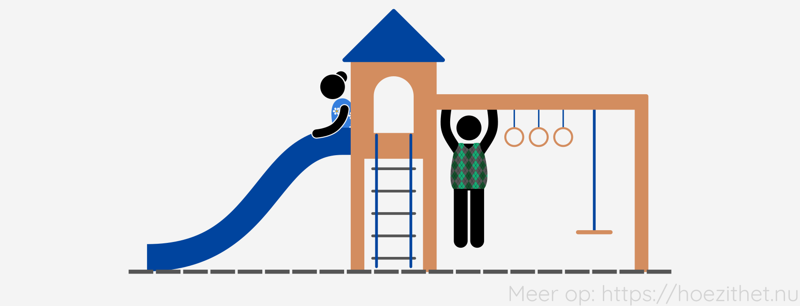

Wanneer je met je voeten op de grond staat, ondersteunt de grond jou. Wanneer
je een kleedje aan een kleerhanger hangt, zorgt de kapstok ervoor dat het
kleedje niet op de grond valt. De kracht die zo'n ondersteuning of ophanging
uitoefent, noemen we een **normaalkracht**.

## Een normaalkracht ondersteunt

Een normaalkracht $\vec{F}_{n}$ is een kracht die een **ondersteuning
uitoefent op een voorwerp**. Het aangrijpingspunt van $\vec{F}_{n}$ tekenen we
op de plaats waar de ondersteuning contact maakt met het voorwerp.

Stel dat Maria en Dirk zich wagen aan een bezoekje aan de lokale speeltuin.
Maria zet zich op de glijbaan en Dirk gaat aan het klimrek hangen.

Maria wordt ondersteund door de glijbaan. De glijbaan oefent dus een
normaalkracht $\vec{F}_{nM}$ uit op Maria. Het aangrijpingspunt van
$\vec{F}_{nM}$ tekenen we aan het zitvlak van Maria.

Bij een ophanging, zoals Dirk die aan het klimrek hangt, is er ook een
normaalkracht. Omdat Dirk met beide handen aan het klimrek hangt, zijn er hier
zelfs twee normaalkrachten. Voor ieder hand één.

## Normaalkracht altijd loodrecht op steunoppervlak

De normaalkracht is _"normaal"_ omdat ze altijd loodrecht op het steunoppervlak
staat <Mute text="(normaal is een ander woord voor loodrecht)" />. Ook
wanneer het steunoppervlak schuin staat, staat de normaalkracht er loodrecht op.

## Gewicht duwt op ondersteuning

In het dagelijkse taalgebruik bedoelen we met _gewicht_ hoeveel kilogram iets
of iemand weegt. In fysica noemen we dat de massa en betekent gewicht iets
anders. In fysica is het gewicht $\vec{F}_g$ de kracht die een **voorwerp
uitoefent op zijn ondersteuning**. Gewicht is dus een **kracht**, met als
eenheid **newton**, en **niet kilogram**.

Welk gewicht $\vec{F}_g$ oefent Maria uit op de glijbaan voor ze eraf schuift,
als je weet dat Maria een massa heeft van $65{,}0~\si{kg}$?

De zwaartekracht trekt Maria naar beneden. Hierdoor oefent ze een gewicht uit
op de glijbaan. Er zijn geen andere krachten die Maria tegen de glijbaan
trekken. Daarom is de grootte het gewicht $\vec{F}\_g$ dat ze uitoefent op de
glijbaan gelijk aan de grootte van de zwaartekracht op Maria.

$$
\begin{aligned}
F_g &= F_{zM}\\
 &= m_M \cdot g\\
 &= 65{,}0~\si{kg} \cdot 9{,}81~\si{N/kg}\\
 &= 637{,}65~\si{N}\\
 &\breq 638~\si{N}\\
\end{aligned}
$$

In bovenstaand voorbeeld is het gewicht van Maria gelijk aan de zwaartekracht
die inwerkt op haar. Dat is vaak zo. Wanneer een voorwerp steunt op een
**horizontaal steunoppervlak** en er werken **geen andere krachten** dan de
zwaartekracht en normaalkracht in op het voorwerp, dan is het **gewicht gelijk
aan de zwaartekracht**.

<Expand title="Verschillende definities voor gewicht">

Als je verschillende handboeken van fysica naast elkaar legt, zal je zien dat
"gewicht" niet overal dezelfde definitie heeft. Sommige handboeken definiëren
gewicht als de [zwaartekracht](zwaartekracht) die inwerkt op een voorwerp,
dus $F_g = m \cdot g$. In dat geval is gewicht een kracht die inwerkt op het
voorwerp zelf, en is er niet per se een ondersteuning nodig.

In alle definities van gewicht, is gewicht wel altijd **een kracht** met als
eenheid **newton** en **nóóit kilogram**.

</Expand>

## Gewicht en normaalkracht zijn tegengesteld

Gewicht en normaalkracht komen altijd samen voor. Daarenboven hebben ze altijd
**dezelfde grootte en richting**, maar hebben ze een **tegengestelde zin**.

Het belangrijkste verschil is dat de
**normaalkracht inwerkt op het ondersteunde voorwerp**, terwijl
**gewicht inwerkt op de ondersteuning**. In een latere les zullen we zulke
krachten die gelijk zijn in grootte, maar tegengesteld in zin, een
_actie-reactiepaar_ noemen. Maar daar hoef je je nu nog geen zorgen over te
maken.

## Samengevat

<Attention title="Normaalkrachten">

Een normaalkracht $\vec{F}_n$ is een kracht die geleverd wordt **door een
ondersteuning** en inwerkt **op het ondersteunde voorwerp**. Een normaalkracht
staat **altijd loodrecht op het steunoppervlak**.

</Attention>

<Attention title="Gewicht">

Het gewicht $\vec{F}_g$ van een ondersteund voorwerp is de **kracht** die
geleverd wordt **door een ondersteund voorwerp** en inwerkt **op de
ondersteuning**.

Het gewicht heeft altijd **dezelfde grootte en richting als $\vec{F}_n$**, maar
heeft een **tegengestelde zin**.

</Attention>
