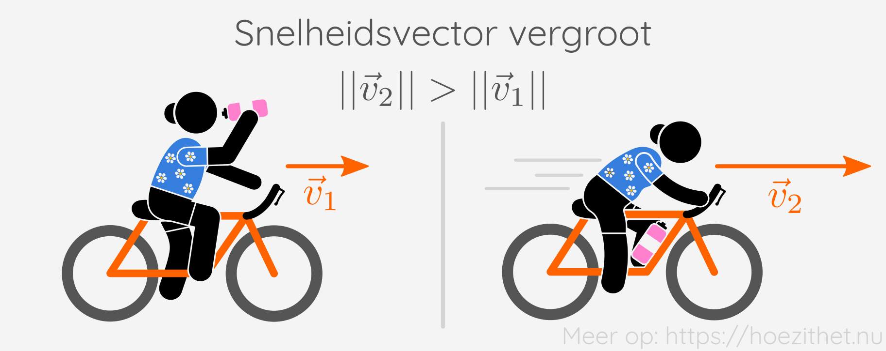
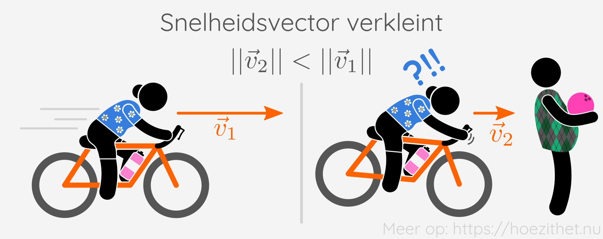
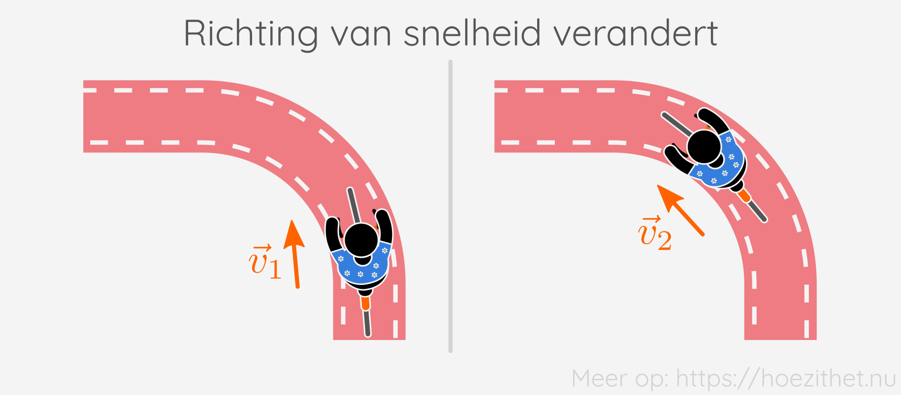
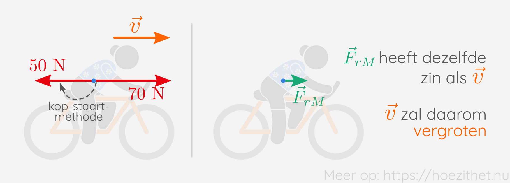
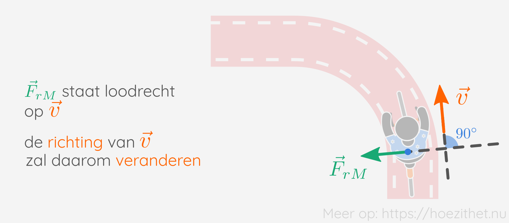

Als er een [resulterende kracht](resulterende_kracht) op een voorwerp
inwerkt, dan zal de **snelheidsvector van dat voorwerp veranderen**. Merk goed
op dat er staat: **"snelheidsvector"** en niet gewoon "snelheid". De
snelheidsvector heeft niet alleen een grootte die kan veranderen, maar ook een
richting. Maar voor we over het veranderen van de snelheidsvector beginnen,
zullen we eerst eens bekijken waarom snelheid juist een vector is.

## Snelheid is een vector

We leerden in een [eerdere les](krachtvector) al dat kracht een
vectoriële grootheid is. Dat betekent dat een kracht een **grootte, richting en
zin** heeft. Net als kracht, is **snelheid ook een vectoriële grootheid**. Zo
is het niet alleen belangrijk hoe snel je rijdt <Mute>(= grootte van de
vector)</Mute>, maar ook waar je naartoe rijdt <Mute>(= richting en zin van
de vector)</Mute>. We schrijven de snelheidsvector als $\vec{v}$.

## Snelheidsverandering

Snelheid is dus een vector. Een vector heeft een grootte en een richting. Als
minstens één van deze verandert, spreken we over **snelheidsverandering**.

<Expand title="En wat met de zin?">

Wanneer de zin van een snelheidsvector verandert, is er natuurlijk ook een
snelheidsverandering. De **zin kan echter niet plots _een beetje_ veranderen**.
Stel dat je met je fiets naar het einde van de straat fietst. Je kan dan niet
plots veranderen van zin en naar het begin van de straat fietsen. Je moet
daarvoor eerst afremmen, draaien en terug versnellen.

De grootte en de richting van de snelheidsvector kunnen wel _een beetje_
veranderen. Vanaf je $20{,} 0~\si{km/h}$ fietst kan je wel plots
$19{,}9~\si{km/h}$ fietsen.

Omdat de zin van de snelheidsvector nooit van het ene moment op het andere kan
veranderen, heeft het niet veel 🤡 zin 🤡 om die in een les over
snelheidsverandering te bespreken.

</Expand>

### Grootte van de snelheid verandert

Wanneer de snelheid vergroot of verkleint, verandert de **grootte** van de
snelheidsvector. Wanneer je bijvoorbeeld sneller begint te trappen op je fiets,
vergroot de vector $\vec{v}$ <Mute>(je gaat sneller vooruit)</Mute>.

Wanneer je remt, verkleint de vector $\vec{v}$ <Mute>(je gaat trager vooruit)</Mute>.

### Richting van de snelheid verandert

Wanneer je een bocht neemt met de fiets, verandert de snelheidsvector $\vec{v}$
ook. **Pas wel op!** Dat betekent **niet** dat je sneller of trager gaat. In
een bocht verandert de snelheidsvector omdat **de richting** van de vector
verandert.

## De resulterende kracht bepaalt de snelheidsverandering

De snelheidsvector kan dus op twee manieren veranderen. Als de **grootte
verandert**, dan **versnel of vertraag** je. En als de **richting verandert**,
dan neem je een **bocht**.

Maar wanneer verandert de grootte en wanneer verandert de richting? Dat hangt
af van hoe de resulterende kracht $\vec{F}_r$ staat ten opzichte van de
snelheidsvector $\vec{v}$.

### Resulterende kracht in de richting van de snelheid

Wanneer de resulterende kracht $\vec{F}_r$ dezelfde richting heeft als de
snelheidsvector $\vec{v}$, dan zal **de grootte van $\vec{v}$ veranderen**. Dat
betekent dus dat het voorwerp zal **versnellen of vertragen**.

Wanneer $\vec{F}_r$ **dezelfde zin** heeft als $\vec{v}$, dan zal het voorwerp
**versnellen**. Stel dat door wrijving met onder andere de wind er een kracht
van $50~\si{N}$ inwerkt op de fietsende Maria. Maria trapt zelf echter met een
kracht van $70~\si{N}$ vooruit. Aan de hand van de
[kop-staartmethode](../../wiskunde/vector_1/grafisch_optellen/#kop-staartmethode)
kunnen we dan de [resulterende
kracht](resulterende_kracht#resulterende-kracht-tekenen) tekenen en zien we
dat $\vec{F}_{rM}$ dezelfde zin heeft als de snelheidsvector. Maria zal dus
**versnellen**.

Wanneer $\vec{F}_r$ een **andere zin** heeft dan $\vec{v}$, dan zal het
voorwerp **vertragen**. Stel bijvoorbeeld dat Maria minder hard begint te
trappen en nu nog slechts met een kracht trapt van $30~\si{N}$. Dan zien we dat
$\vec{F}_{rM}$ nu een andere zin heeft dan $\vec{v}$. Maria zal dus
**vertragen**.

### Resulterende kracht loodrecht op de snelheid

Het kan ook dat $\vec{F}_r$ loodrecht staat op $\vec{v}$. In dat geval zal **de
richting van $\vec{v}$ veranderen**. Het voorwerp zal dus **een bocht nemen**.
Daarbij wijst **$\vec{F}_r$ naar de binnenkant** van de bocht.

Als $\vec{F}_r$ voortdurend loodrecht blijft staan op $\vec{v} $, zonder dat
$\vec{F}_r$ zelf van grootte verandert, dan zal het voorwerp een cirkelvormige
baan volgen.

### Andere gevallen

Wanneer $\vec{F}_r$ niet loodrecht staat op $\vec{v}$, en ook niet dezelfde
richting heeft, dan zullen **zowel de grootte als de richting van $\vec{v}$
veranderen**. Dit is een iets ingewikkeldere situatie waar we later pas verder
op in zullen gaan.

### Geen resulterende kracht? Dan ook geen snelheidsverandering

Tenslotte nog even vermelden dat wanneer de resulterende kracht een grootte
heeft van $0~\si{N}$, dus $\norm{\vec{F}_r} = 0~\si{N}$, dan is er **geen
snelheidsverandering**. Dus geen verandering van grootte en geen verandering
van richting. De snelheidsvector blijft zoals die was.

## Samengevat

<Attention title="Snelheidsverandering">

Zowel de grootte als de richting van de snelheidsvector $\vec{v}$ kunnen veranderen.

Wanneer de **grootte** verandert, **versnelt of vertraagt** het voorwerp. Wanneer de **richting** verandert, **neemt het voorwerp een bocht**.
</Attention>

<Attention title="De resulterende kracht bepaalt de snelheidsverandering">

Wanneer $\vec{F}_r$ **dezelfde richting** en **dezelfde zin** heeft als $\vec{v}$, dan **versnelt** het voorwerp.

Wanneer $\vec{F}_r$ **dezelfde richting** heeft als $\vec{v}$, maar een **verschillende zin**, dan **vertraagt** het voorwerp.

Wanneer $\vec{F}_r$ **loodrecht staat** op $\vec{v}$ dan neemt het voorwerp **een bocht**.
</Attention>
