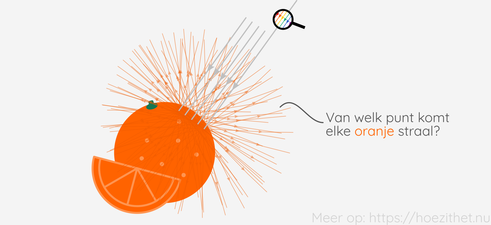

Wanneer wit licht [invalt op een sinaasappel](../absorberen_reflecteren_doorlaten#reflectie-absorptie)
gaan de gereflecteerde lichtstralen alle kanten op. Omdat die oranje
lichtstralen zo kriskras door elkaar gaan, lijkt het onmogelijk om van elke
lichtstraal te weten waar ze vandaan kwam.

Gelukkig is dat wel mogelijk, anders konden onze ogen nooit werken.
**Beeldvorming** is het **samenbrengen van lichtstralen die vanuit dezelfde
plaats vertrokken zijn**. Als we een **scherm** plaatsen op het punt waar de
lichtstralen zijn samengebracht, zien we op dat scherm een **afbeelding** van
het voorwerp <Mute>(bv. de sinaasappel)</Mute>.

De lens van het menselijk oog, bijvoorbeeld, zorgt ervoor dat lichtstralen die
vanuit dezelfde plaats vertrokken zijn, worden samengebracht op het netvlies.
Zoals je ziet, wordt het beeld omgekeerd gevormd op het netvlies, maar daar
hoef je je momenteel geen zorgen over te maken.

De lens van een fototoestel doet hetzelfde, behalve dat die de lichtstralen
samenbrengt op een lichtgevoelige sensor. Ook hier krijgen we een omgekeerd beeld.

## Lichtbundels

Lichtstralen die vanuit een punt op een bloem diffuus gereflecteerd worden,
gaan allerlei kanten op. De **lichtstralen gaan uit elkaar, maar vertrekken
vanuit hetzelfde punt**. We spreken van een **divergerende lichtbundel**.

Wanneer we de bloem willen afbeelden op een scherm, moeten we de lichtstralen
die van dezelfde plaats komen terug kunnen samenbrengen. We willen ervoor
zorgen dat die **lichtstralen naar elkaar toe gaan en opnieuw samenkomen in
hetzelfde punt**. We laten die lichtstralen dus _convergeren_ en spreken van
een **convergerende lichtbundel**.

Lichtstralen die evenwijdig blijven, tenslotte, vormen een **evenwijdige lichtbundel**.

## Camera obscura

De camera obscura <Mute>(Latijn voor "donkere kamer")</Mute> was een van de
eerste apparaten waarmee beeldvorming kon worden gedaan. In haar meest
eenvoudige vorm bestaat ze uit een donkere ruimte met in één van de
wanden een klein gaatje naar de <Mute>(verlichte)</Mute>
buitenwereld.

Het gaatje is zodanig klein dat de lichtstralen die vanuit dezelfde plaats
vertrokken zijn en door het gaatje gaan, niet zo veel uit elkaar zijn gegaan
wanneer ze op de overstaande wand botsen. Hierdoor **verschijnt er op de wand
tegenover het gaatje een vrij scherp beeld**.

Omdat lichtstralen zich <Mute>door een homogene middenstof</Mute>
[rechtlijnig voortplanten](../voortplanting#lichtstralen-gaan-in-een-rechte-lijn) en
alle lichtstralen die op de overstaande wand geraken, door het gaatje
moeten, zien we een **omgedraaid beeld**.

Omdat het gaatje zo klein is, zijn er heel weinig lichtstralen die tot de
overstaande wand geraken en mee het beeld vormen. Daardoor is het beeld heel
**flets**. We zouden dat kunnen tegengaan door het **gaatje te vergroten**,
maar dan zal het **beeld onscherp worden**.

De oplossing hiervoor is om het beeld **scherp te stellen met behulp van
lenzen**. Hoe lenzen hiervoor kunnen zorgen, zien we in de lessen over
lichtbreking.
