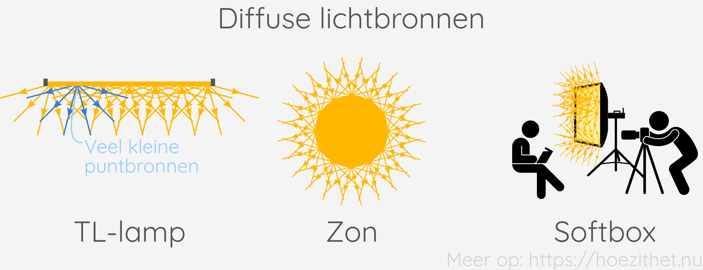
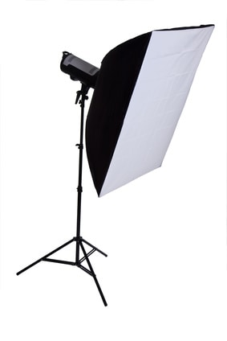

Wanneer een voorwerp van zichzelf **licht produceert**, noemen we dat voorwerp
een **lichtbron**. Voorbeelden hiervan zijn de zon, de sterren, gloeilampen,
tl-lampen, ledlampjes etc. Wanneer een object **géén licht produceert**, noemen
we dat een **donker lichaam**.

## Donkere lichamen

Alles wat van zichzelf geen licht kan geven, noemen we een _donker lichaam_.
Die voorwerpen kunnen we enkel zien wanneer een lichtbron er licht op schijnt.
De meeste voorwerpen zijn donkere lichamen, bijvoorbeeld een bloem, een
LEGO-mannetje of een sinaasappel. Wat zeker géén donkere lichamen zijn: een
brandende gloeilamp en de zon.

## Puntvormige en diffuse lichtbronnen

Qua lichtbronnen kunnen we onderscheid maken tussen een _puntvormige_ en een
_diffuse_ lichtbron. Een puntvormige lichtbron is een **kleine lichtbron** en
zendt **lichtstralen uit die elkaar snijden in hetzelfde punt**, namelijk de
puntvormige lichtbron zelf.

Een **diffuse lichtbron zendt lichtstralen in willekeurige richtingen** uit en
heeft typisch een vrij **grote vorm**. Het is
eigenlijk een verzameling van heel veel puntvormige lichtbronnen.

<Expand>

De flitsende fotograaf

Fotografen moeten voortdurend nadenken over de lichtbron die ze gebruiken. Een
puntvormige lichtbron <Mute>(zoals de flitser op een fototoestel)</Mute> zorgt
namelijk voor schaduwen met heel scherpe randen, wat geen mooie foto oplevert.

 en zachte schaduwen (rechts).")

Meestal willen fotografen de lichtbron dan ook **zo groot mogelijk krijgen**.
In een fotostudio doen ze dat door hun flits door een **doorschijnende
paraplu** te laten gaan. Een andere mogelijkheid is om een _diffuser_ op de
flits te klikken of met behulp van een **softbox**.

</Expand>
