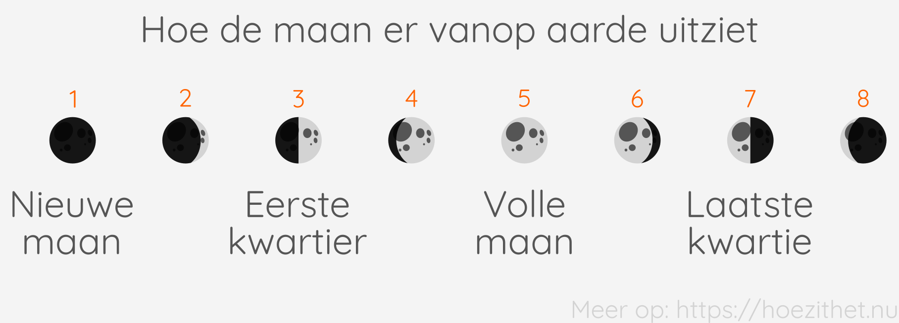
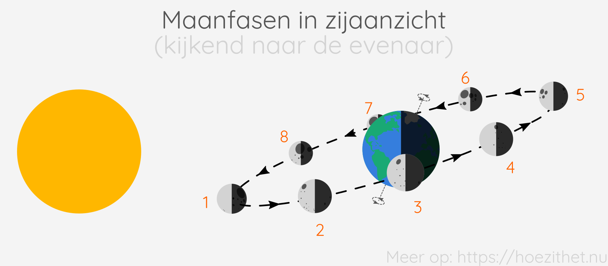
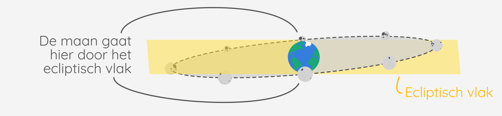
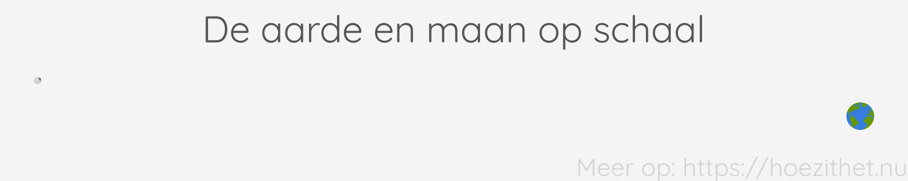
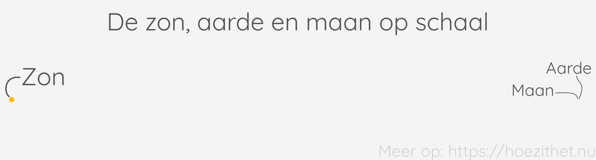
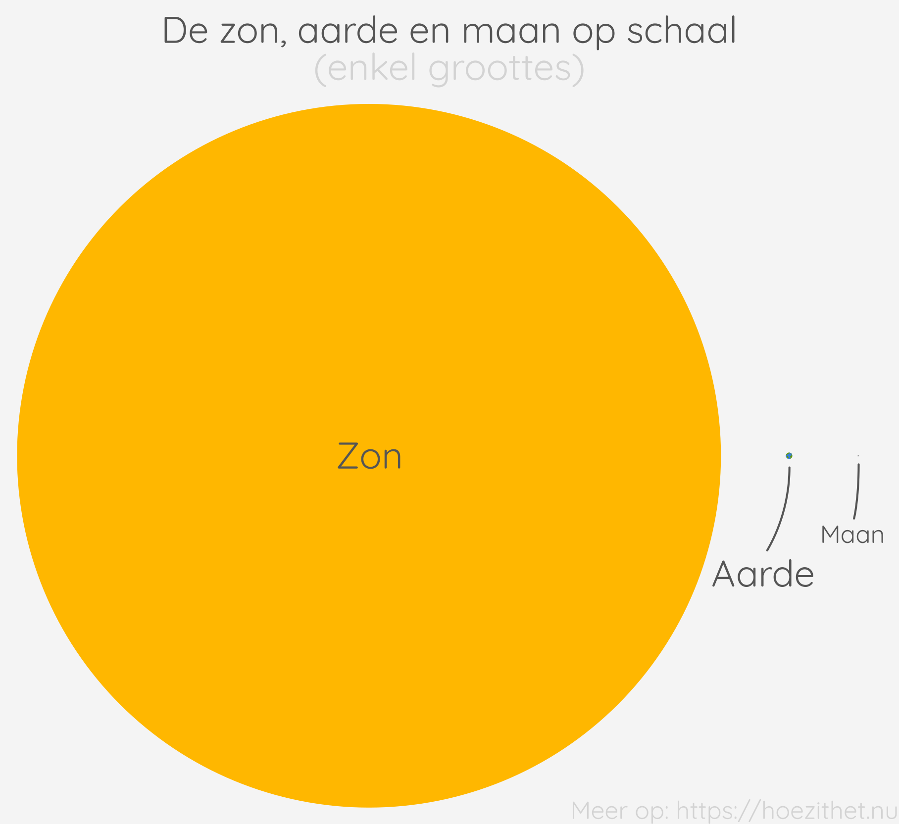

Een zonsverduistering is een mooi voorbeeld van de
[schaduw gecreëerd door een diffuse lichtbron](schaduwvorming#de-schaduw-tekenen-van-een-diffuse-lichtbron).
Om in de sfeer van de hemellichamen te blijven, zullen we ook meteen de
maanfasen en maansverduistering bespreken.

## Zonsverduistering

De zon is een [diffuse lichtbron](lichtstralen#puntvormige-en-diffuse-lichtbronnen).
Hierdoor zal een belicht voorwerp een
[bijschaduw en soms een kernschaduw](schaduwvorming#diffuse-lichtbron-zachte-schaduw)
hebben. Een voorbeeld hiervan is een **totale zonsverduistering**. Daarbij
staan de zon, de maan en de aarde ongeveer op één lijn waardoor er een grote
schaduw van de maan op de aarde valt.


Het is belangrijk te beseffen dat het bovenstaande schema **niet op schaal**
is. Dat wil zeggen dat de verhoudingen van de groottes van de aarde, de maan
en de zon anders zijn op de tekening dan in werkelijkheid. Ook de afstanden
tussen de aarde, de maan en de zon zijn niet realistisch op het schema. Als we
het schema op schaal zouden tekenen, dan zou je de aarde en de maan gewoon niet
kunnen zien omdat ze zoveel kleiner zijn dan de zon en er heel ver vandaan
zijn. Uit nieuwsgierigheid heb ik op het einde van deze les toch eens
[een tekening op schaal gemaakt](#de-aarde-de-zon-en-de-maan-op-schaal) van
deze drie hemellichamen.


Daar waar de kernschaduw op de aarde valt, ziet een totale zonsverduistering er
als volgt uit:

")

In de gebieden waar de **bijschaduw** van de maan valt, is er een **gedeeltelijke zonsverduistering**.

")


De afstand tussen de aarde en de maan schommelt tussen ca. 360 000 km en ca.
410 000 km. Enkel wanneer de man voldoende dicht bij de aarde staat, kan er een
**totale zonsverduistering** zijn. Wanneer de maan te ver van de aarde staat,
maar wel in één lijn staat met de zon en de aarde, ontstaat er een
**ringvormige zonsverduistering**. Vanop aarde ziet dat er zo uit:

")

Ringvormige zonsverduisteringen komen vaker voor dan totale
zonsverduisteringen. Per anderhalf jaar zijn er gemiddeld een vijftal
zonsverduisteringen. Die kunnen eender waar op aarde plaatsvinden.
Meestal is slechts één daarvan een totale zonsverduistering en zijn de rest
ringvormige zonsverduisteringen.


## De maanfasen

Ruwweg gezegd draait de maan rond de aarde en de aarde rond de zon. Eén rondje
van de aarde rond de zon duurt ongeveer een jaar. Eén rondje van de maan rond
de aarde duurt ongeveer een **maan**d
{{< mute "($27{,}321661$ dagen om precies te zijn)" >}}.
Terwijl de maan rond de aarde draait, lijkt vanop aarde de maan
verschillende vormen aan te nemen: soms een volledige cirkel 🌝, soms
iets sikkelvormig 🌛. Dit noemen we de **schijngestalten van de maan** of de
**maanfasen**.

Vanuit de ruimte wordt het duidelijk waar deze schijngestalten vandaan komen.
Terwijl de maan rond de aarde draait, kijken we vanop aarde naar een andere
kant van de schaduw.


In "bovenaanzicht" ziet de situatie er als volgt uit.


## Maansverduistering

De maan draait rond de aarde in een hellend vlak dat een hoek maakt van
ongeveer 5° met het vlak waarin de aarde rond de zon draait (het _ecliptisch
vlak_).

Enkel wanneer de maan **door het ecliptisch vlak beweegt**, kunnen de zon, de aarde
en de maan op één lijn komen te staan. Dat gebeurt slechts twee keer per maand, zoals getoond op deze figuur:

Wanneer de maan door het ecliptisch vlak gaat en de zon toevallig in dezelfde
lijn als de maan en de aarde staat, kan er een zonsverduistering of een
maansverduistering gebeuren. Een **zonsverduistering** ([daarnet](#zonsverduistering) besproken) gebeurt als **de maan tussen de aarde en de
zon staat** . Een **maansverduistering**, daarentegen, kan enkel als **de aarde
tussen de maan en de zon staat**  op het moment dat de maan door het ecliptisch
vlak beweegt.

## De aarde, de zon en de maan op schaal

Sterren, planeten en manen **staan enorm ver van elkaar**, zelfs binnen
eenzelfde zonnestelsel. Ook zijn er **immense verschillen in hoe groot**
verschillende hemellichamen zijn.
Illustraties met meerdere hemellichamen zullen
daarom bijna nooit op ware schaal getekend  worden.

Dat is ook het geval bij alle bovenstaande illustraties met de zon, de aarde en
de maan. Om je toch een idee te geven van de enorme afstanden tussen deze
hemellichamen, heb ik hieronder de aarde en de maan eens op ware schaal
getekend. In werkelijkheid is **de afstand van de aarde tot de maan ongeveer
$380{\ }000\si{ km}$**. De aarde heeft een diameter van
$12{\ }756 \si { km}$ en de maan van $3476\si{ km}$.

De **afstand tussen de aarde en de zon is ongeveer $149{\ }600{\ }000 \si{ km}$**
en is dus nog veel groter dan de afstand tussen
de aarde en de maan. Ook is het verschil in grootte enorm: de zon heeft een
diameter van $1{\ }393{\ }000 \si{ km}$.

Om je een duidelijker idee te geven van hoe groot de
aarde, zon en maan zijn ten opzicht van elkaar nog één laatste figuur. Hierop
zijn de hemellichamen vlak naast elkaar gezet en zijn enkel de groottes van de
hemellichamen op schaal getekend.

