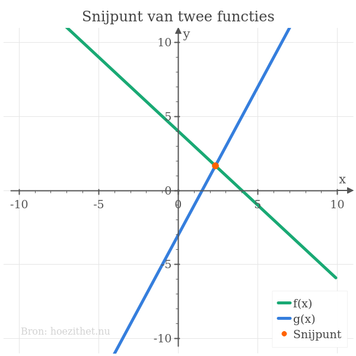
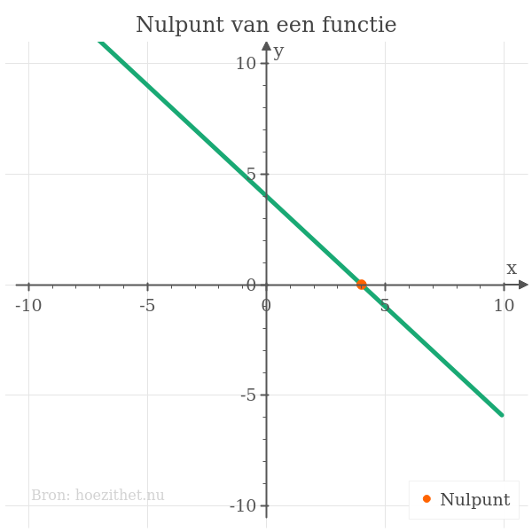

[Vergelijkingen](intro) en [functies](../functies/intro) zijn zeer nauw
met elkaar verbonden. Twee belangrijke toepassingen van vergelijkingen zijn dan
ook

1. De snijpunten zoeken van twee functies;
2. De nulpunten zoeken van twee functies.

In deze les bespreken we deze toepassingen in het geval van
[eerstegraadsvergelijkingen met één onbekende](oplossen).

## Snijpunten van functies

Stel dat we twee functies $\green{f}$ en $\blue{g}$ hebben waarbij

\begin{split}
\green{f(x)} &= -x + 4\\\\\
 \blue{g(x)} &= 2x - 3
\end{split}

De [grafiek](../functies/grafiek) van deze functies ziet er als volgt uit:

Het oranje punt duidt het  aan van de twee functies. Hoe kunnen we de coördinaten van dit snijpunt vinden?

Een snijpunt is een punt dat zowel op de grafiek van $\green{f}$ als op de grafiek van $\blue{g}$ ligt. Denkend aan onze analogie van [het machientje](../functies/intro#een-functie-is-een-machientje), is de $x-$waarde van een snijpunt een **ingang die voor zowel $\green{f}$ als $\blue{g}$ dezelfde uitgang geeft**.

Als $\orange{x}$ de $x-$coördinaat van een snijpunt is, dan is dus $\green{f(\orange{x})} = \blue{g(\orange{x})}$, of wanneer we $\orange{x}$ invullen in het voorschrift van $\green{f}$ en $\blue{g}$:

\begin{split}
\green{f(\orange{x})} &= \blue{g(\orange{x})}\\\\\
\Leftrightarrow \green{-\orange{x} + 4} &= \blue{2\orange{x} - 3}
\end{split}

En **poef** ✨🧙! We krijgen een **vergelijking**. Als we deze [vergelijking
oplossen](eerste_graad), vinden we de $x-$coördinaat van het snijpunt van
$\green{f}$ en $\blue{g}$:

\begin{split}
-\orange{x} + 4 &= 2\orange{x} - 3\\\\\
 \Leftrightarrow -3\orange{x} + 4 &= - 3\\\\\
 \Leftrightarrow -3\orange{x} &= - 7\\\\\
 \Leftrightarrow \orange{x} &= \frac{7}{3}\\\\\
\end{split}


\begin{split}
-x + 4 &= 2x - 3\\\\\
 \Leftrightarrow -x + 4 \pink{- 2x} &= 2x - 3 \pink{- 2x}\\\\\
 \Leftrightarrow \udot{-x} + 4 \udot{\pink{- 2x}} &= \cancelto{0}{2x \pink{- 2x}} - 3\\\\\
 \Leftrightarrow \udot{-3x} + 4 &= - 3\\\\\
 \Leftrightarrow -3x + 4 \pink{-4} &= - 3 \pink{-4}\\\\\
 \Leftrightarrow -3x + \cancelto{0}{4 \pink{-4}} &= \udot{- 3 \pink{-4}}\\\\\
 \Leftrightarrow -3x &= \udot{- 7}\\\\\
 \Leftrightarrow \frac{-3x}{\pink{-3}} &= \frac{- 7}{\pink{-3}}\\\\\
 \Leftrightarrow \cancelto{1}{\frac{-3}{\pink{-3}}}\cdot x &= \frac{- 7}{\pink{-3}}\\\\\
 \Leftrightarrow x &= \frac{7}{3}\\\\\
\end{split}


De $x-$coördinaat van het snijpunt van $\green{f}$ en $\blue{g}$ is dus
$\orange{\frac{7}{3}}$. We kunnen dit controleren door $\orange{\frac{7}{3}}$ in te vullen in $\green{f}$ en $\blue{g}$:

\begin{split}
\green{f(\orange{\frac{7}{3}})} &= -\orange{\frac{7}{3}} + 4\\\\\
 &= \frac{-7}{3} + \frac{12}{3}\\\\\
 &= \bbox[1pt,border: 2px dotted #ff6300]{\frac{5}{3}}
\end{split}

\begin{split}
\blue{g(\orange{\frac{7}{3}})} &= 2\cdot \orange{\frac{7}{3}} - 3\\\\\
 &= \frac{14}{3} - 3\\\\\
 &= \frac{14}{3} - \frac{9}{3}\\\\\
 &= \bbox[1pt,border: 2px dotted #ff6300]{\frac{5}{3}}
\end{split}

Inderdaad, $\green{f(}\orange{\frac{7}{3}}\green{)} = \bbox[1pt,border: 2px dotted #ff6300]{\frac{5}{3}}$ en $\blue{g(}\orange{\frac{7}{3}}\blue{)} = \bbox[1pt,border: 2px dotted #ff6300]{\frac{5}{3}}$! De coördinaten van het snijpunt zijn dan $(\orange{\frac{7}{3}}, \bbox[1pt,border: 2px dotted #ff6300]{\frac{5}{3}})$.

Op de grafiek bovenaan zien we dat dit punt inderdaad overeenkomt met het snijpunt van de twee functies.

## Nulpunten zoeken van functies

Als we een  van een functie in die functie stoppen, komt er $0$ uit de functie.

Stel dat $\orange{x}$ een [nulwaarde](../functies/nulpunten#nulwaarden-van-een-functie) van functie $f(x) = -x + 4$ is, dan is $f(\orange{x}) = 0$, of na invullen:
$$-\orange{x} + 4 = 0$$

En we krijgen een vergelijking! Wanneer we deze oplossen, vinden we de  van de functie.

\begin{split}
-\orange{x} + 4 &= 0\\\\\
\Leftrightarrow -\orange{x} &= - 4\\\\\
\Leftrightarrow \orange{x} &= 4
\end{split}

En inderdaad, $f(\orange{4}) = -\orange{4} + 4 = 0$! De nulwaarde is dus
$\orange{4}$ en het nulpunt is $(\orange{4}, 0)$
.
Dit kan je ook zien op onderstaande grafiek:

## Samengevat


De **snijpunten** van twee functies $f(x)$ en $g(x)$ vind je door eerst de twee **[functievoorschriften](../functies/voorschrift) aan elkaar gelijk te stellen**:

\begin{split}
f(x) &= g(x)\\\\\
\Leftrightarrow \text{(...voorschrift van } f\text{...)} &= \text{(...voorschrift van } g\text{...)}
\end{split}

De oplossing van deze vergelijking geeft de $x-$coördinaat van elk snijpunt. Als je elke $x-$coördinaat in $f(x)$ of $g(x)$ invult, krijg je de bijhorende $y-$coördinaat.



De **nulpunten** van een functie $f(x)$ vind je door het **[functievoorschrift](../functies/voorschrift) gelijk aan nul te stellen**:

\begin{split}
f(x) &= 0\\\\\
\Leftrightarrow \text{(...voorschrift van } f\text{...)} &= 0
\end{split}

De oplossing van deze vergelijking geeft de $x-$coördinaat van elk nulpunt (de nulwaarde). De $y-$coördinaat van een **nul**punt is uiteraard altijd $0$.

