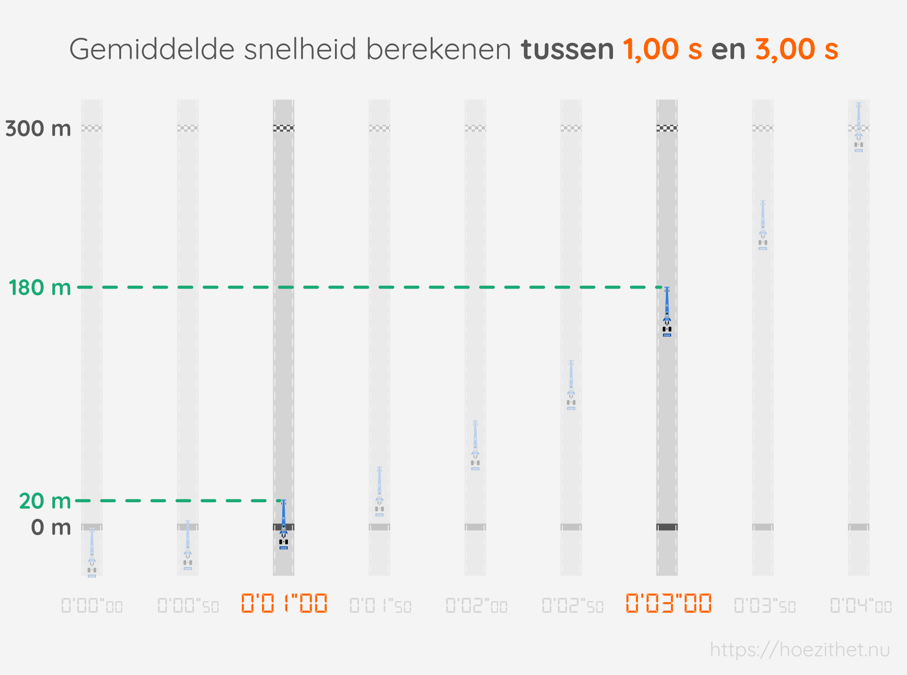
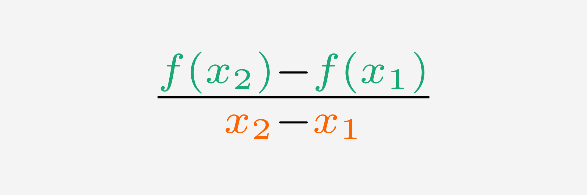
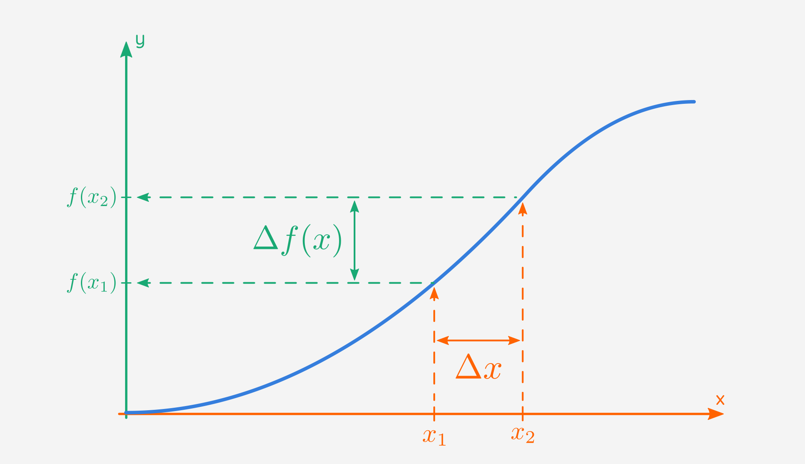
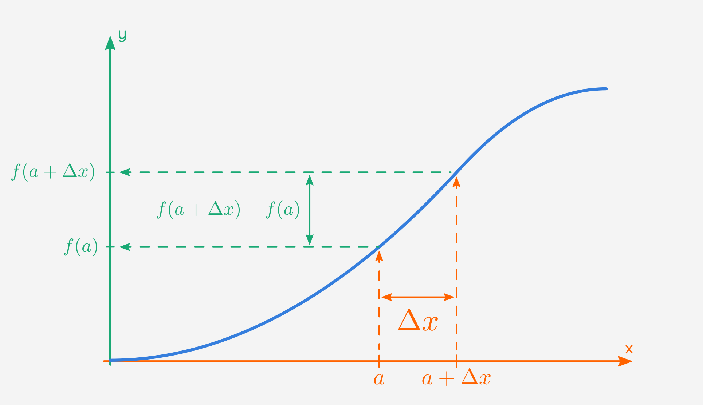

Vooraleer we aan afgeleiden kunnen beginnen, moeten we het
**differentiequotiënt** begrijpen. Wat een monster van een woord! 🦕 Maar geen
paniek. We gaan het stap voor stap uitleggen aan de hand van iets waar je wel
al ervaring mee zal hebben: het berekenen van de gemiddelde snelheid.

## Gemiddelde snelheid als een breuk van twee verschillen

Maria houdt van dragracen. Bij een dragrace vertrekken twee wagens vanuit
stilstand en racen ze $300~\si{m}$ in een rechte lijn. De eerste aan de finish
wint.

De wagens halen enorme snelheden tot meer dan $500~\si{km/h}$. Hieronder zie je
enkele luchtfoto's van Maria in haar _Top Fuel dragster_ tijdens het dragracen.

Stel dat we Maria's gemiddelde snelheid willen berekenen
tussen $\orange{1{,}00~\si{s}}$ en $\orange{3{,}00~\si{s}}$.

Daarvoor moeten we de **afgelegde afstand** <Mute text="(hoeveel (kilo)meter?)"
/> delen door de **tijd die nodig was** <Mute text="(hoeveel uur of seconden?)"
/> om die afstand af te leggen:

$$
\begin{aligned}
\text{gem. snelheid} &= \frac{\green{\text{afgelegde afstand} }}{\orange{\text{tijd die nodig was}}}\\
\end{aligned}
$$

Wanneer de chronometer op $\orange{1{,}00~\si{s}}$ stond, was Maria
$\green{20~\si{m}}$ ver. Bij $\orange{3{,}00~\si{s}}$, was ze
$\green{180~\si{m}}$ ver. De gemiddelde snelheid tussen
$\orange{1{,}00~\si{s}}$ en $\orange{3{,}00~\si{s}}$ is dus:

$$
\begin{aligned}
\text{gem. snelheid} &= \frac{\green{\text{afgelegde afstand} }}{\orange{\text{tijd die nodig was}}}\\
 &= \frac{\green{180~\si{m}} - \green{20~\si{m}}}{\orange{3{,}00~\si{s}} - \orange{1{,}00~\si{s}}}\\
 &= \frac{\green{160~\si{m}}}{\orange{2{,}00~\si{s}}}\\
 &= 80{,}0~\si{m/s}\\
 &= 288~\si{km/h}
\end{aligned}
$$

Lekker snel! 🚀

Je ziet dat we voor de afgelegde afstand en de tijd die nodig was telkens een
**verschil** berekenen. Voor de afstand is dat het **verschil tussen de tweede
positie** ($\green{180~\si{m}}$) **en de eerste positie**
($\green{20~\si{m}}$). Voor de tijd is dat het **verschil tussen de tweede
tijd** ($\orange{3{,}00~\si{s}}$) **en de eerste tijd**
($\orange{1{,}00~\si{s}}$). Die twee verschillen zetten we vervolgens in een
**breuk** met in de teller <Mute>(boven)</Mute> het verschil van posities en 
in de noemer <Mute>(onder)</Mute> het
verschil van tijden. We kunnen de formule voor gemiddelde snelheid dus ook als
volgt schrijven:

$$
\text{gem. snelheid} = \frac{\green{\text{positie}_2} - \green{\text{positie}_1}}{\orange{\text{tijd}_2} - \orange{\text{tijd}_1}}
$$

## Gemiddelde snelheid veralgemenen naar het differentiequotiënt

Stel nu dat we de $\orange{\text{tijd}}$ op de chronometer "$\orange{x}$"
noemen. Maria kan op een bepaald tijdstip $\orange{x}$ natuurlijk maar op één
plaats tegelijk zijn. Met elke tijd $\orange{x}$ op de chronometer komt dus
_hooguit één_ $\green{\text{positie}}$ overeen. Daarom mogen we zeggen dat
Maria's **positie een functie is van de tijd**.

> Als je niet meer goed weet vanaf wanneer een verband tussen twee variabelen
> (zoals positie en tijd) een functie is, kan je altijd onze
> [les over functies](../../functies/intro) eens nalezen.

We kunnen de **positie** die overeenkomt met tijdstip $\orange{x}$ dus **de
functiewaarde van $\orange{x}$** noemen en afkorten als $\green{f(x)}$. Wanneer
we op de luchtfoto's de racewagens met elkaar verbinden, zien we inderdaad dat
de posities mooi de [grafiek van een functie](../../functies/grafiek) volgen
waarbij de **tijd op de x-as** <Mute>(horizontale as)</Mute> staat en de
**positie op de y-as** <Mute>(verticale as)</Mute>:

We kunnen nu onze formule voor gemiddelde snelheid korter schrijven waarbij we

-   $\green{\text{positie}_2}$ en $\green{\text{positie}_1}$ vervangen door
    $\green{f(x_2)}$ en $\green{f(x_1)}$
-   $\orange{\text{tijd}_2}$ en $\orange{\text{tijd}_1}$ vervangen door
    $\orange{x_2}$ en $\orange{x_1}$

Zo krijgen we:

$$
\frac{\green{f(x_2)} - \green{f(x_1)}}{\orange{x_2} - \orange{x_1}}
$$

-   In de teller <Mute>(boven)</Mute> staat $\green{f(x_2)} -
  \green{f(x_1)}$. Daarmee berekenen we het verschil van de functiewaarden van
    $x_2$ en $x_1$. **De teller zegt zo hoeveel de functiewaarde is veranderd**
    tussen $x_1$ en $x_2$.
-   In de noemer <Mute>(onder)</Mute> staat dan weer het verschil van die
    $x_2$ en $x_1$ zélf. Door te delen door $\orange{x_2} - \orange{x_1}$
    berekenen we de "**gemiddelde** verandering van de functiewaarde **per
    $x-$eenheid** <Mute>(bv. per seconde)</Mute> tussen $x_1$ en $x_2$" in
    plaats van gewoon de "verandering van de functiewaarde tussen $x_1$ en
    $x_2$".

<Expand title="Waarom zorgt die deling door $\orange{x_2} - \orange{x_1}$ voor een gemiddelde?">

Stel dat je de **gemiddelde** score wilt berekenen die de leerlingen van een bepaalde klas haalden op een test. Dan ga je alle punten optellen en **delen door het totaal aantal testen**. Door te delen door het totaal aantal testen, krijg je de gemiddelde score **per test**.

Op dezelfde manier krijgen we de **gemiddelde** verandering van de functiewaarde **per $x-$eenheid** door te delen door $\orange{x_2} - \orange{x_1}$.

</Expand>

We zeggen dat deze formule de **gemiddelde verandering van de functiewaarde** berekent per $x-$eenheid tussen $\orange{x_1}$ en $\orange{x_2}$.

<ToggleImage toggleText="Toon uitleg">

</ToggleImage>

Het is belangrijk om te weten dat we die formule niet enkel kunnen gebruiken om gemiddelde snelheid te berekenen, maar voor nog veel andere soorten van _gemiddelde verandering_.
De formule wordt zelfs zo vaak gebruikt, dat ze een eigen naam heeft gekregen: het **differentiequotiënt**.

<Expand title="Waar komt de naam differentiequotiënt vandaan?">

Nu denk je misschien: "Een differ-**watte**?! 🤨" Waar komt die
naam vandaan? Het woord bestaat uit twee stukken:

1. **differentie-**: moeilijk woord voor een _aftrekking_ of _verschil_, denk
   maar aan het Engelse woord _difference_. Dit wijst erop dat er een
   **verschil wordt berekend** in de teller en noemer.
2. **-quotiënt**: moeilijk woord voor een _deling_ of een _breuk_. Dit wijst
   op het feit dat **het ene verschil wordt gedeeld door het andere**.

</Expand>

## Het verschil korter schrijven

Tot slot gaan we het differentiequotiënt nog een tikkeltje korter leren
schrijven. Verschillen als "$\green{f(x_2)} - \green{f(x_1)}$" en
"$\orange{x_2} - \orange{x_1}$" komen namelijk vaak voor en het is lastig om
die telkens voluit te moeten schrijven. Daarom gaan we zulke verschillen
afkorten. Hiervoor gebruiken we de Griekse hoofdletter $\Delta$ (de delta):

$$
\begin{aligned}
\green{f(x_2)} - \green{f(x_1)} &= \green{\Delta f(x)}\\
 \orange{x_2} - \orange{x_1} &= \orange{\Delta x}
\end{aligned}
$$

Die "$\Delta$" lijkt wat overweldigend, maar is eigenlijk niets meer dan een
verkorte schrijfwijze. Met behulp van deze $\Delta$, kunnen we het
differentiequotiënt als volgt afkorten:

$$
\frac{\green{f(x_2)} - \green{f(x_1)}}{\orange{x_2} - \orange{x_1}} = \frac{\green{\Delta f(x)}}{\orange{\Delta x}}
$$

Op een grafiek kan je $\green{\Delta f(x)}$ en $\orange{\Delta x}$ ook aanduiden:

Je zult het waarschijnlijk niet graag horen, maar er is nog een derde en laatste manier om het differentiequotiënt te schrijven. Daarbij gaan we drie dingen veranderen aan de oorspronkelijke formule van het differentiequotiënt:

1. Vervang $\orange{x_2} - \orange{x_1}$ door $\orange{\Delta x}$: 
$$
\frac{\green{f(x_2)} - \green{f(x_1)}}{\orange{\Delta x}}
$$

2. Vervang $x_2$ door $x_1 + \Delta x$: 
$$
\frac{\green{f(x_1 + \Delta x)} - \green{f(x_1)}}{\orange{\Delta x}}
$$

3. Vervang $x_1$ overal door $a$: 
$$
\frac{\green{f(a + \Delta x)} - \green{f(a)}}{\orange{\Delta x}}
$$

Dat ziet er grafisch zo uit:

We hebben nu drie verschillende manieren gezien om het differentiequotiënt te schrijven:

1. 
$$
\frac{\green{f(x_2)} - \green{f(x_1)}}{\orange{x_2} - \orange{x_1}}
$$

2. 
$$
\frac{\green{\Delta f(x)}}{\orange{\Delta x}}
$$

3. 
$$
\frac{\green{f(a + \Delta x)} - \green{f(a)}}{\orange{\Delta x}}
$$

Het is belangrijk om in te zien dat deze alle drie **identiek dezelfde berekening** maken. De berekening wordt enkel anders _verwoord_. Kijk dus nog eens extra naar de drie formules voor het differentiequotiënt, bekijk de bijhorende grafieken nogmaals en zorg dat je de gelijkenis begrijpt.

## Samengevat

<Attention title="Wat is een differentiequotiënt?">

Een differentiequotiënt zegt hoeveel de $\green{\text{functiewaarde}}$
gemiddeld $\orange{\text{per x-eenheid}}$ verandert tussen een gekozen
$\orange{x_1}$ en $\orange{x_2}$.

Het differentiequotiënt is gedefinieerd als:

$$
\frac{\green{f(x_2)} - \green{f(x_1)}}{\orange{x_2} - \orange{x_1}}
$$

Door $\green{f(x_2) - f(x_1)}$ te vervangen door $\green{\Delta f(x)}$ en $\orange{x_2 - x_1}$ door $\orange{\Delta x}$, kunnen we het differentiequotiënt ook schrijven als:

$$
\frac{\green{\Delta f(x)}}{\orange{\Delta x}}
$$

Een andere schrijfwijze vervangt $\orange{x_2} - \orange{x_1}$ door $\orange{\Delta x}$, $\green{f(x_2)}$ door $\green{f(x_1 + \Delta x)}$ en vervangt ten slotte $\green{x_1}$ overal door $\green{a}$:

$$
\frac{\green{f(a + \Delta x)} - \green{f(a)}}{\orange{\Delta x}}
$$

</Attention>
