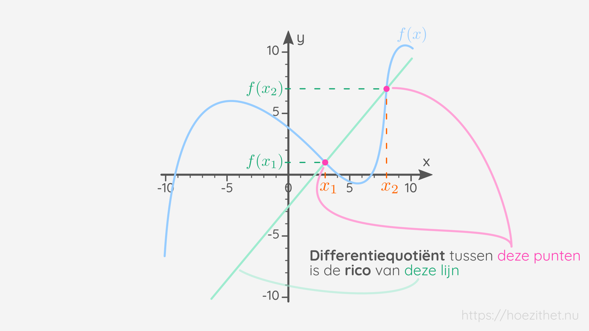
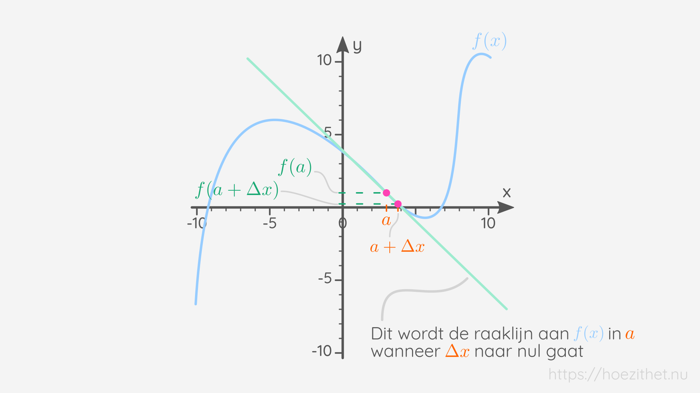

We hebben al geleerd hoe we de ogenblikkelijke verandering, of de _afgeleide_,
van een functie $f(x)$ in een punt $x = a$ kunnen berekenen:

$$
 f'(a) = \lim_{\Delta x \to 0} \frac{ \green{f(a + \Delta x)} - \green{f(a)} }{\orange{\Delta x}} 
$$

> Komt deze formule wat uit de lucht gevallen voor jou? 🤨 Lees dan zeker onze
> [les over het berekenen van de afgeleide in een punt](afgeleide) en onze
> [les over het differentiequotiënt](differentiequotient) eens na.

In deze les gaan we leren dat deze formule eigenlijk ook de formule is voor het
berekenen van de **richtingscoëfficiënt van de raaklijn** aan de grafiek van de
functie $f(x)$ voor $x = a$. Wat een mond vol! 🤯 Maar geen paniek, we leggen
het je stap voor stap uit!

## Wat was dat weer, een _rico_?

De **richtingscoëfficiënt** (afgekort _"rico"_) van een eerstegraadsfunctie is
een maat voor **hoe steil** de rechte is <Mute>(herinner je dat een
eerstegraadsfunctie altijd een rechte is)</Mute>.  Je kan de rico van een
eerstegraadsfunctie als volgt uit de grafiek van de functie halen:

1. Ga ergens op de rechte staan, maakt niet uit waar
2. Schuif één stapje <Mute>(een eenheid)</Mute> op in de x-richting
3. Kijk hoeveel de rechte is gedaald of gestegen. Als de rechte is **gedaald**,
   is de rico **negatief**. Als de rechte is **gestegen**, is de rico
   **positief**.

## Hoe berekenen we die _rico_ weer?

De rico is dus hoeveel een eerstegraadsfunctie stijgt of daalt wanneer je één
x-eenheid opschuift naar rechts. Stel dat we eens stoer willen doen, en we
schuiven _twee_ eenheden op naar rechts of zelfs _drie eenheden_ 😎 en kijken
hoeveel we gestegen of gedaald zijn. Die getallen gaan natuurlijk niet meer
gelijk zijn aan onze rico. Maar zie je een verband met de rico?

Je ziet dat als we _twee_ eenheden opschuiven, we ook met _twee_ keer de rico
zullen stijgen of dalen. En als we _drie_ eenheden opschuiven, zullen we ook
met _drie_ keer de rico stijgen of dalen. Als we **hoeveel we stijgen of
dalen** dus gaan **delen door het aantal stappen opzij**, dan krijgen we
_altijd_ de rico! 💡

$$
\text{rico} = \frac{\green{\text{hoeveel we stijgen of dalen}}}{\orange{\text{aantal stappen opzij}}}
$$

Het aantal stappen opzij is eigenlijk hetzelfde als hoeveel verschil er zit
tussen de _x-waarde_ van het rechtse punt en de _x-waarde_ van het linkse punt.
We zullen de x-waarde van het rechtse punt $\orange{x_2}$ noemen en de
x-waarde van het linkse punt $\orange{x_1}$:

$$
\text{rico} = \frac{\green{\text{hoeveel we stijgen of dalen}}}{\orange{x_2} - \orange{x_1}}
$$

Hoeveel we stijgen of dalen, is dan weer hetzelfde als hoeveel verschil er zit
tussen de _y-waarde_ van het rechtse punt en de _y-waarde_ van het linkse punt.
De y-waarde van het rechtse punt is hetzelfde als de _functiewaarde_ van
$x_2$. Die kunnen we dus schrijven als $\green{f(x_2)}$. Zo is ook de
y-waarde van het _linkse_ punt hetzelfde als de functiewaarde van $x_1$, of
$\green{f(x_1)}$:

$$
\text{rico} = \frac{\green{f(x_2)} - \green{f(x_1)}}{\orange{\orange{x_2} - \orange{x_1}}}
$$

Dit is de formule voor het berekenen van de rico van een eerstegraadsfunctie
$f(x)$!

## Het differentiequotiënt is ook een rico

Wanneer we de formule voor de rico van een eerstegraadsfunctie eens goed
bekijken, zien we toch wel opvallende gelijkenissen met de formule voor het
[differentiequotiënt](differentiequotient):

| Formule voor de rico van een eerstegraadsfunctie                                     | Formule voor het differentiequotiënt                                                 |
| ------------------------------------------------------------------------------------ | ------------------------------------------------------------------------------------ |
| $$ \frac{\green{f(x_2)} - \green{f(x_1)}}{\orange{\orange{x_2} - \orange{x_1}}} $$ | $$ \frac{\green{f(x_2)} - \green{f(x_1)}}{\orange{\orange{x_2} - \orange{x_1}}} $$ |

De formule voor de **rico en het differentiequotiënt zijn identiek dezelfde**!
Wat betekent dat? Wel, wanneer we een differentiequotiënt berekenen, berekenen
we eigenlijk ook de **rico** van de eerstegraadsfunctie <Mute>(of de
rechte)</Mute> die door de punten met coördinaten $(\orange{x_1},
\green{f(x_1)})$ en $(\orange{x_2}, \green{f(x_2)})$ gaat!

## De limiet zorgt voor een raaklijn

In onze les over de [afgeleide in een punt](afgeleide) zagen we dat we de
afgeleide van een functie in $x = a$ vinden door het differentiequotiënt
te berekenen waarbij we $\Delta x$ <Mute>(of $x_2 - x_1$)</Mute> naar $0$
laten gaan:

$$
 f'(a) = \lim_{\Delta x \to 0} \frac{ \green{f(a + \Delta x)} - \green{f(a)} }{\orange{\Delta x}} 
$$

Als $\Delta x$ naar $0$ gaat, betekent het dat de twee punten waartussen we het
differentiequotiënt berekenen steeds **dichter en dichter** bij elkaar komen.

Wat gebeurt er nu wanneer we telkens een lijn zouden trekken door twee punten
op een functie die steeds dichter en dichter bij elkaar komen? We zien op de
grafiek dat die lijn een **raaklijn** aan de grafiek is wanneer de twee punten
héél dicht bij elkaar zijn.

De **limiet** in de formule van de afgeleide zorgt er dus voor dat we het
**differentiequotiënt** gaan berekenen tussen twee punten die **op de
raaklijn** van de functie in $x = a$ liggen.

## De afgeleide is de rico van de raaklijn in $x = a$

In de voorgaande paragrafen hebben we twee dingen geleerd:

1. Het berekenen van het differentiequotiënt tussen twee punten
   $(\orange{x_1}, \green{f(x_1)})$ en $(\orange{x_2}, \green{f(x_2)})$ is
   hetzelfde als het berekenen van de **rico van de eerstegraadsfunctie** die
   door de punten met coördinaten $(\orange{x_1}, \green{f(x_1)})$ en
   $(\orange{x_2}, \green{f(x_2)})$ gaat
2. Het berekenen van de **limiet** van $\Delta x$ naar $0$ in de formule van de
   afgeleide van een functie in $x = a$, zorgt ervoor dat we het
   differentiequotiënt berekenen tussen twee punten die op de **raaklijn** aan
   de functie in $x = a$ liggen

De formule van een afgeleide in een punt combineert die limiet en dat
differentiequotiënt:

$$
 f'(a) = \lim_{\Delta x \to 0} \frac{ \green{f(a + \Delta x)} - \green{f(a)} }{\orange{\Delta x}} 
$$

Het differentiequotiënt berekent een rico tussen twee punten die door de limiet
héél dicht bij elkaar worden gebracht. Omdat die twee punten een raaklijn gaan
vormen, berekenen we met de afgeleide in $x = a$ dus **de rico van de raaklijn
in $x = a$**.

## Samengevat

<Attention>

De afgeleide als de rico van een raaklijn

De afgeleide van $f(x)$ in $x = a$ berekent de **rico van de raaklijn** aan de
grafiek van $f(x)$ in $x = a$.

</Attention>
