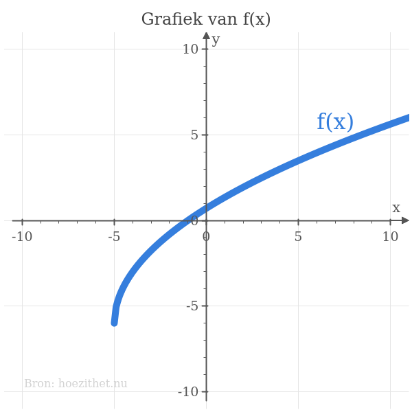
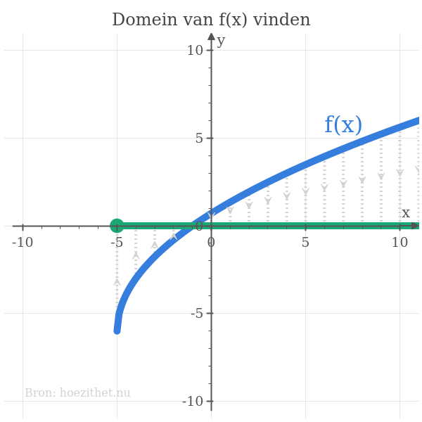
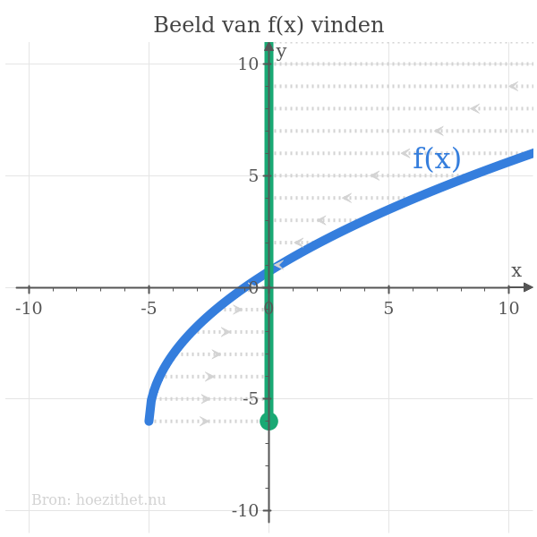

We kunnen niet altijd eender welk getal als $x$ kiezen om in ons
[functievoorschrift](voorschrift) te stoppen. Omgekeerd is het mogelijk dat
niet eender welk getal als $y$ uit de functie komt. Deze twee eigenschappen van
een functie worden beschreven door het **domein** en het **beeld** van de
functie.

## Domein van een functie

Het _domein_ van een functie is de verzameling
van x-waarden waarvoor er een functiewaarde <Mute text="(een y-waarde)" /> bestaat.

-   Voor elke x-waarde die **niet in het domein** zit, bestaat er **géén
    y-waarde**.
-   Voor elke x-waarde die **wel in het domein** zit, bestaat er **juist één
    y-waarde**.

Een typisch voorbeeld is het domein van de functie die als
[functievoorschrift](voorschrift) heeft

$$f(x) = \sqrt{x}$$

Omdat de wortel van een negatief
getal niet bestaat, kan $f(x)$ niet bestaan
wanner x negatief is. Er bestaan met andere woorden géén y-waarden voor
negatieve x-waarden.
Het domein van deze functie $f$ is dus alle _positieve_ reële getallen, want
enkel voor positieve x-waarden bestaat er een functiewaarde. We schrijven:

$$dom f = \mathbb{R}^+$$

Dit kunnen we ook schrijven als een interval:

$$dom f = [0; +\infty[%]$$

## Beeld van een functie

Het _beeld_ of het _bereik_ van een functie is de verzameling
van alle y-waarden die ooit uit de functie kunnen komen.

Een typisch voorbeeld is het beeld van de functie die als
[functievoorschrift](voorschrift) heeft

$$f(x) = x^2$$

Omdat het kwadraat van elk reëel getal positief is, kunnen er uit deze functie
$f$ enkel _positieve_ getallen komen. Met andere woorden is het beeld van deze
functie alle _positieve_ reële getallen. We schrijven:

$$bld f = \mathbb{R}^+$$

Dit kunnen we natuurlijk ook schrijven als een interval:

$$bld f = [0; +\infty[%]$$

## Domein en beeld op een grafiek

Het domein en beeld van een functie kan je ook aflezen van de [grafiek van die
functie](grafiek). Neem bijvoorbeeld de grafiek van de functie
$$f(x) = 3\cdot \sqrt{x + 5} - 6$$
Die grafiek ziet er zo uit:

Om op deze grafiek het **domein** af te lezen, moet je de grafiek **projecteren
op de x-as**. Het resultaat van de projectie
is aangeduid ****.
<Mute text="We gaan ervan uit dat de grafiek oneindig blijft verder stijgen aan de rechterkant." />
We zien dan dat $\green{dom f = [-5; +\infty[}$.

Het **beeld** <Mute text="(of het bereik)" /> van diezelfde functie kunnen we
vinden door de grafiek nu te **projecteren op de y-as**. Op de onderstaande
grafiek zie je het resultaat van deze projectie
****.

<Mute text="We gaan ervan uit dat de grafiek oneindig blijft verder stijgen aan de rechterkant." />
Je vindt dat $\green{bld f = [-6; +\infty[}$.

## Samengevat


Het **domein van een functie** is de verzameling van alle mogelijke **x-waarden
waarvoor er een functiewaarde bestaat**.



Het **beeld van een functie** is de verzameling van **alle mogelijke functiewaarden**.



Het **domein van een functie** lees je af op een grafiek door de grafiek te **projecteren op de x-as**.



Het **beeld van een functie** lees je af op een grafiek door de grafiek te **projecteren op de y-as**.

