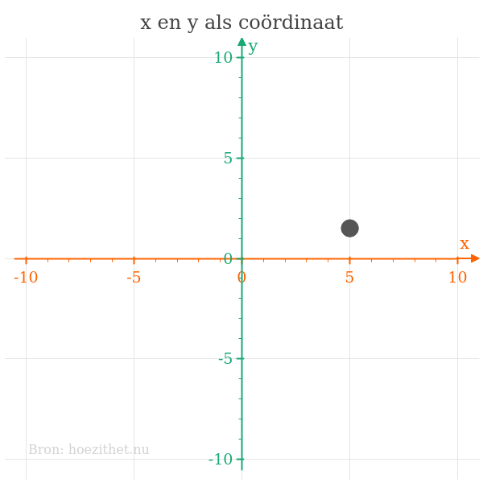
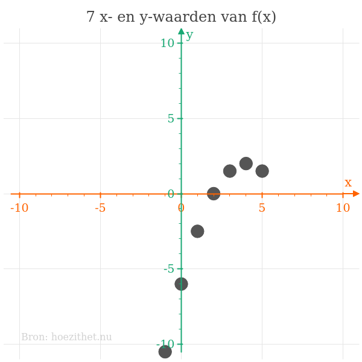
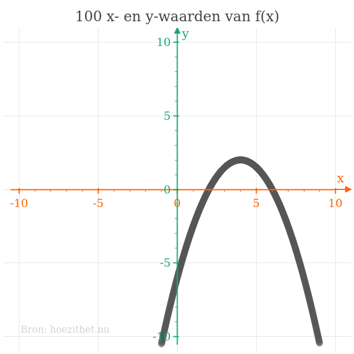
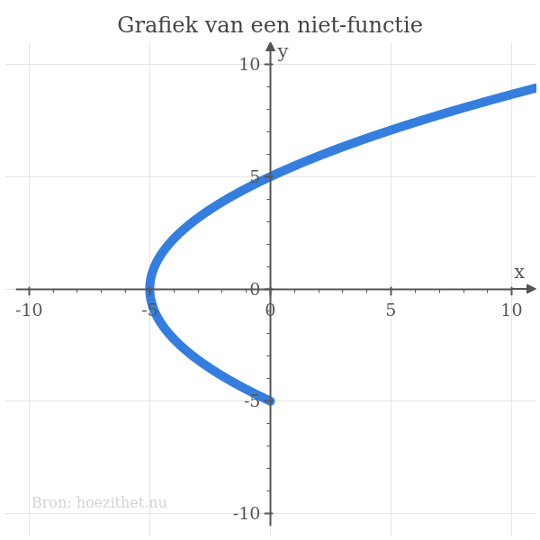

We kunnen de waarden voor $\orange{x}$ en $\green{y}$ in een
[waardentabel](waardentabel) zien als coördinaten van punten op een
assenstelsel. Stel bijvoorbeeld dat we een functie hebben met de volgende
waardentabel:

| Ingang $\orange{x}$ | Uitgang $\green{y} = f(\orange{x})$ |
| ------------------- | ----------------------------------- |
| $\orange{-1}$       | $\green{-10{,}5}$                   |
| $\orange{0}$        | $\green{-6}$                        |
| $\orange{1}$        | $\green{-2{,}5}$                    |
| $\orange{2}$        | $\green{0}$                         |
| $\orange{3}$        | $\green{1{,}5}$                     |
| $\orange{4}$        | $\green{2}$                         |
| $\orange{5}$        | $\green{1{,}5}$                     |

In de laatste rij van die waardentabel is $\orange{x = 5}$ en
$\green{y = 1{,}5}$. We kunnen dit voorstellen door een puntje met coördinaten
$(\orange{5};~\green{1{,}5})$.


Zo kunnen we alle rijen in onze waardentabel voorstellen als puntjes in een
assenstelsel.

## Veel puntjes vormen een curve

We laten ons even gaan en we zoeken $f(\orange{x})$ voor waanzinnig veel
waarden van $\orange{x}$. Bijvoorbeeld voor alle waarden tussen $\orange{-1}$
en $\orange{9}$ in stapjes van $0{,}01$ (dus $\orange{-1}$, $\orange{-0{,}99}$,
$\orange{-0{,}98}$, $\orange{-0{,}97}$ enzovoort tot $\orange{9}$). Wat gebeurt
er als we die enorme hoeveelheid puntjes nu op een assenstelsel zetten? We
krijgen deze mooie figuur:

We hebben nu zoveel puntjes op ons assenstelsel dat we eigenlijk niet meer zien
dat het _aparte_ puntjes zijn. Het zijn wel degelijk aparte puntjes
,
maar we zien het als **één doorlopende curve**.
Deze curve noemen we de **grafiek van de functie**.

## Hoogstens één $y$ voor elke $x$

We weten dat er bij een functie voor een bepaalde waarde van $x$ [hoogstens
één](intro#samengevat) waarde van $y$ bestaat. Grafisch betekent dit dat er op
de curve van een functie **nooit twee punten boven elkaar liggen**. De curve
hieronder is een voorbeeld van een curve waar er voor bepaalde waarden van $x$
**meerdere** waarden van $y$ bestaan. Met andere woorden is hier $y$ **geen
functie van** $x$. Zonder het onderste stukje dat lijkt "terug te keren" is
$y$ _wel_ een functie van $x$.

