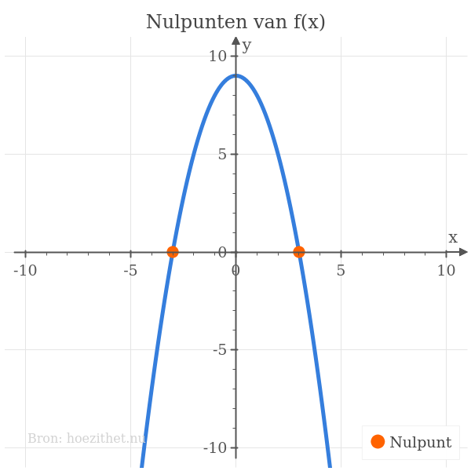

In veel toepassingen van functies zijn we geïnteresseerd in de waarde die we
voor $x$ moeten kiezen zodat $f(x)$ gelijk wordt aan nul. Een $\orange{x}$ die zorgt dat
$f(\orange{x}) = 0$, noemen we een **nulwaarde**. Het bijhorend **nulpunt** is
dan $(\orange{x},~0)$.

## Nulwaarden van een functie

Stel dat we een $x$ in het machientje stoppen en dat er $0$ uit komt. Dan noemen
we $x$ een **nulwaarde** van de functie. Bijvoorbeeld voor de functie met als
[functievoorschrift](voorschrift)

$$
f(x) = x - 2
$$

is $x=\orange{2}$ een nulwaarde want $f(\orange{2}) = \orange{2} - 2 = 0$.

Je vindt de nulwaarden van een functie door **het functievoorschrift gelijk te
stellen aan nul** en die [vergelijking op te lossen](../1g_vgl/oplossen). We
stellen het functievoorschrift gelijk aan _nul_ omdat we op zoek zijn naar de
x-waarden die het voorschrift <Mute>en dus de y-waarde</Mute> _nul_ maken.
Voor het bovenstaande voorbeeld:

$$
\begin{aligned}
f(x) = 0 \\
 \Leftrightarrow x - 2 = 0 \\
 \Leftrightarrow x = 2
\end{aligned}
$$

We vinden inderdaad de nulwaarde $x=2$.

## Nulpunten van een functie

De namen _nulpunten_ en _nulwaarden_ worden soms door elkaar gebruikt, maar
strikt gezien zijn ze niet hetzelfde. Nul*waarden* zijn x-_waarden_, maar
nul*punten* zijn _punten_ met een x- én y-coördinaat. De x-coördinaat van een
nulpunt is de nul*waarde*. De y-coördinaat van een nulpunt is altijd
_nul_ <Mute>(uiteraard)</Mute>. Als de nulwaarde bijvoorbeeld $\orange{-2}$ is,
dan is het nulpunt $(\orange{-2},~0)$.

## Nulpunten op een grafiek

We kunnen een functie voorstellen met een [grafiek](grafiek) door de x- en
y-waarden als x- en y-coördinaten te interpreteren. De nulpunten van een
functie kan je snel op de grafiek vinden omdat je weet dat de **y-coördinaat van
een nulpunt altijd 0 is**. Nulpunten zijn met andere woorden de punten waar de
**grafiek de x-as snijdt**.

Hieronder staat de grafiek getekend van de functie $f(x) = -x^2 + 9$ die de
nul*waarden* $x=-3$ en $x=3$ heeft en dus de nul*punten* $(-3,~0)$ en $(3,~0)$.
De twee nulpunten zijn aangeduid in het **oranje**.

## Samengevat

<Attention>

Definitie nulwaarden

De **nulwaarden van een functie** zijn de **x-waarden waarvoor de
functiewaarde gelijk is aan 0**.
</Attention>

<Attention>

Definitie nulpunten

De **nulpunten van een functie** zijn de punten op de grafiek van die functie
die als **y-waarde 0 hebben**. Ze zijn de **snijpunten met de x-as**.
</Attention>
