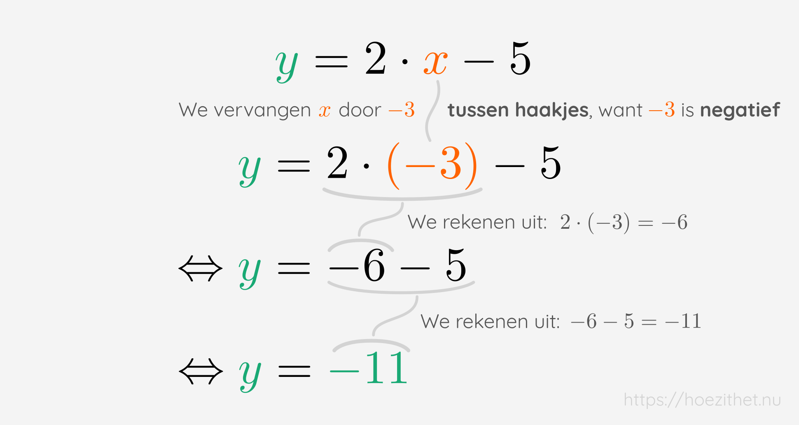

Een [functie](intro) is een verband tussen een $\orange{x}$ en een
$\green{y}$ waarbij met elke $\orange{x}$ hoogstens één $\green{y}$
overeenkomt. Het **functievoorschrift** zegt ons hoe we $\green{y}$ moeten
berekenen voor een bepaalde $\orange{x}$.

Wanneer je bijvoorbeeld een bal laat vallen op de grond, kan je aan de hand van
**de hoogte** van waar je de bal laat vallen berekenen **hoe lang het duurt**
voor de bal op de grond is. Je mag van ons aannemen dat je de tijdsduur van de val (de valtijd) als volgt
kan berekenen:

$$
\text{valtijd in seconden} = 0{,}45 \cdot \sqrt{\text{hoogte in meter}}
$$

De valtijd is dus _afhankelijk van_ de hoogte. Daarom kunnen we zeggen dat de
**valtijd de afhankelijke variabele is**. De afhankelijke variabele duiden we
altijd aan met $\green{y}$. De variabele waarvan $\green{y}$ afhangt <Mute
text="(de hoogte in dit geval)" /> noemen we de **onafhankelijke variabele**.
Die duiden we altijd aan met $\orange{x}$.

We kunnen in ons voorbeeld de **valtijd** dus vervangen door $\green{y}$ en
de **hoogte** door $\orange{x}$. Onze formule ziet er dan zo uit:

$$
\green{y} = 0{,}45 \cdot \sqrt{\orange{x}}
$$

Dit is een voorbeeld van een **functievoorschrift**. Een functievoorschrift
is dus **een vergelijking** die altijd bestaat uit twee stukken:

-   **Links** van het gelijkteken staat onze **afhankelijke variabele**, namelijk
    "$\green{y}$"
-   **Rechts** van het gelijkteken staat **hoe we de afhankelijke variabele
    kunnen berekenen**. Daar staat dus altijd een bepaalde **berekening met
    $\orange{x}$**.

## Andere voorbeelden van functievoorschriften

Het functievoorschrift $\green{y} = 0{,}45 \cdot \sqrt{\orange{x}}$ is
natuurlijk maar één voorbeeld van een functievoorschrift. Elke vergelijking
die je kan schrijven met aan de **linkerkant gewoon $\green{y}$** en aan de
rechterkant **een berekening met énkel $\orange{x}$** is een functievoorschrift. Enkele
andere voorbeelden:

$$
\green{y} = 2\cdot \orange{x}^2 - 5\cdot \orange{x} + 3
$$

$$
\green{y} = -\orange{x}
$$

$$
\green{y} = \frac{1 + 3\cdot \orange{x}^2}{-\sqrt{\orange{x}}}
$$

$$
\green{y} = 5
$$

Je kan het misschien vreemd vinden dat $\green{y} = 5$ ook een
functievoorschrift is. Er staat namelijk geen $\orange{x}$ aan de rechterkant!
🤨 Maar we hebben nooit gezegd dat er een $\orange{x}$ _moet_ staan. We hebben
gezegd dat we de vergelijking moeten kunnen _herschrijven_ zodat er rechts een
berekening met enkel $\orange{x}$ staat. Dat kunnen we:

$$
\green{y} = 5\cdot {x}^0
$$

## x-waarden invullen in een functievoorschrift

Een x-waarde invullen in een functievoorschrift betekent dat we de $\orange{x}$
in ons functievoorschrift gaan **vervangen door een bepaald getal**. Voor het
functievoorschrift met de valtijd van de bal, betekent dit dat we gaan uitrekenen
wat de valtijd voor een bepaalde hoogte zal zijn.

Stel bijvoorbeeld dat we de valtijd willen berekenen van een bal die van
bovenaan een deurgat wordt losgelaten. Een deur is ongeveer $2~\si{m}$ hoog,
dus dat betekent dat we $\orange{x} = \orange{2}$ moeten invullen in ons
functievoorschrift:

$$
\green{y} = 0{,}45 \cdot \sqrt{\orange{2}} = \green{0{,}64}
$$

We komen uit dat $\green{y} = \green{0{,}64}$. Dat betekent dat de bal na
ongeveer $0{,}64~\si{s}$ op de grond zal zijn. <Mute>(Probeer dit thuis gerust ook eens uit door een balletje van die hoogte te laten vallen en de valtijd te meten met een chronometer.)</Mute>
Voor het functievoorschrift $\green{y} = 0{,}45 \cdot \sqrt{\orange{x}}$ geldt
dus dat wanneer $\orange{x} = \orange{2}$, dan is $\green{y} = \green{0{,}64}$.
Wiskundig zeggen we: **de functiewaarde van $\orange{2}$ is $\green{0{,}64}$**.

Andere functievoorschriften kunnen andere functiewaarden hebben voor dezelfde
x-waarde. Hieronder berekenen we de functiewaarde van $\orange{2}$ voor verschillende functievoorschriften. Je ziet dat we heel verschillende getallen kunnen uitkomen.

| Functievoorschrift                                               | Functiewaarde van $\orange{2}$                                                 |
| ---------------------------------------------------------------- | ------------------------------------------------------------------------------ |
| $\green{y} = 2\cdot \orange{x}^2 - 5\cdot \orange{x} + 3$        | $2\cdot \orange{2}^2 - 5\cdot \orange{2} + 3 = \green{1}$                      |
| $\green{y} = -\orange{x}$                                        | $-\orange{2} = \green{-2}$                                                     |
| $\green{y} = \frac{1 + 3\cdot \orange{x}^2}{-\sqrt{\orange{x}}}$ | $\frac{1 + 3\cdot \orange{2}^2}{-\sqrt{\orange{2}}} = \green{-9{,}1924\ldots}$ |
| $\green{y} = 5$                                                  | $\green{5}$                                                                    |

## $y(x)$ en $f(x)$ gebruiken in plaats van $y$

Wanneer we in het functievoorschrift $\green{y} = 0{,}45 \cdot
\sqrt{\orange{x}}$ de x-waarde $\orange{x} = \orange{2}$ invulden, kregen we
$\green{y} = \green{0{,}64}$. We kunnen ook eens een andere x-waarde
uitproberen, bijvoorbeeld $\orange{x} = \orange{3}$. Probeer die zelf eens in
te vullen, je zou $\green{y} = \green{0{,}78}$ moeten krijgen.

Het kan verwarrend zijn om al die "$\green{y} = $" te zien staan. De ene keer
keer is $\green{y} = \green{0{,}64}$, de andere keer is $\green{y} =
\green{0{,}78}$! Waar is $\green{y}$ nu eigenlijk aan gelijk?! 🤯 Het
probleem zit hem in de notatie. Met die verschillende $\green{y}$'s bedoelen we
eigenlijk telkens iets anders:

-   De "$\green{y} = \green{0{,}64}$" kregen we nadat we $\orange{x} =
\orange{2}$ hadden ingevuld. Het is met andere woorden de _functiewaarde_ van
    $\orange{x} = \orange{2}$.
-   De "$\green{y} = \green{0{,}78}$" kregen we nadat we $\orange{x} = \orange{3}$ hadden
    ingevuld. Het is met andere woorden de _functiewaarde_ van
    $\orange{x} = \orange{3}$.

Om een duidelijker verschil te maken tussen die verschillende $\green{y}$'s,
zetten we na de $\green{y}$ **tussen haakjes welke $x$ we hebben ingevuld**. We zeggen dat:

-   $\green{y(2)} = \green{0{,}64}$
-   $\green{y(3)} = \green{0{,}78}$

Een andere veelgebruikte notatie is om "$f(\ldots)$" te schrijven in plaats van
"$y(\ldots)$". We gebruiken een "$f$" om te benadrukken dat het om een
**f**unctie gaat.

-   $\green{f(2)} = \green{0{,}64}$
-   $\green{f(3)} = \green{0{,}78}$

Wat doen we met het functievoorschrift? Die begint namelijk ook met "$\green{y}
= $". Wel, die schrijven we zelf als $\green{y(x)}$ of $\green{f(x)}$. Zo geven
we aan dat we eigenlijk nog niets hebben ingevuld in het voorschrift <Mute
text="(of anders gezegd dat we letterlijk $x$ hebben ingevuld)" />.

$$
\green{y(x)} = 0{,}45\cdot \sqrt{x}
$$

Of:

$$
\green{f(x)} = 0{,}45\cdot \sqrt{x}
$$

<Attention>

Verwar de haakjes niet met een vermenigvuldiging!

Wanneer we "$f(2)$" schrijven, zou je kunnen denken dat we $f$ vermenigvuldigen
met $2$. **Dat is niet zo!** De haakjes staan er om duidelijk te maken dat we
$2$ hebben **ingevuld in ons voorschrift**. Het kan in het begin heel
verwarrend zijn, maar maak er een gewoonte van om bv. $f(2)$ altijd in je hoofd
te lezen als **"de functiewaarde van $2$"**.

</Attention>

## Negatieve x-waarden invullen

Een laatste valkuil is het invullen van negatieve x-waarden. Let daarbij op dat je die telkens **tussen haakjes** vervangt. Zo voorkom je vreemde fouten. Stel bv. dat we $\orange{x} = \orange{-3}$ invullen in het voorschrift $\green{y} = 2\cdot \orange{x} - 5$:

Je ziet dat als je het negatieve getal niet tussen haakjes zet, je vreemde dingen kan krijgen zoals een maalteken dat vlak
naast een minteken staat... 🤨

## Samengevat

<Attention>

Wat is een functievoorschrift?

Een functievoorschrift bestaat uit 2 stukken:

1. **Links** staat er $\green{y} = $ **of** $\green{f(x)} = $
2. **Rechts** staat er een berekening met $\orange{x}$

Het functievoorschrift zegt ons **hoe we de functiewaarde moeten berekenen van
een bepaalde x-waarde**.

</Attention>

<Attention>

De functiewaarde van een x-waarde vinden

Je kan de **functiewaarde** (of y-waarde) van een bepaalde x-waarde $\orange{x}
= \orange{a}$ vinden als volgt:

1. Vervang in het voorschrift **alle $\orange{x}-$en door $\orange{a}$**;
2. Je krijgt een berekening met enkel getallen; **Reken deze berekening uit**;
3. De uitkomst van de berekening is de **functiewaarde van $\orange{a}$**.

⚠️Let op wanneer je de functiewaarde van een **negatief getal** berekent dat je
het getal steeds **tussen haakjes** zet wanneer je $\orange{x}$ vervangt door
dat getal.
</Attention>
