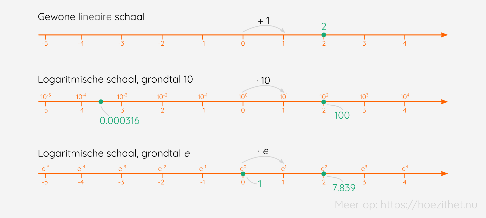

Als je naar de **sterrenhemel** kijkt, dan zie je dat niet alle sterren even fel schijnen. Sommige zijn feller dan anderen en dat hadden de Oude-Grieken ook al gezien. 

Hipparchos stelde een **magnitudeschaal** op. Hij gaf de helderste sterren het cijfer 1 en de minst heldere sterren het cijfer 6. Dit is echter niet zomaar een schaal, maar een **logaritmische** schaal. Een ster van magnitude 6 is 2,512 helderder dan een ster van magnitude 5, maar 100 keer helderder dan een ster van magnitude 1. 🤯🌠⭐

## Wat is een logaritme?
Een **logaritme** is eigenlijk steeds een **functie** <Mute text="(je stopt een getal in het machientje en je krijgt een ander ervoor terug)"/>, meer bepaald **het omgekeerde van de exponentiële functie**. Je hebt ook een **grondtal a** nodig.

$$
^\orange{a}\!\log x = y \Leftrightarrow x = \orange{a}^y
$$

| Je schrijft   | Je leest het als                   |
|---------------|------------------------------------|
| $^a\!\log x$ | Het logaritme van x met grondtal a |

$^2\!\log 8$ is het getal waartoe je $2$ moet **verheffen** om $8$ te bekomen. In dit geval dus $3$. 🎉

<Attention title="De logaritme">

De **logaritme** met **grondtal** $a \in \mathbb{R}^+_0 \backslash \{1\}$ van een **strikt positief reëel getal** is de **exponent van de macht** waartoe we $a$ moeten verheffen om dit getal te krijgen.
</Attention>

Bovenstaande definitie is een mondvol, dus laten we het goed analyseren. ️

In het begin krijgen we de **twee voorwaarden**. Een **logaritme** kan enkel gevonden worden als het **grondtal reëel, strikt positief en verschillend van 1** is. Daarnaast moet het getal waarvan we het logaritme nemen (de $x$), ook een **strikt positief reëel getal** zijn.

We gebruiken dus **dezelfde grondtallen als bij exponentiële functies**. Het getal dat we invullen (de $x$) kan ook **niet negatief of nul** zijn. De reden? Moest dit wel toegelaten zijn, dan zou het **niet consistent** zijn. Dit zou voor gevaar zorgen, **uitdrukkingen die je niet kan oplossen**. ⚠️ Met een grondtal 1 kan je bijvoorbeeld alleen het getal 1 verkrijgen, welke exponent je ook toevoegt. 😕

Verder in de definitie krijgen we dan **de betekenis** van een logaritme. De **uitkomst** is namelijk de macht waartoe het **grondtal $a$ verhoffen** moet worden **om $x$ te bekomen**.

<Attention title="Logaritmen met 1 en 0">

$$
^a\!\log a = 1 \text{, want } a^1 = a
$$
$$
^a\!\log 1 = 0 \text{, want } a^0 = 1
$$
</Attention>

Toch willen we ook nog even vermelden dat een **andere veelvoorkomende notatie** <Mute text="(voornamelijk in het buitenland)"/> het grondtal rechtsonder schrijft: $\log _a x$. 😉

## Basisformules
Er zijn twee **basisformules**, waarmee we de rekenregels voor logaritmen kunnen bewijzen.

De **eerste formule** is $^a\!\log a^y = y$. De logaritme van $a^y$ met **grondtal $a$** is $y$. Met andere woorden: we zochten de exponent waartoe we het **grondtal a** moesten verheffen om $a^y$ te bekomen. Aangezien $a^y$ reeds een exponent bevat ($y$), is dat dus de uitkomst! 🥳

De **tweede basisformule** is $a^{^a\!\log x} = x$. Nu staat de logaritme in de exponent! 😮 Maar ook dit kan je intuïtief aanvoelen. $^a\!\log x$ geeft je het getal waartoe je $a$ moet verheffen om $x$ te bekomen (definitie van een logaritme). Wanneer je dan $a$ verheft tot dat bekomen getal ($^a\!\log x$), krijg je dus $x$. 🤯

Twee **voorbeelden** om beide te illustreren.

$$
^3\!\log 9 = {^3}\!\log 3^\orange{2} = \orange{2}
$$
$$
3^{^3\!\log \green{9}} = 3^2 = \green{9}
$$

## Tiendelige en natuurlijke logaritmen
Zoals we hebben gezien in de definitie van een logaritme, kan elk **strikt positief reëel getal, verschillend van 1** als grondtal dienstdoen. Nu zijn er in de wiskundige wereld twee **grondtallen** die we **niet schrijven**, maar waarvoor we een **andere notatie** gebruiken. 🌍

Enerzijds is er de **tiendelige of Briggse logaritme**. Dit logaritme heeft als **grondtal 10**. We noteren: $\log x$. Wanneer je dus een **logaritme <Mute text="schijnbaar"/> zonder grondtal** tegenkomt, is dit een **Briggse logaritme**. Het tiendelige of Briggse logaritme **rekent relatief simpel** en wordt dus vaak gebruikt, voornamelijk in de fysica en sterrenkunde. ⭐

$$
\log 10 = 1 \text{, want } 10^1 = 10
$$
$$
\log 1000 = 3 \text{, want } 10^3 = 1000
$$
$$
\log (0.01) = -2 \text{, want } 10^{-2} = 0.01
$$

Anderzijds is er de **natuurlijke of Neperiaanse logaritme**. Dit logaritme heeft als **grondtal $e$** ($\approx 2,718$). We noteren: $\ln x$. Het getal $e$ is heel handig bij de (wiskundige) **analyse** en krijgt daarom zijn eigen notatie. Het natuurlijke of Neperiaanse logaritme wordt voornamelijk door **wiskundigen** gebruikt.

$$
\ln 10 \approx 2.3026 \text{, want } e^{2.3026} = 10
$$

<Expand title="Een wiskundig mopje">

Een tiendelige en een natuurlijke logaritme gingen naar de bar in Frankrijk. 🍺 Ze bestelden allebei een drankje en hadden het prima naar hun zin. Na een tijdje kwam de barman vragen wie er ging betalen, waarop het tiendelige logaritme antwoordde: "Moi, parce qu'il *ne pais rien*." 🥁😂
</Expand>

## Logaritmische schaal
In de inleiding hadden we het reeds laten vallen: de **logaritmische schaal**. Een normale <Mute text="lineaire"/> schaal werkt als volgt: bij elke sprong komt er $1$ bij. Wanneer je drie sprongen tegelijkertijd maakt ($1 + 1 + 1$), komt er $3$ bij enzovoort. Een logaritmische schaal werkt een beetje anders. **Per sprong vermenigvuldig je** met het **grondtal van een logaritme**. Een logaritmische schaal met **grondtal 10** geeft volgende situatie. Als je drie sprongen maakt ($10 \cdot 10 \cdot 10$), komt er dus $1000$ bij. Een immens verschil! 🤯

## Samengevat
<Attention title="Definitie van een logaritme">

De **logaritme** met **grondtal** $\orange{a} \in \mathbb{R}^+_0 \backslash \{1\}$ van een **strikt positief reëel getal** is de **exponent van de macht** waartoe we $a$ moeten verheffen om dit getal te krijgen.

In symbolen:
$$
\forall a \in \mathbb{R}^+_0 \backslash \{1\}, \forall x \in \mathbb{R}^+_0: {^\orange{a}}\!\log x = y \Leftrightarrow x = \orange{a}^y
$$
</Attention>

<Attention title="De basisformules">

$$
^a\!\log a^y = y
$$

$$
a^{^a\!\log x} = x
$$
</Attention>

<Attention title="Tiendelige en natuurlijke logaritmen">

**Tiendelige of Briggse logaritmen** zijn logaritmen met **grondtal 10**. We noteren: $\log x$.

**Natuurlijke of Neperiaanse logaritmen** zijn logarimten met **grondtal $e$**. We noteren: $\ln x$.
</Attention>