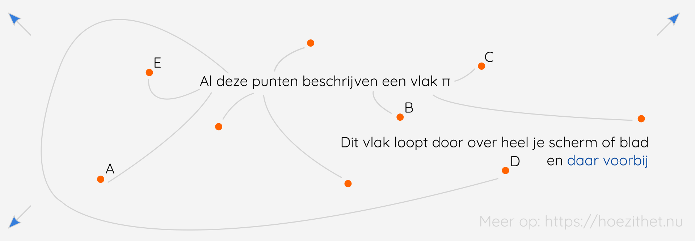
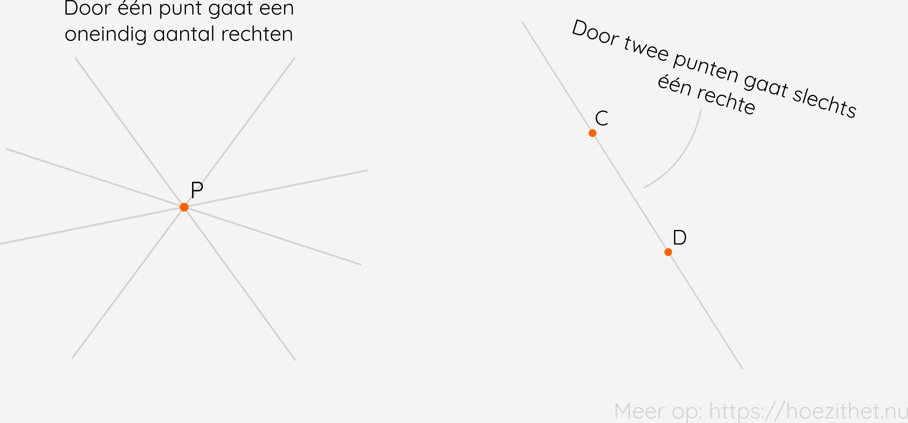
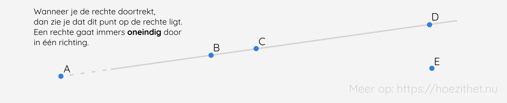
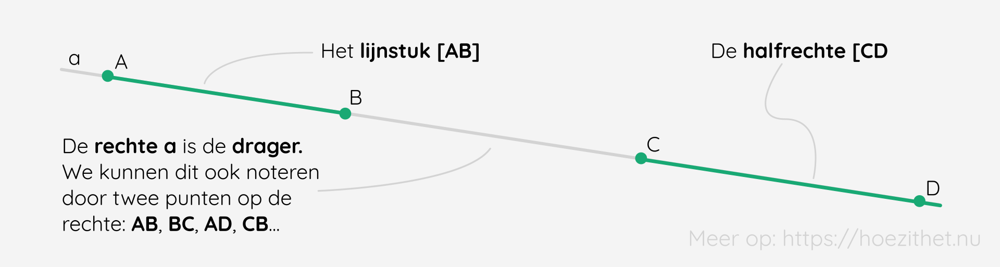
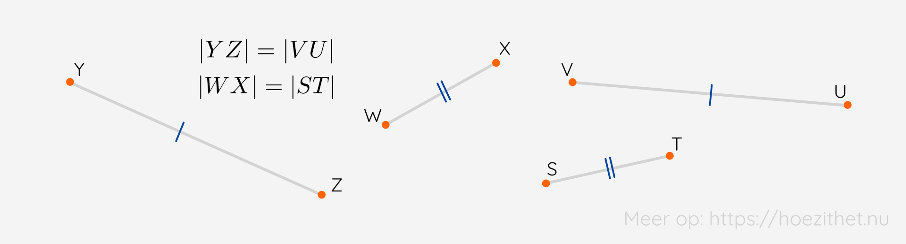
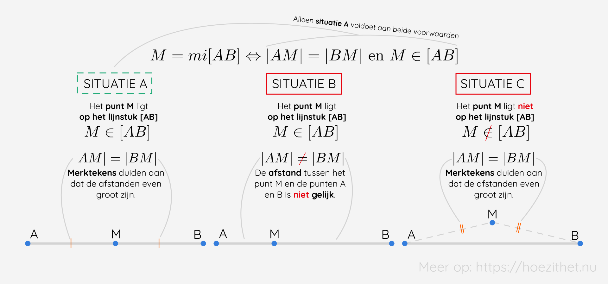

Vooraleer we de wondere wereld van de meetkunde <Mute text="of geometrie"/> kunnen betreden 🗝️, moeten we enkele basisbegrippen kennen. Op deze kennis kunnen we vervolgens voortbouwen om de vormen en figuren die we tegenkomen wiskundig te beschrijven.

## Een punt in het vlak
Een **punt** is het kleinste *deeltje* in de meetkunde. We stellen dit voor met **een stip** en benoemen het (wanneer we dat willen) **met een hoofdletter**.

Een **vlak** (vaak aangeduid als 'het vlak $\pi$' of met een andere Griekse letter), waar de **vlakke of tweedimensionale meetkunde** zich afspeelt, is een verzameling van een oneindig aantal punten. Het zet zich **oneindig** voort in **2 richtingen: lengte en breedte**. Je kan het vergelijken met een blaadje papier. Alles wat op het papier staat, ligt in een vlak. Een **ruimte** daarentegen, die zet zich in **3 richtingen** voort, namelijk **lengte, breedte en hoogte**. Dat is hoe wij naar de wereld kijken. Alles rondom ons kunnen we beschrijven met een lengte, breedte en hoogte of in **drie dimensies**.

In het vlak kunnen we met behulp van punten een heleboel vormen en vlakke figuren tekenen en beschrijven. We kunnen het vlak zien als een spelbord waarop de punten onze pionnen zijn. 🎲

## Definiëren twee punten een rechte?
Naast een punt en een vlak werken we in de meetkunde ook met **rechten**. Een **rechte of lijn** is een verzameling van punten, **oneindig in 1 richting**. Het is met andere woorden een **rechte lijn** die oneindig doorloopt langs beide kanten. We noteren dit bijna altijd met een **kleine letter**. Aangezien we een (rechte) lijn niet oneindig lang kunnen tekenen, spreken we af om een rechte **nooit in een punt te laten eindigen**. We trekken de lijn dus altijd nog een beetje door voordat we stoppen. 📏 Zo is het duidelijk dat het om een rechte gaat en geen lijnstuk (zie verder).

**Door één punt** A gaan **oneindig veel rechten**. Maar **door twee punten** A en B gaat slechts **één rechte**. Probeer zelf maar eens om een tweede rechte (die niet samenvalt met de andere) te tekenen door twee punten! Je zal zelf zien dat dit niet gaat. ✋ 

**Punten** die **op dezelfde rechte** liggen (dit kunnen meer dan twee punten zijn), noemen we **collineaire punten**.

De punten **A, B, C, D** zijn **collineair**. De punten **A, D en E** zijn bijvoorbeeld **niet collineair**. Merk ook op dat **elke groep van twee punten steeds collineair** is, aangezien twee punten steeds één rechte definiëren.

## Van punt naar ruimte
Nog even herhalen vooraleer we verder gaan. Een **punt** is een stip en dus het kleinste dat er is in de meetkunde. Als je heel veel stippen in **1 richting** (bv. horizontaal) naast elkaar zet, dan krijg je een **rechte**. Een **vlak** is nog groter en kan je je voorstellen als een blaadje papier. 📝 Alles wat op het blad staat, ligt in het vlak. Ook dit loopt **oneindig** door (in **twee richtingen**). Tenslotte is er een **ruimte**, dit heeft **drie dimensies** en het is dus een oneindig aantal punten in **drie richtingen**.

<Expand title="Even stilstaan bij de betekenis van 'richting'">

Vaak denken mensen bij het woord **richting** aan links of rechts. In de wiskunde, en voornamelijk de fysica, spreken we echter op een andere manier over *richting*. Voor ons is richting namelijk **horizontaal, verticaal, in een hoek van 60°...**. Links en rechts duidt de **zin** aan. Wanneer we dus spreken over **oneindig in 1 richting**, kan je je het volgende voorstellen: **een horizontale lijn die zowel links als rechts oneindig doorloopt**. De richting kan bv. 'horizontaal' zijn en zegt niets over links of rechts.
</Expand>

## Wat is het verschil tussen een rechte en een lijnstuk?
Een **lijnstuk** is, zoals doet vermoeden, een stuk van een lijn. 🤯 Meer bepaald: een lijn die **begrensd is door twee punten**. We **benoemen** het lijnstuk steeds naar zijn **grenspunten**. Dat zijn de **punten die het lijnstuk begrenzen**. Weet jij nu welke van volgende twee een lijnstuk is en welke een rechte <Mute text="of lijn"/>? 🤔

![Een lijnstuk is een lijn die stopt in punten. We noteren dit met twee rechte haakjes, eentje rond elk grenspunt: [AB]. Een rechte loopt doorheen de punten, zoals eerder reeds vermeld. We noteren geen vierkante haakjes, maar gewoon AB.](img/lijnstuk_rechte.png)

Naast rechten en lijnstukken, bestaan er ook nog **halfrechten**. Dit zijn rechten die **aan één kant begrensd** zijn en één **grenspunt** hebben. Zij lopen dus maar **langs één kant oneindig** door.

Tenslotte spreken we ook nog van een **drager**. Dit is de **rechte waarop het lijnstuk of de halfrechte ligt**. Zo ligt een lijnstuk [AB] steeds op de rechte AB. We noemen **AB** hier de **drager van [AB]**.

### Overzicht notatie's

## Hoe noteer ik de lengte van een lijnstuk?
Elk lijnstuk kunnen we **meten met een liniaal**. 📏 We meten dan eigenlijk **de afstand tussen de twee grenspunten**. In volgende lessen ga je nog zien hoe je de lengte van een lijnstuk <Mute text="oftewel de afstand tussen de twee grenspunten"/> kan bereken uit andere gegevens, maar hoe moet je de bekomen lengte dan noteren?

Vooraleer we de lengte van het lijnstuk kunnen noteren, moeten we **zeggen van welk lijnstuk** we de lengte hebben gemeten. We doen dit door de vierkante haakjes te vervangen door **verticale strepen**. De lengte van het lijnstuk [AB] noteren we dus als **|AB|** = ...

Vervolgens noteren we de lengte na het gelijkheidsteken. Een getal alleen, zoals vier, zegt echter niets. Vier wat? Vier duimen? 👍 Vier poten? 🐾 Of vier konijntjes? 🐇 We hebben een **eenheid** nodig. In Europa, en eigenlijk bijna overal, werken we met het **metriek stelsel**. Ook in de wetenschap is dit het systeem bij voorkeur. 
Alleen Engelsen, Amerikanen, Canadezen... doen een beetje moeilijk en werken met een ander systeem, <Mute text=" namelijk het Brits-Amerikaanse maatsysteem of The Imperial System"/>.

Het **metriek stelsel** ken je gegarandeerd. Ik noem enkele voorbeelden: centimeter (cm), kilogram (kg), seconden (s)... Klinkt het bekend in de oren? 👂
> De [les over grootheden en eenheden](../../fysica/grootheden_eenheden/intro) gaat dieper in op deze eenheden, zeker eens de moeite om te lezen!

In de meetkunde maken we vooral (zo goed als altijd) gebruik van **afstandsmaten**. Dit zijn de **centimeter**, **decimeter**, **meter**... Twee centimeter wil dan eigenlijk niets anders zeggen dan: twee maal de lengte van een centimeter. Een correcte notatie voor de lengte van [AB] is dus $|AB| = 4 \si{ cm}$.

<Expand title="Wanneer gebruik ik geen eenheden?">

Je zal zien dat er soms toch **geen eenheid** staat. Deze wordt vaak weggelaten **als het gaat over verhoudingen** of als **de afbeelding geschaald wordt**. De grootte van de afbeeldingen op *Hoe Zit Het?* wordt namelijk aangepast naargelang de grootte van je scherm. 🖥️ Wij kunnen iets tekenen dat 4 cm lang is, maar als het dan verkleind wordt om op je smartphone 📱 te passen, klopt de lengte niet meer. En aangezien de lengte van een (centi)meter vaststaat, kiezen we ervoor om de **eenheid weg te laten**. Dat is het meest correct. Onze illustraties zijn tenslotte maar voorbeelden en geen tekeningen van een architect. 🏠
</Expand>

Wanneer twee (of meer) **lijnstukken dezelfde lengte** hebben, duiden we dit aan met **dezelfde merktekens**.

## Wat is het midden van een lijnstuk?
Meetkunde bevat jammer genoeg - voor sommigen - relatief veel **definities**. Maar je moet je altijd bedenken dat meetkunde een spel is, waarvan je de spelregels nu eenmaal **goed moet kennen**. Een groot voordeel bij meetkunde is dat je het meestal eens kan tekenen om te zien of je definitie klopt.

<Attention title="Midden van een lijnstuk">
 
M is het midden van een lijnstuk [AB] als en slechts als M op het lijnstuk [AB] ligt en het lijnstuk verdeeld is in twee even lange stukken.

$$
M = mi[AB] \Leftrightarrow |AM| = |BM| \text{ en } M \in [AB] 
$$
</Attention>

Wat wil dit nu precies zeggen? 🧐 Stap per stap gaan we erdoorheen! **M** is een hoofdletter en verwijst hier dus naar **een punt M**. Dan komen we mi[AB] tegen. Dat betekent **het midden van** het lijnstuk **[AB]**.

Een dubbele wederzijdse pijl ($\Leftrightarrow$) betekent **als en slechts als**. Een punt M is dus het midden van [AB] **alleen als** er wordt voldaan aan wat er na de pijl komt. Die voorwaarde is dat de **afstand tussen het punt A en het punt B** ($|AM| = |BM|$) gelijk moet zijn en **M moet een element zijn van [AB]** <Mute text="(M moet op het lijnstuk [AB] liggen)"/>.

In welke van de drie onderstaande situaties is M het midden van het lijnstuk [AB]? <Mute text="Druk op 'toon uitleg' voor de uitkomst."/>

Zie je, zo moeilijk zijn die definities niet! 💪💃🎉

## Samengevat
<Attention title="Punten, rechten, vlakken">

Een **punt** stellen we voor met een **stip** en benoemen we met een **hoofdletter**. Het is het kleinste *deeltje* in de meetkunde. Een **rechte of lijn** is een verzameling van een **oneindig aantal punten in één richting**. We benoemen dit met een **kleine letter** of door **twee punten** op de rechte (zoals: AB). Door **twee punten** gaat slechts **één rechte** en door **één punt** gaan **oneindig veel rechten**. Punten op dezelfde rechte noemen we **collineaire punten**.

Het **vlak** is een **oneindige verzameling punten in twee richtingen**. Een blaadje papier is een vlak en alles wat erop staat, staat afgebeeld in **twee dimensies** of **in het vlak**. Een **ruimte** is een **oneindige verzameling punten in drie richtingen**. We noemen dat **drie dimensionaal** en dat is de wereld waarin we leven.
</Attention>

<Attention title="Een lijnstuk (meten)">

Een **lijnstuk [AB]** is een **lijn begrensd door twee punten**, de **grenspunten**. Een **halfrechte [AB** is slechts **aan één kant** begrensd door een **grenspunt**. De rechte die waarop het lijnstuk of de halfrechte ligt, noemen we de **drager**.

Om betekenis te geven aan de **lengte van een lijnstuk |AB|**, gebruiken we **eenheden** zoals de **meter**. Lijnstukken met **dezelfde lengte** krijgen **merktekens**.
</Attention>

<Attention title="Het midden van een lijnstuk">

M is het midden van een lijnstuk [AB] als en slechts als M op het lijnstuk [AB] ligt en het lijnstuk verdeelt is in twee even lange stukken.

$$
M = mi[AB] \Leftrightarrow |AM| = |BM| \text{ en } M \in [AB] 
$$
</Attention>
