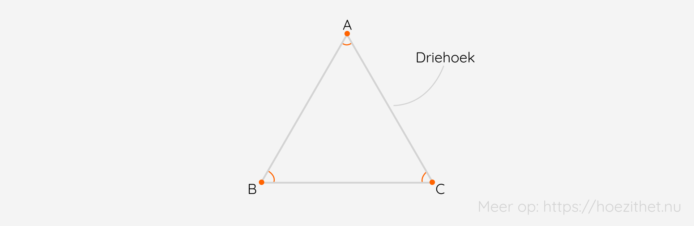
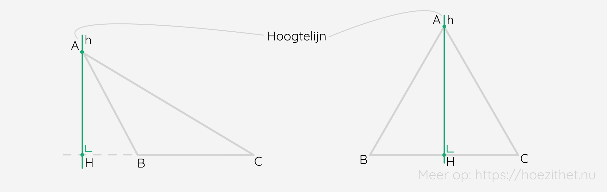
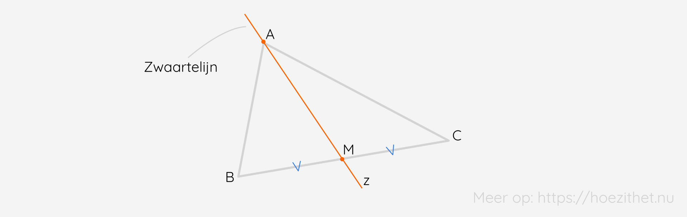

**Driehoeken** vinden we overal rondom ons! 🌍 Ingenieurs gebruiken ze ook vaak omdat het zeer **stevige en stabiele figuren** zijn om te gebruiken in de bouw. 🏗️🚧

## Wat is een driehoek?
**Elke veelhoek met drie hoeken en drie zijden** is een driehoek. Logisch, toch? 🕶️

We spreken van de driehoek ABC en we **noteren** $\triangle{ABC}$. 

Er is ook nog wat **specifieke terminologie** te kennen.
Zo is $\hat{B}$ de **overstaande hoek** van de zijde $[AC]$. Het is met andere woorden de enige **hoek die niet op de zijde ligt**. 🙈 $\hat{A}$ en $\hat{C}$ zijn dan weer de **aanliggende hoeken** van de zijde $[AC]$. Ze liggen beide **aan één kant van het lijnstuk**. Ten slotte kan elke hoek ook een **ingesloten hoek** zijn van twee zijden. Bijvoorbeeld: $\hat{B}$ is de ingesloten hoek van $[BC]$ en $[AB]$. Het is de **hoek die op beide zijden ligt**.

## De som van de hoeken van een driehoek is 180°

Eén van de bekendste en meest gebruikte eigenschappen in de (vlakke) meetkunde is deze van de **som van de hoeken van een driehoek**. De hoeken vormen namelijk altijd **180°**.

Je kan dit **zelf testen** door een willekeurige driehoek te tekenen en vervolgens de hoeken af te knippen. ✂️ Wanneer je de hoeken vervolgens naast elkaar legt, zie je dat ze een **gestrekte hoek** <Mute text="of 180°"/> vormen.

<Attention title="Som van de hoeken van een driehoek">

De **som van de hoeken van een driehoek** is steeds **180°**.
</Attention>

<Expand title="Driehoeken en de vorm van ons universum">

Dat de som van de hoeken van een driehoek 180° vormt is een handig gegeven. We moeten echter wel een kanttekening maken en erbij zeggen dat deze eigenschap enkel en alleen geldt in de vlakke meetkunde. In meetkundige systemen met gebogen oppervlakken, zoals de bolmeetkunde, geldt deze eigenschap niet. Aan de hand van deze inzichten is het gelukt om de vorm van ons universum te bepalen. 🌌

Astronomen hebben een denkbeeldige driehoek geconstrueerd met drie extreem verafgelegen objecten :star2:. Ze hebben vervolgens de som gemaakt van de hoeken en kwamen op een afgeronde waarde van 180°. Dit wil zeggen dat het universum zo goed als vlak is (aangezien de eigenschap alleen geldt in vlakke meetkunde). 🤯
</Expand>

## Merkwaardige lijnen
Een driehoek heeft verschillende **merkwaardige lijnen**. Dit zijn lijnen met een of meerdere speciale eigenschappen. Twee van zulke merkwaardige lijnen, de [middelloodlijn](../rechten) en [bissectrice](../hoeken), hebben we reeds behandeld in vorige lessen. **In het geval van een driehoek** wordt deze eigenschap dan **toegepast** op een zijde of hoek van de **driehoek**. 

<Attention title="Middelloodlijn van een driehoek">

Een **middelloodlijn van een driehoek** is de rechte die **door het midden** gaat van een zijde en **loodrecht** staat op de drager van die zijde.
</Attention>

<Attention title="Bissectrice van een driehoek">

Een **bissectrice van een driehoek** is de rechte die door een **hoekpunt** gaat en de bijhorende hoek in **twee even grote hoeken** verdeelt.
</Attention>

De **hoogtelijn** van een driehoek werkt **analoog** aan de methode voor het bepalen van [de afstand tussen een punt en een rechte](../rechten) 😁. Het enige verschil hierbij is dat het hier om een **rechte** gaat en niet om een lijnstuk (waarvan we de lengte kunnen meten).

Zoals je kan zien is het mogelijk dat de **hoogtelijn** van een driehoek **buiten de driehoek** ligt. De definitie spreekt immers over **de drager van de zijde**. Deze ligt dus ook buiten de eigenlijk zijde.

<Attention title="Hoogtelijn van een driehoek">

Een **hoogtelijn** van een driehoek is de **loodlijn** uit een hoekpunt **op de drager** van de overstaande zijde.
</Attention>

Tenslotte is er ook nog de **zwaartelijn**. Moest je een driehoek op zo'n zwaartelijn balanceren, dan blijft hij mooi in **evenwicht**. Hij gaat door een **hoekpunt** en het **midden van de overstaande zijde**.

<Attention title="Zwaartelijn van een driehoek">

Een **zwaartelijn** van een driehoek is de **rechte** door een hoekpunt en **door het midden** van de overstaande zijde.
</Attention>

Van elke merkwaardige lijn zijn er **drie in elke driehoek**. Deze drie hebben ook allemaal een **gemeenschappelijk snijpunt**. In het geval van de zwaartelijnen, noemen we dit het **zwaartepunt**. 🏋️

## Classificatie
Driehoeken kunnen we op **twee manieren** classificeren. Enerzijds aan de hand van **hoeken** en anderzijds door middel van **zijden**.

We spreken van een **scherphoekige driehoek** wanneer hij **drie scherpe hoeken** heeft. Een **rechthoekige driehoek** is een driehoek met **een rechte hoek** en op dezelfde manier is een **stomphoekige driehoek** een driehoek met **een stompe hoek**.

Een **ongelijkzijdige** (of **ongelijkbenige**) **driehoek** is een driehoek met **drie verschillende, <Mute text="dus niet even lange,"/> zijden**. Een **gelijkbenige driehoek** is dan weer een driehoek met **twee gelijke zijden**, net zoals wij twee (ongeveer) gelijke benen hebben 🦵. De derde mogelijkheid is een **gelijkzijdige driehoek** met **drie gelijke zijden**.

## Samengevat
<Attention title="De driehoek">

Een driehoek $\triangle{ABC}$ is een **vlakke figuur** met **drie hoeken en drie zijden**. We definiëren een **overstaande hoek**, **ingesloten hoek** en **aanliggende hoeken**.
</Attention>

<Attention title="Som van de hoeken van een driehoek">

De **som van de hoeken van een driehoek** is steeds **180°**.
</Attention>

<Attention title="Merkwaardige lijnen">

In een driehoek zijn **vier merkwaardige lijnen**:

* Een **middelloodlijn van een driehoek** is de rechte die **door het midden** gaat van een zijde en **loodrecht** staat op de drager van die zijde.
* Een **bissectrice van een driehoek** is de rechte die door een **hoekpunt** gaat en de bijhorende hoek in **twee even grote hoeken** verdeelt.
* Een **hoogtelijn** van een driehoek is de **loodlijn** uit een hoekpunt **op de drager** van de overstaande zijde.
* Een **zwaartelijn** van een driehoek is de **rechte** door een hoekpunt en **door het midden** van de overstaande zijde.

</Attention>

<Attention title="Driehoeken classificeren">

We kunnen driehoeken classificeren volgens **hoeken** of **zijden**.
</Attention>
