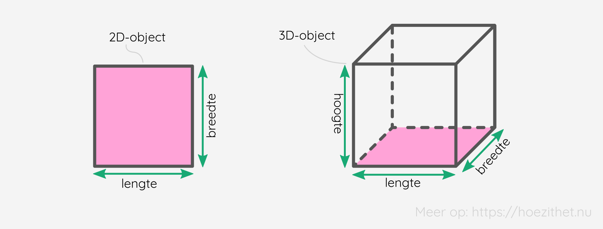
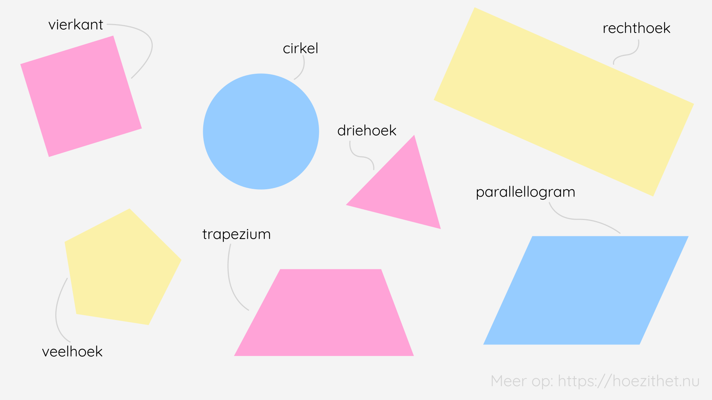
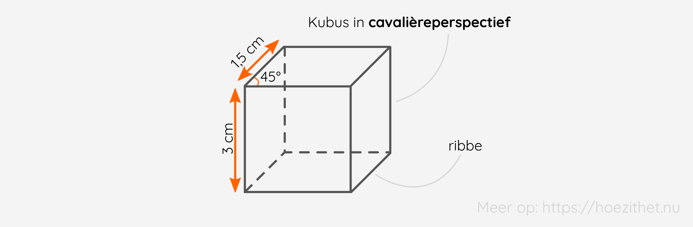
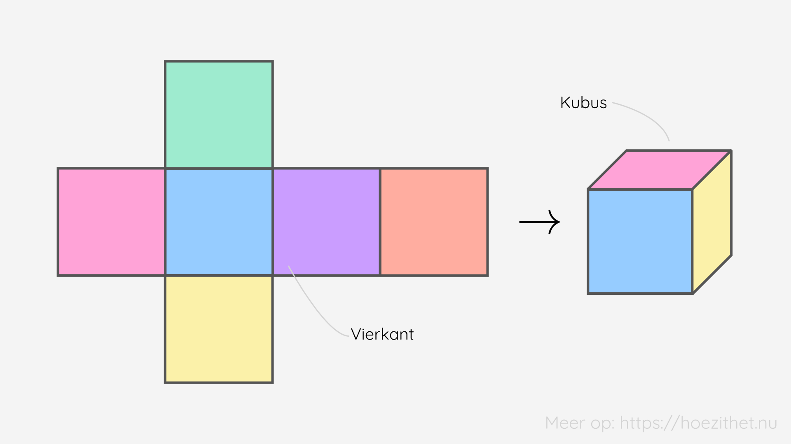
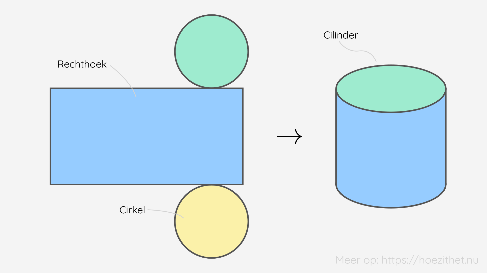
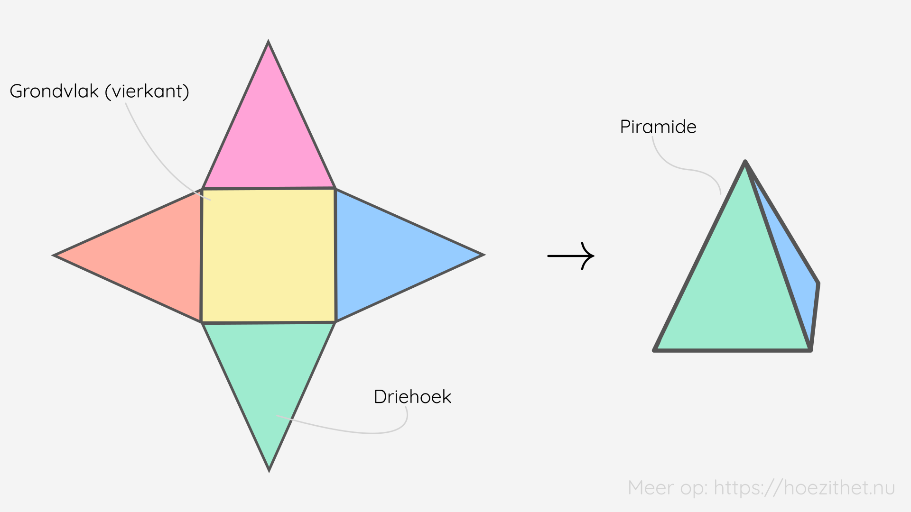
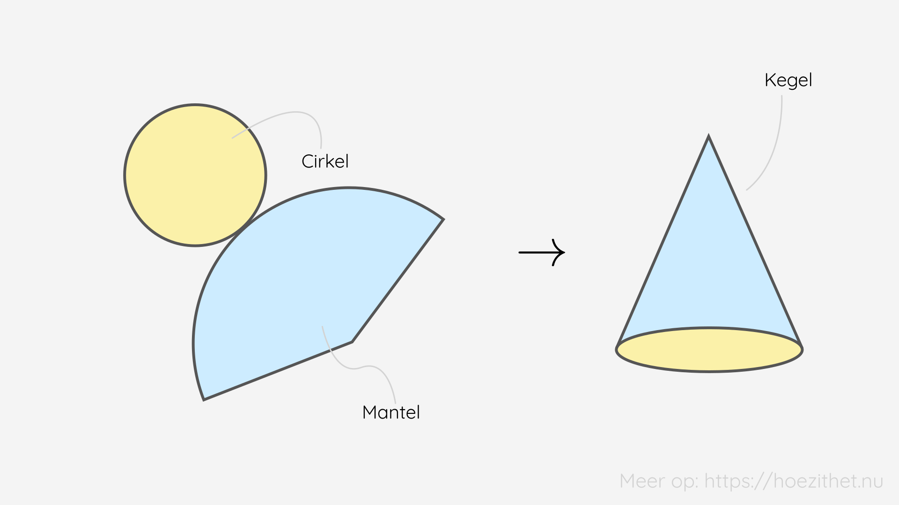
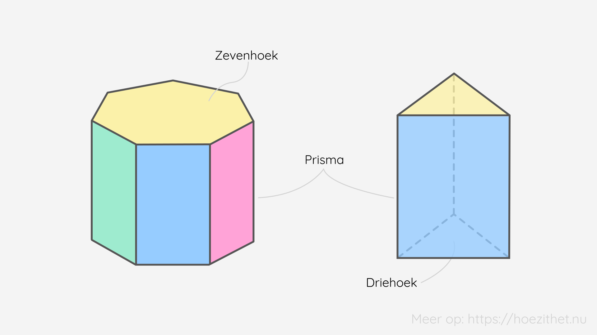
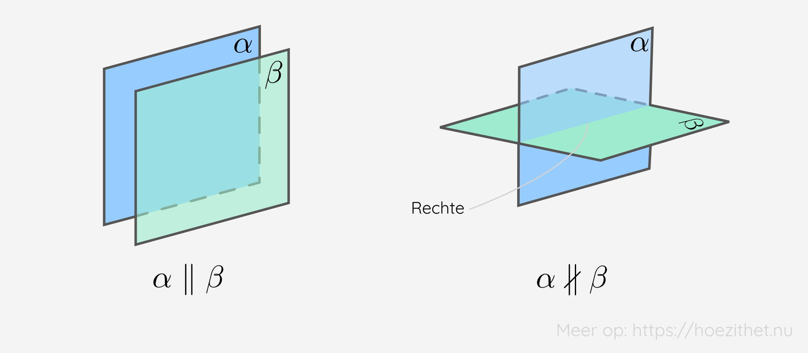

Tot nu toe hebben we het vooral over vlakke meetkunde gehad. Meetkunde die zich afspeelt op een blaadje papier. 📝 Maar wij leven niet in een vlakke wereld, wij leven in een wereld vol diepte. Wij leven in een **driedimensionele wereld**. 🌱🐘🧍

Overal rondom ons zien we **ruimtefiguren** en dat is waar we het deze les over gaan hebben.

## Het verschil tussen 2D en 3D
De **vlakke meetkunde** speelt zich af in **twee dimensies**, terwijl de **ruimtemeetkunde** zich afspeelt in **drie dimensies**. Zo'n dimensie moet je zien als een richting waarin je kunt meten. Bij twee dimensies wordt dit **lengte en breedte** en bij drie dimensies komt er ook nog **hoogte** bij. Om **een punt in een vlak** te beschrijven heb je slechts **2 coördinaten** nodig, eentje voor elke richting. En je kunt het al raden 💭: **in een ruimte** (drie dimensies) heb je **3 coördinaten** nodig. 🤯

En dingen met **één dimensie** dan? 🤔 Wel, die kun je voorstellen op **een enkele rechte** (zoals de getallenas). Je kan dus alleen punten gebruiken als je iets in deze dimensie wilt plaatsen. 

Wil je **in een vlak** <Mute text="dat twee dimensies heeft"/> iets plaatsen, dan kan je kiezen voor allerlei **vlakke figuren**. Denk hierbij aan trapezia, parallellogrammen, vierkanten, driehoeken... Het is **in de ruimte** <Mute text="die drie dimensies heeft"/> dat je **ruimtefiguren** tegenkomt. Voorbeelden hiervan zijn de kubus, de balk, de cilinder en de *parallellepipedum* <Mute text="(dat is de overeenkomstige ruimtefiguur van een parallellogram)"/> (we konden deze geweldige naam niet weglaten 😊🎶). 

## Enkele vlakke figuren
Voor de volledigheid vermelden we hier nog even **de vlakke figuren** waarvan je verondersteld wordt ze te kennen. 

> In de lessen over [driehoeken](./driehoeken), [vierhoeken](./vierhoeken) en [cirkels](./cirkels) kan je meer leren over deze vlakke figuren. 🙌

## Ruimtefiguren weergeven in 2D
We zijn allemaal wel al eens ruimtefiguren tegengekomen die zijn afgebeeld op een blad papier. Hiervoor gebruikt men **perspectieven**, zodat we **een gevoel van drie dimensies** krijgen op een tweedimensionaal vlak. 

Elke (stippel)lijn noemt men een **ribbe** <Mute text="van de kubus"/>.

<Attention title="Cavalièreperspectief">

Het **cavalièreperspectief** wordt het meest gebruikt voor het afbeelden van ruimtefiguren. Om dit correct te gebruiken, **teken je eerst het vlak waarop je kijkt in ware grootte**. Vervolgens teken je de **zijvlakken onder een hoek van 45°** met de horizontale lijnen. Het zijn ook alleen deze schuine lijnen (die je onder een hoek tekent) die niet de werkelijke grootte hebben. Je tekent ze **de helft van de werkelijke lengte**. Ten slotte worden de **onzichtbare ribben (randen) met een stippellijn** aangeduid.
</Attention>

## Ruimtefiguren bestaan uit vlakke figuren
We kunnen de ruimtefiguren ook **opensnijden** zodat we een soort bouwplaat krijgen. We spreken dan van de **ontwikkeling of opbouw van een ruimtefiguur**. Op zo'n ontwikkeling zijn de **maten en hoeken** perfect af te lezen, in tegenstelling tot perspectieven. We merken ook dat de **ruimtefiguren opgebouwd zijn uit vlakke figuren**. 🤯

Een **kubus** bestaat uit **zes vierkanten**. Hieronder staat één ontwikkeling van een kubus, maar er zijn er meer! Kan jij er nog eentje vinden? 🧐 **TIP**: Als je je ontwikkelingen uitknipt ✂️, kan je ze onmiddellijk uittesten door ze op te vouwen. 💪

Een **balk** bestaat uit **zes rechthoeken**, die bestaan uit **drie paar gelijke rechthoeken**. Ook hier zijn andere ontwikkelingen mogelijk dan hieronder getoond. 🕵️‍♀️

Een **cilinder** bestaat uit **twee cirkels** en **een rechthoek**. De rechthoek vormt de **mantel** van de cilinder. 🧥

Een **piramide** bestaat uit **een veelhoek** als grondvlak en **driehoekige zijvlakken** vanaf elke van de zijde van de veelhoek naar **een gemeenschappelijke top**. Hieronder is de ontwikkeling van een piramide met een **vierkant als grondvlak** getekend.

Een **kegel** bestaat uit **een cirkel** als grondvlak en **een gekromd vlak**. 🍦 Dit gekromd vlak bekomt men door alle punten van de cirkel te verbinden met een **gemeenschappelijke top**.

Tot slot bestaat er ook nog een **prisma**. Dit is **elke figuur met hetzelfde grond- en bovenvlak**, die **geen gekromde oppervlakken** heeft. De cilinder is dus **geen** prisma! ⚠️ Met andere woorden is elke ruimtefiguur waarbij **twee veelhoeken**, eentje boven en eentje onder, **verbonden** zijn **met rechthoeken**, een prisma.

## Evenwijdige en snijdende vlakken
Net zoals rechten, kunnen **vlakken evenwijdig zijn aan elkaar of elkaar snijden**.

> Herinner je je dit niet meer? 🤔 Lees dan nog snel even [de les over rechten](./rechten)! 🕶️📏

De definitie is namelijk voor beide **juist hetzelfde**. Alleen gaat het hier niet over rechten, maar over vlakken!

Als je de twee snijdende vlakken beter bekijkt 🤓, dan kunnen je twee dingen opvallen. Ten eerste vormen **alle snijpunten** samen, <Mute text="dat zijn de punten die in/op beide vlakken liggen,"/> **een rechte**. Ten tweede snijden de twee rechtse vlakken elkaar in dit voorbeeld loodrecht $\alpha \perp \beta$. Had je dit gezien? 👀

Ten slotte hebben we het nog even over **kruisende rechten**. Bij deze rechten is het **onmogelijk om ze in één vlak te plaatsen**. Daarmee verschillen ze van evenwijdige en snijdende rechten, waarbij dit wel mogelijk is! 😀

## Samengevat
<Attention title="Verschillende dimensies">

We kunnen dingen in verschillende dimensies tekenen/plaatsen. Een **dimensie** moet je zien als een richting waarin je kunt meten. De **vlakke meetkunde** speelt zich af in **twee dimensies** (lengte en breedte) en de **ruimtemeetkunde** in **drie dimensies** (lengte, breedte en hoogte).
</Attention>

<Attention title="Vlakke figuren">

Er bestaan verschillende soorten **vlakke figuren**, die je perfect op een blaadje papier kan tekenen. De voornaamste zijn: een **driehoek**, **rechthoek**, **vierkant**, **trapezium**, **parallellogram**, **cirkel** en een **veelhoek**.
</Attention>

<Attention title="Ruimtefiguren">

**Ruimtefiguren** kan je niet zomaar op een blaadje papier weergeven. Ze bevinden zich in de ruimte. De voornaamste zijn: een **kubus**, **balk**, **cilinder**, **piramide**, **kegel** en **prisma**.
</Attention>

<Attention title="Cavalièreperspectief">

Het **cavalièreperspectief** wordt het meest gebruikt voor het afbeelden van ruimtefiguren. Om dit correct te gebruiken, **teken je eerst het vlak waarop je kijkt in ware grootte**. Vervolgens teken je de **zijvlakken onder een hoek van 45°** met de horizontale lijnen. Het zijn ook alleen deze schuine lijnen (die je onder een hoek tekent) die niet de werkelijke grootte hebben. Je tekent ze **de helft van de werkelijke lengte**. Tenslotte worden de **onzichtbare ribben (randen) met een stippelijn** aangeduid.
</Attention>

<Attention title="Evenwijdige en snijdende vlakken">

De definitie voor **evenwijdige en snijdende vlakken** komt precies overeen met die van evenwijdige en snijdende rechten. Alleen gaat het niet over rechten, maar over vlakken.
</Attention>