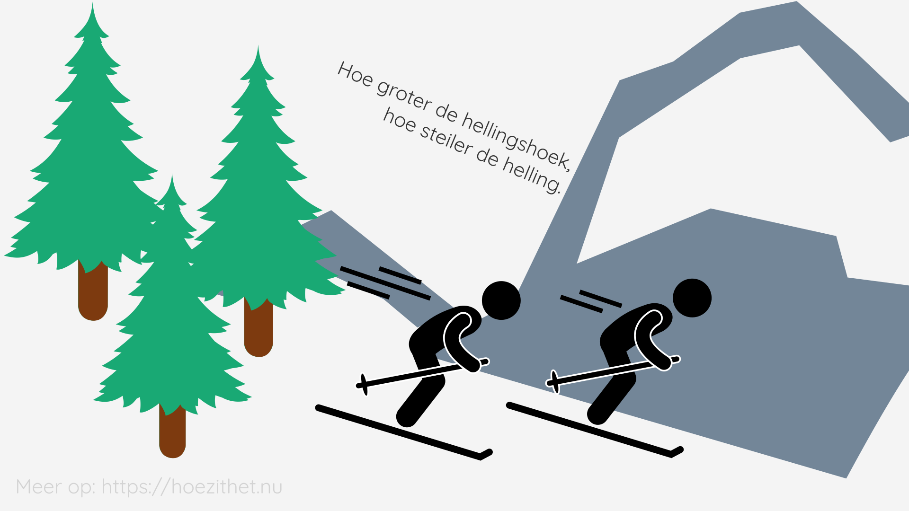
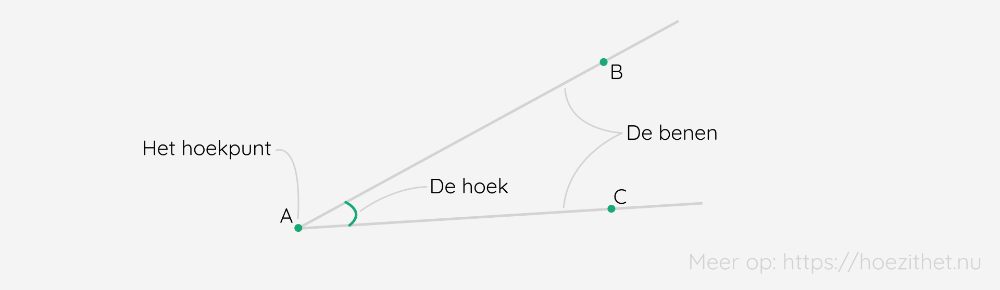
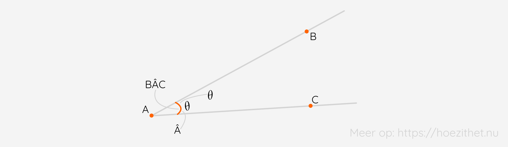
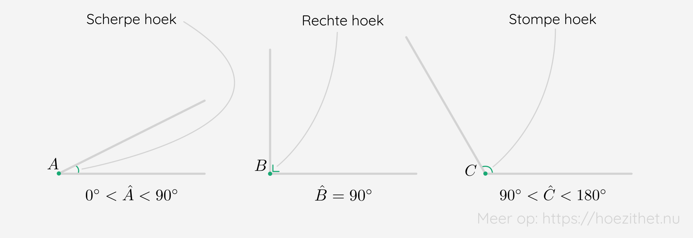
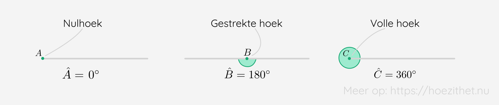
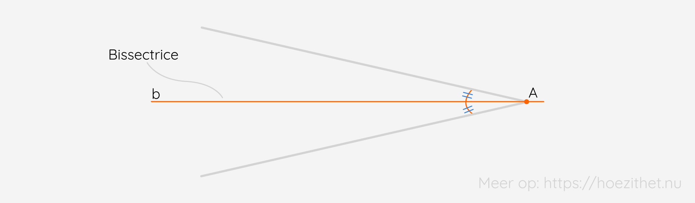
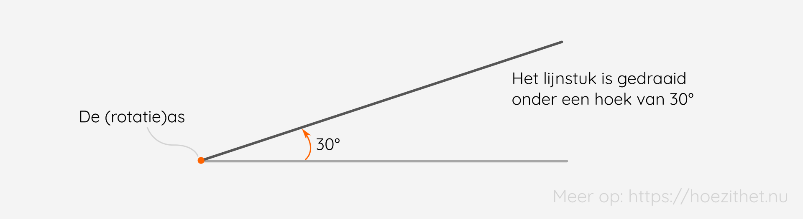

Wanneer twee lijnen elkaar snijden, dan doen ze dit onder een bepaalde **hoek**. Hoeken zijn belangrijk in alles wat met meetkunde te maken heeft, want ze vertellen iets over **de manier waarop** twee rechten, halfrechten of lijnstukken elkaar **snijden**. Daarnaast komen hoeken ook voor bij **draaiingen** 🥴, dus hou je goed vast!

## Wat is een hoek?
**Hoeken** kom je overal tegen. Denk maar aan de letterlijke hoeken van een kamer of de hellingshoek <Mute text="ook gekend als de hellingsgraad"/> van een skipiste. ⛷️🏂

Een **hoek** wordt steeds **bepaald door twee halfrechten met een gemeenschappelijk grenspunt**. De halfrechten noemen we de **benen** van de hoek en het grenspunt noemen we **het hoekpunt**. Een hoek heeft steeds **twee benen** en **één hoekpunt**.

We kunnen een hoek op drie manieren **benoemen**. Enerzijds kunnen we dit doen met een **Griekse letter**, zoals $\alpha$ (alfa) of $\theta$ (thèta). Anderzijds kunnen we dit doen met een ***gewone* letter** (de letter van het grenspunt) waar een **hoedje** 🎩 op staat, bijvoorbeeld $\hat{A}$ of $\hat{B}$. Een derde manier gebruiken we als er **verwarring** mogelijk zou zijn met één letter. 😕 We schrijven dan **drie letters** op. Twee letters (de buitenste) zijn afkomstig van **een punt op elk been**. De middelste letter is **de hoek zelf** en krijgt een hoedje. Zo krijg je bijvoorbeeld $B\hat{A}C$. 😀

## Bijzondere hoeken
Er zijn enkele **bijzondere hoeken** waarvan je de naam best onthoudt, omdat je ze nog veel zal tegenkomen. 🧠

Om te beginnen kan je elke hoek opdelen in één van drie categorieën naargelang **de grootte** ervan. Deze indeling, van **scherpe, stompe en rechte hoeken**, zal je waarschijnlijk wel al kennen!

Daarnaast zijn er nog drie <Mute text="nieuwe"/> termen: een **nulhoek**, **gestrekte hoek**, en **volle hoek**. 

Echt moeilijk te onthouden zijn ze niet, toch?! 🧐😉

## Wat is de bissectrice van een hoek?
In [de les over rechten](../rechten) hebben we de definitie van het midden van een lijnstuk gezien. Ook **hoeken** kunnen we **verdelen in twee gelijke hoeken**. De lijn die de hoek verdeelt noemt men de **deellijn of bissectrice**. 

Elke **hoek** heeft **juist één bissectrice**, net zoals elk lijnstuk juist één midden heeft. 👍

<Attention title="Bissectrice van een hoek">

De **bissectrice** (of **deellijn**) van een hoek is de rechte die de hoek in twee even grote hoeken verdeelt.
</Attention>

<Expand title="Een hoek verdelen in drie gelijke delen zonder geodriehoek">

Later in je schoolse loopbaan, zal je nog leren hoe je het midden van een lijnstuk, een loodlijn, een bissectrice... met **slechts passer en meetlat** kan construeren (dus zonder geodriehoek). Hier hielden de **oude Grieken** zich ook al mee bezig, maar ze zijn er nooit in geslaagd om een **hoek in drie gelijke hoeken te verdelen**. Dit is één van de **drie problemen uit de klassieke Griekse meetkunde**. 

Vooraleer je begint met dit toch te proberen, wil ik je waarschuwen: in 1836 heeft de wiskundige Wantzel **bewezen dat dit onmogelijk is**.
</Expand>

## Het verband tussen hoeken en draaiingen 🥴
Wanneer je een lijnstuk opneemt en **draait** <Mute text="(je zorgt er dus voor dat één punt, de as, op dezelfde plaats blijft liggen)"/>, dan **maak je** eigenlijk een **bepaalde hoek**. Meer nog, je draait iets steeds **onder een bepaalde hoek**.

Later, bij de lessen over goniometrie, zal je zien dat een hoek ook anders beschreven kan worden. Namelijk als een afstand die je wandelt over de buitenkant van een cirkel. Dan spreken we niet meer over graden, maar over **radialen**. Maar voor nu zijn graden meer dan genoeg! 😉

## Samengevat
<Attention title="Hoeken">

Een **hoek** wordt steeds **bepaald door twee halfrechten met een gemeenschappelijk grenspunt**. De halfrechten noemen we de **benen** van de hoek en het grenspunt noemen we **het hoekpunt**. Een hoek heeft steeds **twee benen** en **één hoekpunt**.

**Scherpe hoeken** zijn kleiner dan 90°, **rechte hoeken** zijn precies 90° en **stompe hoeken** zijn groter dan 90°, maar kleiner dan 180°.

Een **nulhoek** is een hoek van 0°, een **gestrekte hoek** is een hoek van 180° en een **volle hoek** eentje van 360°.
</Attention>

<Attention title="Bissectrice van een hoek">

De **bissectrice** (of **deellijn**) van een hoek is de rechte die de hoek in twee even grote hoeken verdeelt.
</Attention>

<Attention title="Hoeken en draaiingen">

Een **draaiing** van een object gebeurt steeds **om een bepaalde hoek**.
</Attention>
