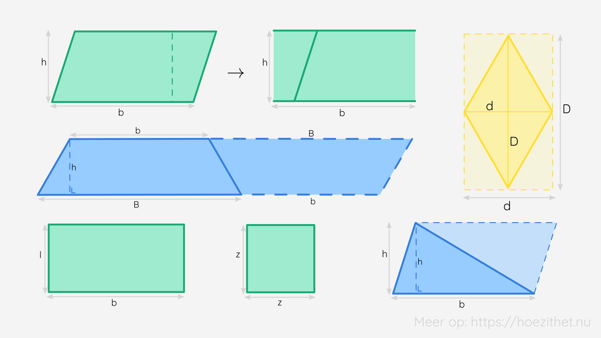

Als er een virus door de wereld raast 🦠, moeten we best anderhalve meter afstand houden. Wanneer we dus toch naar een concert gaan in een concertgebouw 🎵, dan heeft iedere persoon een **oppervlakte** van $2.25 \si{ m}^2$ nodig. Alleen zo krijgt het virus geen kans. 💪

## Wat is de oppervlakte?
De **oppervlakte** <Mute text="A"/> van een vlakke figuur is een **maat voor de grootte** ervan. Het vertelt ons **hoe groot** het gebied binnen de zijden is. Wanneer een vloerder nieuwe tegels wil leggen in je huis, dan moet hij de **oppervlakte** kennen om te berekenen hoeveel tegels hij nodig heeft. 

Ongetwijfeld ken je al verschillende **oppervlaktematen**. Denk maar aan **cm², m² of ha** (= 10 000 m²). Wat opvalt is de **tweede macht** <Mute text="(uitgesproken als 'vierkante')"/> die overal aanwezig is. Maar waarom? 🤔 

De reden is simpel: we **vermenigvuldigen twee afstandsmaten** <Mute text="(zoals cm of m)"/> met elkaar om een oppervlakte te bekomen. Net zoals met getallen, kunnen we als volgt redeneren:

$$
 4 \cdot 4 = 4^2 \text{ dus } \si{cm} \cdot \si{cm} = \si{cm}^\orange{2}
$$

Met eenheden rekenen is niet anders dan met gewone getallen.

## Hoe bereken ik de oppervlakte?
Om de **oppervlakte van figuren** te berekenen, zijn er enkele **formules** die je moet kennen.

| Figuur         | Formule                                     |
|----------------|---------------------------------------------|
| Trapezium      | $A_{trapezium} = \frac{(B + b) \cdot h}{2}$ |
| Parallellogram | $A_{parallellogram} = b \cdot h$            |
| Ruit           | $A_{ruit} = \frac{D \cdot d}{2}$            |
| Rechthoek      | $A_{rechthoek} = l \cdot b$                 |
| Vierkant       | $A_{vierkant} = z \cdot z = z^2$            |
| Driehoek       | $A_{driehoek} = \frac{b \cdot h}{2}$        |
| Cirkel         | $A_{cirkel} = r \cdot r \cdot \pi$          |

Merk op dat je bij de **figuren** waar er in de **noemer** een $2$ staat, dit eigenlijk wil zeggen dat het de **helft** is **van een rechthoek**. In de teller staat dan de formule voor de oppervlakte van een rechthoek (soms licht gewijzigd). 💡

Als je de **oppervlakte van samengestelde figuren** wilt bepalen, dan verdeel je deze figuur best in verschillende figuren waarvoor een formule bestaat. Zo kan je een gevel van een huis splitsen in een vierkant (of rechthoek) en een driehoek. 🏠 🌲

## Oppervlakte van ruimtefiguren
In de [les over ruimtefiguren](../figuren) hebben we geleerd dat ruimtefiguren bestaan uit vlakke figuren. Als we een **ontwikkeling** maken, dan zien we dit goed. Om de totale oppervlakte van een ruimtefiguur te berekenen, neem je dus **de som van oppervlaktes van de vlakke figuren** waaruit de ruimtefiguur is opgebouwd. 

Ook hier kan je het voor sommige ruimtefiguren **eenvoudiger** maken. Zo bestaat een **kubus** uit **zes identieke vierkanten**, dus je **vermenigvuldigt** de **oppervlakte van één vierkant met zes**. Kan jij nog zo'n formules vinden? 🧐

## Samengevat
<Attention title="Een oppervlakte">

De **oppervlakte** (vaak aangeduid met A) van een vlakke figuur is een **maat voor de grootte** ervan. We gebruiken **oppervlaktematen** om dit weer te geven, zoals cm², m² of ha.
</Attention>

<Attention title="Oppervlakteformules">

De **oppervlakteformules** leer je best vanbuiten, of je zorgt ervoor dat je weet **vanwaar ze komen**.

| Figuur         | Formule                                     |
|----------------|---------------------------------------------|
| Trapezium      | $A_{trapezium} = \frac{(B + b) \cdot h}{2}$ |
| Parallellogram | $A_{parallellogram} = b \cdot h$            |
| Ruit           | $A_{ruit} = \frac{D \cdot d}{2}$            |
| Rechthoek      | $A_{rechthoek} = l \cdot b$                 |
| Vierkant       | $A_{vierkant} = z \cdot z = z^2$            |
| Driehoek       | $A_{driehoek} = \frac{b \cdot h}{2}$        |
| Cirkel         | $A_{cirkel} = r \cdot r \cdot \pi$          |

Voor **ruimtefiguren** neem je **de som van oppervlaktes van de vlakke figuren** waaruit de ruimtefiguur is opgebouwd.
</Attention>
