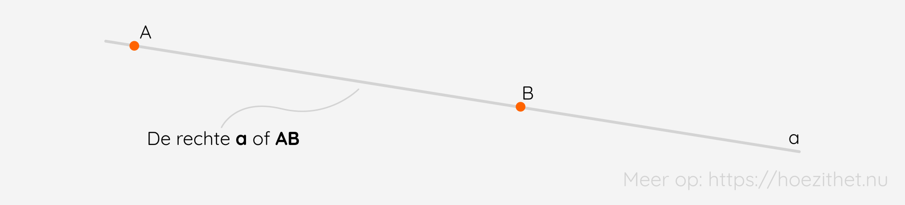
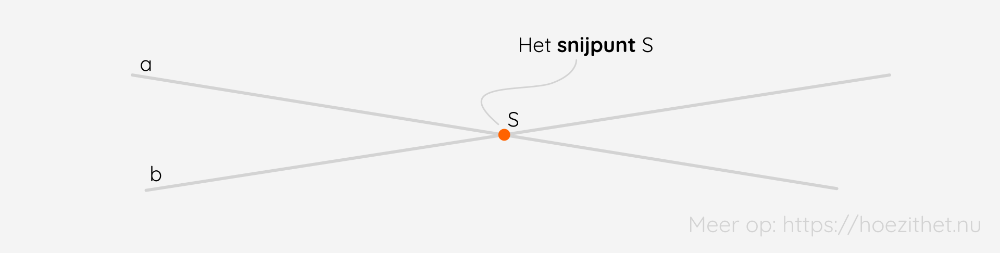
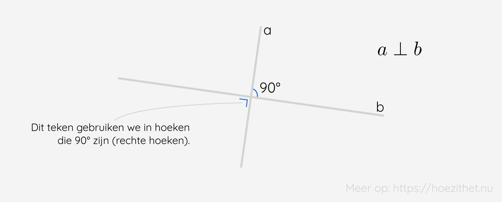
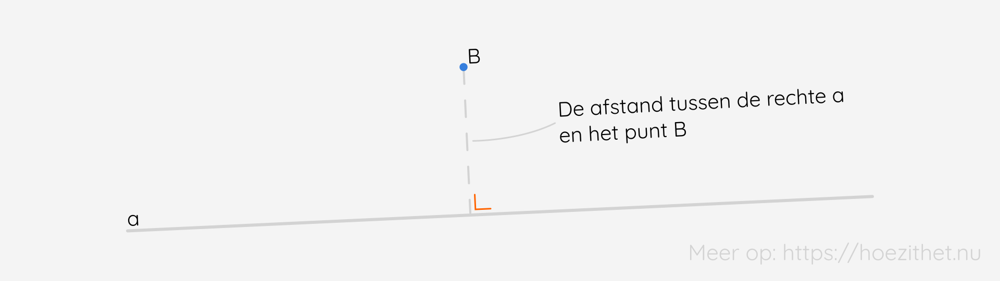

Overal rondom ons zien we **lijnen of rechten**. Sommige snijden elkaar niet en andere wel. In deze les bekijken we de rechten door een wiskundige bril! 🤓

## Wat is een rechte?
In de [vorige les](../basisbegrippen) hebben we reeds gezien wat een rechte is, maar om volledig te zijn herhalen we dit nog even.

Een **rechte of lijn** is een rechte lijn die **oneindig doorloopt**. Het is dus een **oneindige verzameling punten in één richting**. Maar aangezien het onmogelijk is om een rechte oneindig door te trekken, spreken we af dat elke **onbegrensde** <Mute text="(door een punt)"/> **lijn** een rechte is. Zoals doet vermoeden is een rechte ook steeds een **rechte lijn** en heeft hij geen gebogen stukken.

We kunnen een rechte op twee manieren **benoemen**. Enerzijds **door een kleine letter**, zoals a. Of anderzijds **door twee punten op die rechte**.

## Wat is het verschil evenwijdige en snijdende rechten?
Het verschil tussen een evenwijdige en snijdende rechte is fundamenteel. Het is een verschil zoals dag ☀️ en nacht 🌔.

**Evenwijdige rechten** zijn rechten die overal even ver <Mute text="(letterlijk even wijd)"/> van elkaar liggen. Als de <Mute text="(loodrechte)"/> afstand tussen twee rechten bijvoorbeeld overal $1~\si{cm}$ is, dan zijn die rechten evenwijdig. Ze hebben dan **geen enkel punt gemeenschappelijk**. Het kan echter ook dat de afstand tussen twee rechten overal $0~\si{cm}$ is, en dan zijn de rechten òòk evenwijdig. In dat geval vallen de rechten samen en hebben ze dus **al hun punten gemeenschappelijk**. Wanneer rechte $a$ evenwijdig is aan rechte $b$, schrijven we dat als **$a$ // $b$** of **$a \parallel b$**.

**Snijdenden rechten** zijn rechten die **juist één punt gemeenschappelijk** hebben. Dit gemeenschappelijke punt noemen we **het snijpunt**.

Daarnaast bestaat er ook nog iets zoals **kruisende rechten**. Dit zijn rechten die elkaar **noch snijden**, **noch evenwijdig** zijn. We komen deze alleen tegen in een **driedimensionale ruimte**, dus niet in het vlak (zoals een blaadje papier). Het zijn **rechten die niet in hetzelfde vlak liggen**. We gaan hier verder op in bij de les rond [ruimtefiguren](../figuren).

## Een rechte hoek tussen twee loodrechte dragers
Als je de [vorige les](../basisbegrippen) goed hebt gelezen, dan weet je dat een drager de rechte is waarop een bepaald lijnstuk, halfrechte, punt... ligt.
Wanneer twee dragers <Mute text="of rechten"/> **loodrecht** op elkaar liggen, betekent dit dat ze een **rechte hoek** <Mute text="(90°)"/> vormen. We noteren **$a \perp b$**. 

Bert is bouwvakker. 👷 Hij is al enkele dagen bezig met het metsen van een muur en wil nu controleren of hij wel goed bezig is. Staat de muur mooi recht? Zijn materiaal ligt echter beneden en Bert is een beetje lui. 🦥 Hij heeft alleen touw en een klein stukje lood bij zich (zijn geluksbrenger).

Gelukkig heeft Bert altijd opgelet bij **wiskunde en fysica** en weet hij perfect hoe hij hiermee kan controleren of hij goed bezig is. 💡 Weet jij ook hoe je hiermee kan controleren of de muur recht staat?

Vermoedelijk komt de benaming *loodrecht* van dit gebruik.

Daarnaast bestaat er **bij een lijnstuk** nog een speciale soort **loodlijn** (dat is een lijn die loodrecht staat op een andere), namelijk de **middelloodlijn.** 
<Attention title="Middelloodlijn">

De **middelloodlijn van een lijnstuk** is de rechte die door het midden van dit lijnstuk gaat en loodrecht staat op dit lijnstuk.
</Attention>

## Overige eigenschappen
Voor de volgende eigenschappen neem je er best een **blaadje papier** 📃 en een **scherp potlood** ✏️ bij! Zo kan je zelf controleren of wat ik zeg correct is en studeer je ondertussen de **eigenschappen** al wat in!

### Overzicht

| Gegevens                            | Eigenschap                                                                                                           |
|-------------------------------------|----------------------------------------------------------------------------------------------------------------------|
| rechte a en punt B                  | Door elk punt van het vlak kan je precies één rechte tekenen die evenwijdig is met een gegeven rechte.               |
| rechte a en punt B                  | Door elk punt van het vlak kan je precies één rechte tekenen die loodrecht staat op een gegeven rechte.             |
| $a \parallel b$ en $b \parallel c$  | Als twee rechten evenwijdig zijn met eenzelfde derde rechte, dan zijn die twee rechten onderling ook evenwijdig. |
| $a \parallel b$ en $c \nparallel a$ | Als een rechte een van twee evenwijdigen snijdt, dan snijdt ze ook de andere.                                        |
| $a \perp c$ en $b \perp c$          | Als twee rechten loodrecht op eenzelfde derde rechte staan, dan zijn de rechten onderling evenwijdig.                |
| $a \perp b$ en $b \parallel c$      | Als een rechte loodrecht staat op een van twee evenwijdige rechten, dan staat ze ook loodrecht op de andere.         |


De vlakke meetkunde, die het meest besproken wordt in het middelbaar, noemt men soms ook Euclidische meetkunde, naar de grondlegger **Euclides** (4e eeuw v. Chr.). Alle regeltjes in deze Euclidische meetkunde worden afgeleid uit **vijf axioma's of postulaten**. Een soort basisbeginselen waarop al de rest is voortgebouwd. 🏛️

De eerste eigenschap die hierboven is opgelijst, is het **vijfde postulaat** van de Euclidische meetkunde en dit kan men niet bewijzen. Veel wiskundigen, waaronder Euclides zelf, hebben dit doorheen de tijd proberen te bewijzen, zonder succes. Uiteindelijk was het **Carl Friedrich Gauss** (18e - 19e eeuw), een andere bekende wiskundige, die hieruit concludeerde dat er ook **niet-Euclidische meetkunde** bestaat, waarbij het vijfde postulaat niet geldt. Sindsdien zijn er tal van niet-Euclidische meetkundes ontdekt/bestudeerd, zoals de **hyperbolische** en **elliptische** meetkunde. 🤓


## Hoe bereken ik de afstand tussen een punt en een rechte?
Als we de **afstand** willen meten 📏 tussen twee objecten, gebruiken we steeds **rechte lijnen**. Dit is de *kortste weg* en wordt dus gebruikt voor afstanden. Maar welke rechte lijn moeten we dan gebruiken om de afstand tussen een punt en een rechte te bepalen? :thinking face: We kunnen zoveel rechte lijnen trekken. Daarom spreken we af om de **loodlijn van de rechte a door het punt B** te gebruiken, dit is immers weer de *kortste weg*. 💡

## Samengevat
<Attention title="Wat is een rechte?">

Een **rechte of lijn** is een rechte lijn die **oneindig doorloopt**. We benoemen een rechte door een **kleine letter**, zoals a of **door twee punten op die rechte**.
</Attention>

<Attention title="Snijdende, kruisende en evenwijdige rechten">

**Snijdenden rechten** zijn rechten die **juist één punt gemeenschappelijk** hebben. Dit gemeenschappelijke punt noemen we **het snijpunt**.

**Evenwijdige rechten** zijn rechten die **geen enkel gemeenschappelijk punt** hebben of rechten die **samenvallen**.

Zowel snijdende als evenwijdige rechten liggen **in hetzelfde vlak**. Dit in tegenstelling tot **kruisende rechten**, die **niet in hetzelfde vlak** liggen.
</Attention>

<Attention title="Overige eigenschappen">

Er zijn nog enkele belangrijke eigenschappen (probeer ze uit door ze te tekenen!):
1. Door elk punt van het vlak kan je precies één rechte tekenen die evenwijdig is met een gegeven rechte.
2. Door elk punt van het vlak kan je precies één rechte tekenen die  loodrecht staat op een gegeven rechte.
3. Als twee rechten evenwijdig zijn met met eenzelfde derde rechte, dan zijn die twee rechten onderling ook evenwijdig.
4. Als een rechte een van twee evenwijdigen snijdt, dan snijdt ze ook de andere.
5. Als twee rechten loodrecht op eenzelfde derde rechte staan, dan zijn de rechten onderling evenwijdig.
6. Als een rechte loodrecht staat op een van twee evenwijdige rechten, dan staat ze ook loodrecht op de andere.
</Attention>

<Attention title="Afstand tussen een punt en een rechte">

We bepalen de afstand tussen **een rechte a** en een **punt B** als **de lengte van de loodlijn** van de **rechte a** door het **punt B**.
</Attention>
