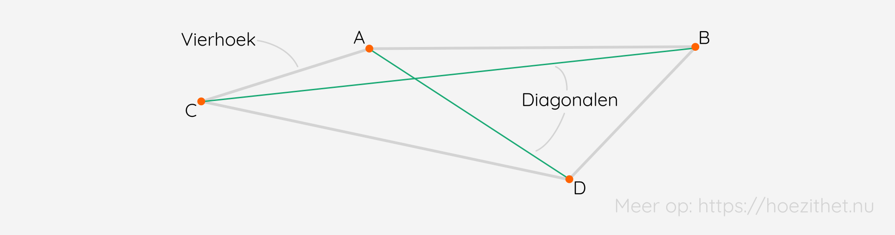
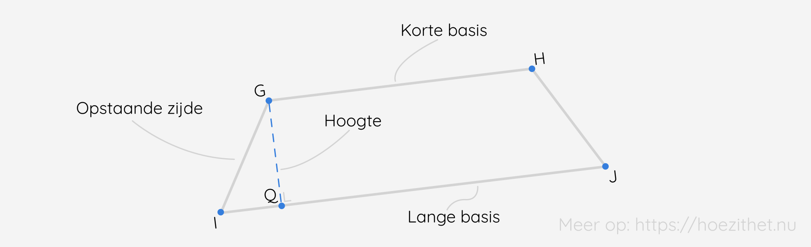
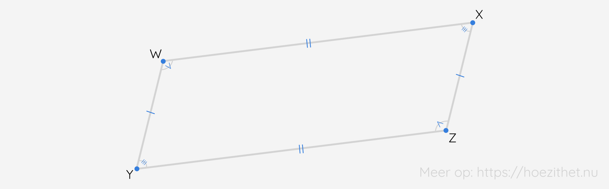
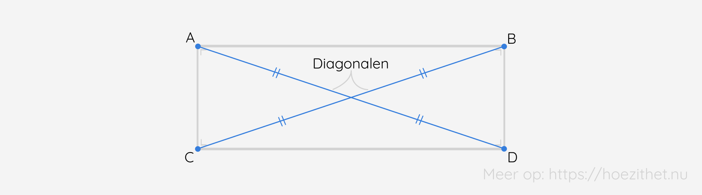
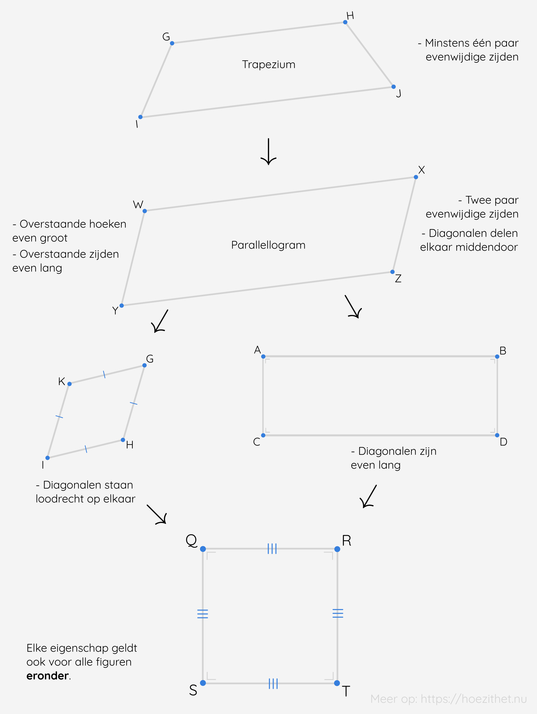

Vierkanten, rechthoeken, ruiten, trapezia en parallellogrammen zijn allemaal voorbeelden van **vierhoeken**, maar waarin verschillen ze? 🧐

## Wat is een vierhoek?
Elke **vlakke figuur** die wordt gevormd door **vier zijden** en **vier hoeken** noemen we een **vierhoek**.

In bovenstaande vierhoek kunnen we ook nog **diagonalen** tekenen. Dit is een **lijnstuk** dat **twee niet-aangrenzende hoekpunten** met elkaar verbindt. In bovenstaande figuur wordt dit dan [AD] en [BC]. <Mute text="Druk op 'Toon uitleg' om deze te zien."/>

Net zoals bij [driehoeken](./driehoeken) kunnen we ook spreken van **overstaande zijden en hoeken**. 📐 Dit zijn steeds de zijden en hoeken die **het verst** van elkaar liggen. Met andere woorden de hoeken die het **minst met elkaar gemeen** hebben. 

## De som van de hoeken van een vierhoek is 360°
Naast het feit dat alle **vierhoeken** vier zijden en vier hoeken hebben, is **de som van de hoeken** ook steeds gelijk. Dit komt namelijk altijd uit op **360°**.

<Attention title="Som van de hoeken van een vierhoek">

De **som van de hoeken van een vierhoek** is steeds **360°**.
</Attention>

## Het trapezium
**Een trapezium** is een vierhoek met *ten minste* **één paar evenwijdige zijden**.

[GH] en [IJ] zijn hier de **evenwijdige zijde**. De langste zijde noemt men de **grote basis zijde** en de korte zijde de **korte basis**. De twee **niet-evenwijdige zijden** noemt men de **opstaande zijden**.

De **hoogte** van een trapezium meet je **tussen de twee evenwijdige zijden**, hier is dit [GQ]. 📏 

Er zijn twee bijzonder gevallen bij de trapezia. ⚠️ Enerzijds kan je een **gelijkbenig trapezium** hebben met twee **even lange opstaande zijden**. Anderszijds bestaat er ook een **rechthoekig trapezium** met precies **twee rechte hoeken**.

<Attention title="De basishoeken van een gelijkbenig trapezium">

De twee hoeken aan de grote basis van een **gelijkbenig trapezium** noemt men **de basishoeken**. In het voorbeeld (een gelijkbenig trapezium), zijn dit $\hat{I}$ en $\hat{J}$. 

In een gelijkbenig trapezium zijn de basishoeken altijd **even groot**.
</Attention>

## Het parallellogram
De volgende stap is een **parallellogram**. Dit is een vierhoek met **twee paar evenwijdige zijden**. 

Deze definitie zorgt ervoor dat **elke parallellogram ook een trapezium** is, want een trapezium heeft **ten minste** één paar evenwijdige zijden. **Omgekeerd geldt dit niet**. Niet elke trapezium is een parallellogram ❗.

<Attention title="Eigenschappen van een parallellogram">

In een parallellogram zijn de **overstaande zijden even lang** en de **overstaande hoeken even groot**. Ook snijden de **diagonalen** elkaar **middendoor**. Beide diagonalen worden dus perfect doormidden gesneden door de andere diagonaal.
</Attention>

## De rechthoek
Een **rechthoek** is een vierhoek met **vier rechte hoeken**. Als je je de [les over rechten](./rechten) nog herinnert 💡, dan weet je dat wanneer **twee rechten loodrecht op eenzelfde derde rechte** staan, de rechten **onderling evenwijdig** zijn. We kunnen dit ook toepassen op een rechthoek (de zijden liggen op een rechte), waardoor we onmiddellijk kunnen afleiden dat een rechthoek **twee paar evenwijdige zijden** heeft. Met andere woorden: een **rechthoek** is ook een **parallellogram** en dus ook een **trapezium**. 🤯

<Attention title="Eigenschappen van een rechthoek">

In een rechthoek zijn de **diagonalen even lang** en snijden ze elkaar **middendoor**. Omgekeerd geldt dit ook: elke vierhoek waarvan de diagonalen even lang zijn en elkaar middendoor snijden is een **rechthoek**.
</Attention>

## De ruit
**Een ruit** is een vierhoek met **vier even lange zijden**.

"Is dit niet gewoon een parallellogram?", vraag je je misschien af. 🧐 En je bent niet eens zo fout! Het is inderdaad een **parallellogram**, maar een **met vier gelijke zijden**.

<Attention title="Eigenschappen van een ruit">

In een ruit staan de **diagonalen loodrecht op elkaar** en delen ze elkaar **middendoor**. Ook hier geldt de omgekeerde eigenschap.
</Attention>

## Het vierkant
Wanneer we alle **eigenschappen combineren**, krijgen we een **vierkant**. Dit is een vierhoek met **vier rechte hoeken** en **vier even lange zijden**. De **diagonalen** zijn **even lang**, snijden elkaar **middendoor** en staan **loodrecht** op elkaar. Kijk zelf maar eens na! 😌

## Samengevat
<Attention title="Wat is een vierhoek">

Elke **vlakke figuur** die wordt gevormd door **vier zijden** en **vier hoeken** noemen we een **vierhoek**. Een **lijnstuk** dat **twee niet-aangrenzende hoekpunten** met elkaar verbindt, noemen we **diagonalen.**
</Attention>

<Attention title="Som van de hoeken van een vierhoek">

De **som van de hoeken van een vierhoek** is steeds **360°**.
</Attention>

Hieronder volgt een overzicht van de **verschillende soorten vierhoeken**:

