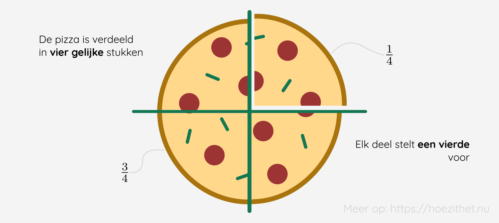

Je bent op een feestje met acht personen en het is tijd voor de taart. 🎂 Iedereen wil uiteraard een even groot
stuk van de taart, dus wordt hij in acht gelijke stukken gesneden. 🍰 Iedereen krijgt dus één achtste of $\frac{1}{8}$ van de taart.

Zoals je wellicht al weet, noemen we die $\frac{1}{8}$ een **breuk**. In deze les leggen we uit wat zo'n breuk weer precies is en in welke vormen een breuk zoal kan voorkomen.

## Waar staat de teller?

Een breuk bestaat uit een **teller** en een **noemer**. Tussen de teller en noemer trekken we een **breukstreep**.

De **teller** *telt* het aantal stukken dat je neemt. De **noemer** *benoemd* in hoeveel stukken we de taart hebben verdeeld. In de breuk $\frac{3}{4}$ is de teller $3$ en de noemer $4$. Dat betekent dat we de taart in $4$ stukken hebben verdeeld en we daar $3$ stukken van nemen.

Een trucje om de teller en noemer te onthouden: de **t**eller staat aan de **t**op! 

| Je schrijft       | Je leest het als               |
|-------------------|--------------------------------|
| $\frac{3}{4}$     | drie vierde |
| $\frac{1}{8}$     | één achtste |
| $\frac{5}{4}$     | vijf vierde  |
| $\frac{2}{3}$     | twee derde |

## Hoe werkt een breuk?
Het is handig om bij breuken **een pizza** 🍕 voor te stellen. De **noemer** van een breuk vertelt je **in hoeveel stukken** de pizza wordt verdeeld.
De **teller** van een breuk vertelt je dan **hoeveel stukken je neemt/eet**. 😋

Zo is de pizza hieronder verdeeld in vier **gelijke** stukken. De *kleine* pizzapunt
stelt $\frac{1}{4}$ voor, terwijl de rest van de pizza $\frac{3}{4}$ voorstelt.

Een andere manier om aan breuken te denken is door middel van **een deling**. Zo betekent $\frac{3}{4}$ hetzelfde als $3 : 4$. De uitkomst van beide is $0{,}75$. Het is **veel makkelijker** om een **deling als een breuk te schrijven**, daarom werken wiskundigen veel liever met breuken in plaats van het deelteken.

Aangezien een breuk eigenlijk een deling is, moeten we nog even naar onze **mintekens** kijken. 👀 Zowel teller als noemer kunnen één (of meer) minteken(s) bevatten. Als **alleen de teller** of **alleen de noemer negatief** is, dan is de **breuk in zijn geheel negatief**. We noteren een minteken voor de breukstreep ($-\frac{a}{b}$). Als **teller én noemer negatief** zijn, dan is de **breuk in zijn geheel positief**.

<Attention title="Een nul in de breuk">

Als de **nul in de teller** voorkomt, dan is de **uitkomst** $0$. Je neemt nul stukken van een pizza, dus kan je ook geen (of nul) stukken eten.

Als de **nul in de noemer** voorkomt, dan is de **uitkomst ongedefinieerd**, ongeacht het getal in de teller.
</Attention>

<Expand title="Waarom kunnen we niet delen door 0?">

Er zijn verschillende redenen waarom we niet kunnen delen door 0.

Enerzijds kunnen we deze vraag benaderen **vanuit algebraïsch standpunt** waar een deling eigenlijk **het omgekeerde** is **van een vermenigvuldiging**. Wanneer we dus $\frac{a}{b} = c$ hebben, dan geldt er: $c \cdot b = a$. Maar wanneer $b = 0$, dan is dit niet mogelijk. Neem bijvoorbeeld volgende breuk: $\frac{3}{0} = x$. Dan zou $x \cdot 0 = 3$, maar aangezien we delen door 0 in het linkerlid, krijgen we $0 \neq 3$. We kunnen dus **niet delen door nul zonder problemen**.

Anderzijds kunnen we deze vraag (letterlijk 🥁) **benaderen met limieten**. Bij een limiet vragen we ons af wat er gebeurt met een uitdrukking wanneer $x$ nadert naar een getal. In ons geval kiezen we (voor het gemak) voor $\frac{1}{x}$ en vragen we ons af **welk getal dit nadert als $x$ nadert naar 0**. Om volledig te zijn, naderen we zowel van links (negatieve getallen) als van rechts (positieve getallen). We krijgen dan $\lim\limits_{x \to 0^{\orange{-}}} \frac{1}{x} = -\infty$ en $\lim\limits_{x \to 0^{\orange{+}}} \frac{1}{x} = +\infty$, waardoor $\lim\limits_{x \to 0} \frac{1}{x}$ ongedefineerd is. 

Hieronder vind je een tabel die toont hoe de rechterlimiet (die nadert van rechts) wordt berekend. Voor de linkerlimiet voeren we hetzelfde proces uit, maar nemen we steeds een negatieve $x$.

| $x$     | $\frac{1}{x}$     |
|---------|-------------------|
| 1       | 1                 |
| 0.1     | 10                |
| 0.01    | 100               |
| 0.001   | 1000              |
| 0.0001  | 10000             |
| 0.00001 | 100000            |
| $\ldots$  | $\ldots$        |
| 0       | $+\infty$         |

Het is dus duidelijk dat we **geen eenduidige oplossing** hebben wanneer we **delen door 0**. Vandaar dat dit **ongedefinieerd** is.

</Expand>

## Gelijkwaardige en gelijknamige breuken
Er bestaan verschillende **speciale breuken**. Dit zijn breuken met **een bepaalde eigenschap** en we kunnen deze aanduiden met een **speciale benaming**. Zo heb je **gelijkwaardige** en **gelijknamige** breuken.

Sommige breuken zien er anders uit, maar zijn eigenlijk gelijk aan elkaar. Zulke breuken noemen we **gelijkwaardige breuken**. Of ze nu zeggen dat je $\frac{1}{2}$ van de pizza krijgt of $\frac{2}{4}$, uiteindelijk zal je dezelfde hoeveelheid pizza kunnen eten. We kunnen namelijk zowel de teller als de noemer van $\frac{2}{4}$ **delen door 2**. Dan krijgen we $\frac{1}{2}$.

$$
\frac{\frac{2}{\orange{2}}}{\frac{4}{\orange{2}}} = \frac{1}{2}
$$

<Attention title="Handig!">

Als je een breuk hebt, mag je steeds de **teller en noemer vermenigvuldigen of delen met eenzelfde getal**.

$$
\frac{25}{40} = \frac{\frac{25}{\orange{5}}}{\frac{40}{\orange{5}}} = \frac{5}{8}
$$
$$
\frac{1}{2} = \frac{1 \cdot \orange{10}}{2 \cdot \orange{10}} = \frac{10}{20}
$$

</Attention>

Een andere soort breuken die we vaak tegenkomen zijn de **gelijknamige breuken**. Gelijknamige breuken hebben **dezelfde noemer**. Enkele voorbeelden hiervan zijn:

$$
\frac{2}{\green{5}}, \frac{8}{\green{5}}, \frac{25}{\green{5}}
$$

Laten we het laatste voorbeeld nog eens van dichterbij bekijken. 🔎 We kunnen $\frac{25}{5}$ namelijk ook schrijven als $\frac{5}{1}$ <Mute text="of simpelweg als 5."/> Als we dit doen is de breuk **niet meer gelijknamig** met de anderen, want de **noemer is veranderd**. 

Omgekeerd kunnen we ook **een breuk gelijknamig maken**. Hoe we dit doen en waarom we dit gebruiken kan je lezen in de les over [het optellen en aftrekken van breuken en kommagetallen](../optellen_aftrekken).

## Breuken, kommagetallen en procenten
Breuken, kommagetallen <Mute text="of decimale vormen"/> en procenten behoren allemaal tot dezelfde familie. **Kan jij hun relatie vinden uit onderstaande tabel?** 🧐

| Breuk            | Kommagetal | Procent |
|------------------|------------|---------|
| $\frac{1}{1}$    | 1          | 100%    |
| $\frac{1}{4}$    | 0,25       | 25%     |
| $\frac{17}{100}$ | 0,17       | 17%     |
| $\frac{5}{8}$    | 0,625      | 62,5%   |

Zoals eerder gezegd is een breuk eigenlijk **een deling**. Wanneer je **1 deelt door 4** ($\frac{1}{4}$) krijg je **0,25** (probeer maar op je rekentoestel als je mij niet vertrouwt 🤨). Om dit vervolgens om te zetten naar een **procent**, **vermenigvuldig je met 100**. Reken maar eens na voor de andere voorbeelden!

Een **%** wil eigenlijk niets anders zeggen dan **op honderd**. 10% lees je dus als **10 op 100** of $\frac{10}{100}$.

## Samengevat
<Attention title="Wat is een breuk?">

Een breuk bestaat uit een **breukstreep** met daarboven de **teller** en onder de breukstreep staat de **noemer**. Eigenlijk is een breuk gewoon een andere manier om een **deling** te schrijven. De teller is het **deeltal** en de noemer de **deler**.

De **uitkomst** van een breuk met **nul in de teller** is $0$. De **uitkomst** van een breuk met **nul in de noemer** is **ongedefinieerd**.
</Attention>

<Attention title="Soorten breuken">

**Gelijkwaardige breuken** zijn breuken die eigenlijk hetzelfde willen zeggen. We kunnen de **teller en de noemer delen of vermenigvuldigen met eenzelfde getal** om een gelijkwaardige breuk te vinden.

**Gelijknamige breuken** zijn breuken met **dezelfde noemer**. De grootte van een deel is hetzelfde.
</Attention>
