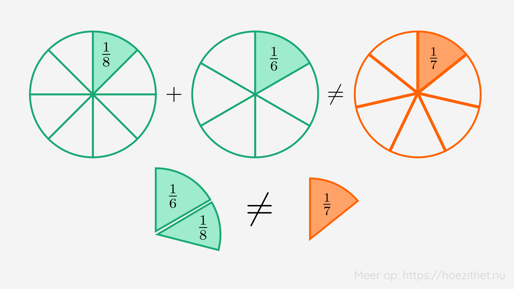
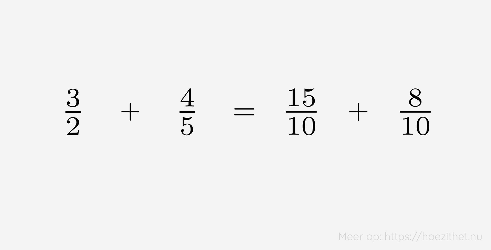
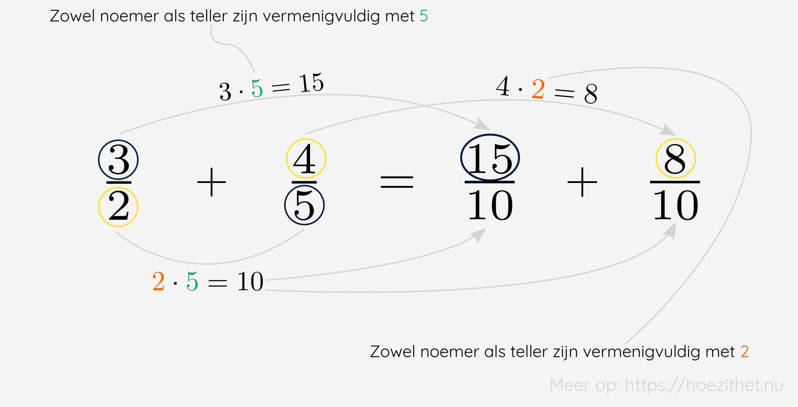

Je bent nog steeds op een verjaardagsfeestje en het [eerste stukje taart](./breuken/) ($\frac{1}{8}$) is op. 🍰 Blijkbaar is er nog een <Mute text="(even grote)"/> taart voor zij die willen. Jij en vijf anderen lusten wel nog een stukje. 😋 Deze taart wordt dus in zes gelijke delen verdeeld en jij krijgt hier één stukje van. Hoeveel taart heb je dan in het totaal gegeten? 

## Hoe kan ik breuken optellen en aftrekken?
Uit de inleiding weten we dat je $\frac{1}{8}$ en $\frac{1}{6}$ van twee even grote taarten hebt gegeten. Hoe moeten we deze breuken nu optellen om te weten hoeveel taart je in totaal hebt gegeten?

Misschien moeten we gewoon tellers en noemers optellen? 🧐 Laten we proberen!

$$
\frac{1 + 1}{8 + 6} = \frac{\frac{2}{\orange{2}}}{\frac{14}{\orange{2}}} = \frac{1}{7}
$$ 

Dit kàn **niet juist** zijn! Het stuk van $\frac{1}{6}$ is immers op z'n eentje al groter dan $\frac{1}{7}$. <Mute text="Een stuk van een taart dat gedeeld is in meer gelijke stukken is kleiner dan een stuk van een (even grote) taart die in minder stukken is verdeeld."/> 

De methode met het optellen van teller en noemer is dus **foutief**!

Misschien moeten we alleen de teller of alleen de noemer optellen? 🤨 Maar als we hier even verder over nadenken kan ook dit niet. Wat doen we immers als we twee verschillende noemers (zoals in het voorbeeld) of twee verschillende tellers hebben? 🤔

We moeten de breuken kunnen vergelijken. Elk stuk, van beide taarten, moet even groot zijn. Daarom is er slechts één juiste manier: **de breuken gelijknamig maken en vervolgens de tellers optellen of aftrekken**.

## Hoe maak ik een breuk gelijknamig?
Als je breuken wilt optellen of aftrekken, moeten ze **altijd gelijknamig** zijn. Anders kan je deze niet optellen of aftrekken.

> Als je de term *gelijknamige breuken* niet herkent, bekijk je best nog even de les over [breuken](./breuken/).

Om breuken gelijknamig te maken, gebruiken we vaak het **kleinst gemeenschappelijk veelvoud** van de noemers. We mogen echter niet zomaar de noemers veranderen zonder de tellers aan te passen. **Teller en noemer** moeten immers steeds **met hetzelfde getal** vermenigvuldigd <Mute text="(of gedeeld)"/> worden. Als we de noemer dus bijvoorbeeld vermenigvuldigen met $4$, dan vermenigvuldigen we ook de teller met $4$.

Aangezien het soms moeilijk is om het kleinst gemeenschappelijk veelvoud te vinden, kan je ook volgend **stappenplan** gebruiken:
1. Je **vereenvoudigt**, indien mogelijk, de breuken.
2. Je vermenigvuldigt de noemers met elkaar en het resultaat is de **nieuwe noemer voor beide breuken**
3. Je vermenigvuldigt de teller van de eerste breuk met de noemer van de tweede breuk, het resultaat is de **nieuwe teller van de eerste breuk**
4. Je vermenigvuldigt de teller van de tweede breuk met de noemer van de eerste breuk, het resultaat is de **nieuwe teller van de tweede breuk**

### Nieuwe noemers voor beide breuken
Bij de eerste stap **vermenivuldig je de noemers van beide breuken**. Het resultaat dat je bekomt wordt de nieuwe noemer voor beide breuken. Vaak komt dit overeen met het kleinst gemeenschappelijk veelvoud en anders is het niet veel extra werk. Bijvoorbeeld:

$$
\frac{1}{\green{8}} \text{ en } \frac{1}{\green{6}} \rightarrow \green{6} \cdot \green{8} = 48
$$ 

$48$ wordt de **nieuwe noemer van beide breuken**.

### Nieuwe teller van de eerste breuk
Nadat je de breuken op dezelfde noemer hebt gezet, moet je ook nog de **tellers aanpassen**. Anders zou je de breuk veranderen en dat willen we natuurlijk niet! 🙅 De nieuwe **teller van de eerste breuk** bekom je door de teller te **vermenigvuldigen** met de **(oude) noemer van de tweede breuk**.

$$
\frac{\green{1}}{8} \text{ en } \frac{1}{\green{6}} \rightarrow \green{1} \cdot \green{6} = 6
$$

$6$ wordt de **nieuwe teller van de eerste breuk**.

### Nieuwe teller van de tweede breuk
Nu moeten we enkel nog de nieuwe teller van de tweede breuk berekenen. Dit doen we door de **teller van de tweede breuk** te **vermenigvuldigen** met de **(oude) noemer van de eerste breuk**.

$$
\frac{1}{\green{8}} \text{ en } \frac{\green{1}}{6} \rightarrow \green{8} \cdot \green{1} = 8
$$

$8$ wordt de **nieuwe teller van de tweede breuk**. 

We bekomen dus **twee gelijknamige breuken** die gelijkwaardig zijn aan de originele: 

$$
\frac{1}{8} \text{ en } \frac{1}{6} = \frac{6}{48} \text{ en } \frac{8}{48}
$$

Hoera! 👍

### Extra voorbeeld
Kan jij mij vertellen welke stappen ik heb genomen om onderstaande optelling gelijknamig te maken?

<ToggleImage toggleText="Toon uitleg">

</ToggleImage>

## Gelijknamige breuken optellen en aftrekken
Het moeilijkste deel is achter de rug! 😌🎉 Nadat we twee gelijknamige breuken hebben, moeten we alleen nog de **tellers optellen of aftrekken** volgens de [regels die we reeds kennen](./rekenen_gehele_getallen). We kunnen nu dus eindelijk berekenen hoeveel pizza we in totaal hebben gegeten.

$$
\frac{6}{48} + \frac{8}{48} = \frac{6 + 8}{48} = \frac{\frac{14}{\orange{2}}}{\frac{48}{\orange{2}}} = \frac{7}{24}
$$ 

**TIP:** Soms kan het handig zijn om **de breuken eerst te vereenvoudigen** vooraleer je ze gelijknamig maakt en optelt of aftrekt. Je zet de breuk dan om naar een vorm waarbij teller en noemer geen gemeenschappelijke deler meer hebben. Dit maakt veel rekenwerk makkelijker! 💪

## Kommagetallen optellen en aftrekken
Om kommagetallen op te tellen of af te trekken kan je **twee methoden** gebruiken. Enerzijds kan je de kommagetallen omzetten naar breuken en **bovenstaand stappenplan** volgen of anderzijds kan je een **gedachte-trucje** toepassen.

Eigenlijk rekenen kommagetallen niet veel anders dan gewone getallen. Je moet gewoon zorgen dat er **evenveel getallen** achter de komma staan bij beide getallen. Als er ergens minder getallen zijn, dan **vul je aan met nullen**. Immers, $0{,}1$ is hetzelfde als $0{,}10000...$ 

Vervolgens **doe je alsof de komma er niet staat** en reken je uit. **Vergeet daarna de komma niet terug op de juiste plaats te zetten!** Je moet altijd het aantal <Mute text="(de lengte)"/> cijfers na de komma behouden. Bijvoorbeeld:

$$
0.2 + 0.05 = 0.2\green{0} + 0.05 \rightarrow 20 + 5 = 25 \rightarrow 0.25
$$
$$
0.752 - 0.57 = 0.752 - 0.57\green{0} \rightarrow 752 - 570 = 182 \rightarrow 0.182
$$
$$
5.8 + 10 = 5.8 + 10\green{.0} \rightarrow 58 + 100 = 158 \rightarrow 15.8
$$
$$
1.589 - 3.4 = 1.589 - 3.4\green{00} = -1.811
$$
 

## Samengevat
<Attention title="Breuken optellen en aftrekken">

Om breuken op te tellen of af te trekken moet je de **breuken eerst gelijknamig** maken en vervolgens de **tellers optellen of aftrekken**.

In symbolen:
$$
\frac{a}{\orange{b}} \pm \frac{c}{\orange{b}} = \frac{a \pm c}{\orange{b}}
$$
</Attention>
<Attention title="Breuken gelijknamig maken">

Om breuken gelijknamig te maken, kan je volgend **stappenplan** gebruiken:
1. Je **vereenvoudigt**, indien mogelijk, de breuken
2. Je vermenigvuldigt de noemers met elkaar en het resultaat geeft de **nieuwe noemers voor beide breuken**
3. Je vermenigvuldigt de teller van de eerste breuk met de noemer van de tweede breuk, het resultaat is de **nieuwe teller van de eerste breuk**
4. Je vermenigvuldigt de teller van de tweede breuk met de noemer van de eerste breuk, het resultaat is de **nieuwe teller van de tweede breuk**

</Attention>

<Attention title="Kommagetallen optellen en aftrekken">

Je kan **de kommagetallen omzetten naar breuken** of een **gedachte-trucje** gebruiken. 

Je **vult** hiervoor de **kommagetallen aan met nullen** totdat ze beide evenveel getallen achter de komma hebben. Vervolgens **denk je de komma even weg** om de bewerking uit te voeren en plaats je hem daarna terug. Je **plaatst de komma zodanig dat er evenveel cijfers na de komma zijn** als er waren voor je de bewerking uitvoerde.
</Attention>