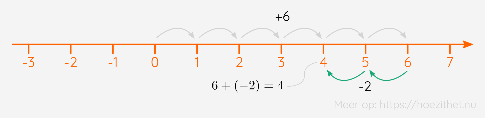

Alvorens we in de rationale getallen duiken, frissen we graag nog eerst even de
bewerkingen met **gehele getallen** op. De verzameling van de gehele getallen
(afgekort: $\mathbb{Z}$), kent vier basisbewerkingen: de optelling, de
aftrekking, de vermenigvuldiging en de deling. We bespreken hieronder de
terminologie en de eigenschappen van elk van deze basisbewerkingen. We gaan
telkens ook wat dieper in op wat we moeten doen wanneer we in die bewerkingen
**negatieve getallen** tegenkomen.

## Gehele getallen optellen

Wanneer we getallen bij elkaar optellen, noemen we die getallen de **termen**
van de optelling. De uitkomst van de optelling noemen we de **som**.

### Een optelling voorstellen op een getallenas

Een optelling kunnen we visueel voorstellen op een **getallenas**. We beginnen op de $0$ van de getallenas en telkens we een optelling tegenkomen, zetten we een aantal stappen. Wanneer je bv. vanaf de $0$ **drie stappen naar rechts** gaat en je daarna nog eens
**twee stappen naar rechts** gaat, kom je uit op de $5$ van de getallenas. We kunnen dit schrijven als de som $3 + 2 = 5$.

### Optellingen met negatieve getallen

In de verzameling van de gehele getallen zitten er ook **negatieve getallen**. Hoe kunnen we die optellen? Een negatief getal optellen, betekent op onze getallenas dat we dat aantal stappen **naar links** zetten, in plaats van naar rechts. Zo krijg je $4$ wanneer je $6$ en $-2$ optelt. Je gaat eerst **zes stappen naar rechts** en dan **twee stappen naar links**, door het minteken voor de $2$.

Je kunt natuurlijk ook twee negatieve getallen bij elkaar optellen. Zo krijg je $-5$ wanneer je $-2$ en $-3$ optelt: je zet eerst **twee stappen naar links** en vervolgens nog eens **drie stappen naar links**.

### De optelling in $\mathbb{Z}$ is commutatief

Of je nu eerst $3$ stappen naar rechts en vervolgens $2$ stappen naar rechts zet, of eerst $2$ stappen en dan $3$ stappen, dat maakt geen verschil:

$$
3 + 2 = 5
$$
$$
2 + 3 = 5
$$

We mogen dus de **termen in een optelling van plaats veranderen**. Wanneer de volgorde van het uitrekenen van een bewerking niet uitmaakt, zeggen we dat die bewerking **commutatief** is. Het optellen van gehele getallen is dus commutatief. Een ander voorbeeld:

$$
-8 + 5 + 10 = 7
$$
$$
10 + 5 + (-8) = 7
$$
$$
10 + (-8) + 5 = 7
$$
$$
5 + 10 + (-8) = 7
$$
$$
5 + (-8) + 10 = 7
$$

Je ziet, onafhankelijk van de volgorde van de termen krijgen we steeds dezelfde oplossing.

### De optelling in $\mathbb{Z}$ is associatief

Wanneer er **haakjes** in een bewerking staan, betekent het dat we eerst moeten uitrekenen wat er binnen de haakjes staat. Bijvoorbeeld

$$
87 + (21 + 5)
$$

Dan moeten we eerst de $21 + 5$ die tussen de haakjes staat uitrekenen om vervolgens de volledige uitkomst te berekenen:

$$
87 + \orange{(21 + 5)} = 87 + \orange{26} = 113
$$

Maar wat als de opgave als volgt was?

$$
(87 + 21) + 5
$$

Dan moeten we eerst de $87 + 21$ uitrekenen:

$$
\orange{(87 + 21)} + 5 = \orange{108} + 5 = 113
$$

En wat zien we?! We krijgen dezelfde uitkomst! Zelfs wanneer we de **haakjes helemaal weglaten**, krijgen we dezelfde uitkomst:

$$
87 + 21 + 5 = 113
$$

Het maakt voor de optelling van de gehele getallen **niet uit waar er haakjes staan**. We zeggen dat de **optelling van gehele getallen associatief** is. Een ander voorbeeld:

$$
\big(15 + (-4)\big) + 22 = 11 + 22 = 33
$$
$$
15 + (-4 + 22) = 15 + 18 = 33
$$
$$
15 + (-4) + 22 = 33
$$

Merk op dat de haakjes rond de $-4$ niets met associativiteit te maken hebben. Die staan er enkel zodat het minteken niet zou "botsen" met het plusteken. Anders zouden we iets krijgen als $15 + - 4 + 22$ en dat leest moeilijk. Veel properder (en juister) is $15 + (-4) + 22$.

### Nul is het neutraal element voor de optelling in $\mathbb{Z}$

Wanneer we ergens op de getallenas staan en we zetten **nul** stappen naar rechts, dan blijven we natuurlijk **op hetzelfde getal** staan. Enkele voorbeelden:

* $25 + 0 = 25$
* $13 + 0 = 13$
* $-63 + 0 = -63$

Nul optellen bij een getal geeft als uitkomst dus dat getal zelf. Ook als we bij **nul** een getal optellen, krijgen we het getal zelf:

* $0 + 32 = 32$
* $0 + (-53) = - 53$
* $0 + (-8) = -8$

We zien dat een optelling bij nul of een optelling met nul geen effect heeft. Daarom zeggen we dat **nul het neutraal element is voor de optelling van gehele getallen**.

## Gehele getallen aftrekken

De onderdelen van een aftrekking noemen we, net als bij een optelling, de **termen**. Tussen die termen noteren we een **minteken** en de uitkomst van de aftrekking is het **verschil**.

Wanneer de aftrekking bestaat uit twee termen, noemen we de eerste term ook wel het **aftrektal** en de tweede term de **aftrekker**. In de aftrekking hierboven is $10$ dus het aftrektal en is $2$ de aftrekker.

Net zoals bij een optelling, kunnen we ook een aftrekking voorstellen op een getallenas. Het minteken zegt dat we voor het daarop volgende getal naar *links* moeten in plaats van naar rechts. Zo betekent $10 - 2$: zet $10$ stappen naar rechts en vervolgens $2$ naar links, door het minteken voor de $2$. We komen dan uit bij $8$.

### Aftrekkingen met negatieve getallen

Wat als we nu een **negatief getal** willen aftrekken? Bijvoorbeeld:

$$
12 - (-8)
$$

We zetten eerst $12$ stappen naar rechts, maar wat dan? $8$ stappen naar rechts of naar links? Één minteken wil zeggen: "naar links". Twee mintekens wil terug zeggen: "naar rechts". Dus: $12$ stappen naar rechts en vervolgens $8$ stappen opnieuw naar rechts. We komen uit op $20$:

$$12 - (-8) = 20$$ 

Merk op dat dit hetzelfde is als:

$$
12 + 8 = 20
$$

We zeggen dat **twee opeenvolgende mintekens** hetzelfde is als **één plusteken**. Vind je dat vreemd? We zullen even proberen uitleggen waarom dat eigenlijk logisch is. Een minteken betekent niets meer dan "**het tegengestelde van**":

* $-3$ is het tegengestelde van $3$
* $-7$ is het tegengestelde van $7$
* $-51$ is het tegengestelde van $51$

Als we nu twee opeenvolgende mintekens hebben, zoals bv. $-(-8)$, dan kunnen we dat lezen als: *"het tegengestelde van $-8$"*. En dat is terug $8$ zelf natuurlijk.

<Expand title="Waarom is $8$ het tegengestelde van $-8$?">

Het tegengestelde van een getal vind je door je af te vragen: welk getal moet ik hierbij optellen om bij $0$ uit te komen? Of anders: hoeveel stappen moet ik op de getallenas zetten om van dit getal naar $0$ te gaan?

Wanneer je bijvoorbeeld op $3$ staat, moet je $3$ stappen *naar links* zetten om terug op $0$ uit te komen. Het tegengestelde van $3$ is daarom $-3$.

Wanneer we op $-8$ staan, moeten we echter $8$ stappen *naar rechts* zetten om bij $0$ uit te komen. Het tegengestelde van $-8$ is dus $8$.

</Expand>

Enkele andere voorbeelden:

* Het tegengestelde van $-7$ is $7$, dus $$-(-7) = +7$$
* Het tegengestelde van $-65$ is $65$, dus $$-(-65) = +65$$
* Het tegengestelde van $-13$ is $13$, dus $$-(-13) = +13$$

Wanneer we nu een aftrekking met een negatief getal tegenkomen, is het dus niet verwonderlijk dat dat neerkomt op een optelling:

* $37 - (-22) = 37 + 22 = 59$
* $12 - (-9) = 12 + 9 = 21$
* $84 - (-50) = 84 + 50 = 134$

Wat als dat eerste getal nu ook negatief is? Bijvoorbeeld,

$$
-16 - (-20)
$$

Wel, dan doen we precies hetzelfde. De $-(-20)$ wordt terug $+$ en we krijgen de optelling van een negatief en positief getal:

$$
-16 - (-20) = -16 + 20
$$

Dat lezen we als: "We gaan eerst $16$ stappen *naar links* en vervolgens $20$ stappen *naar rechts*". We komen dan uit op $4$:

$$
-16 - (-20) = -16 + 20 = 4
$$

Enkele andere voorbeelden:

* $-33 - (-7) = - 33 + 7 = - 26$
* $-12 - (-60) = -12 + 60 = 48$
* $-1 - (-1) = - 1 + 1 = 0$

### De aftrekking in $\mathbb{Z}$ is **NIET** commutatief

In tegenstelling tot de optelling van gehele getallen, is de **aftrekking van gehele getallen NIET commutatief**! We mogen de termen van een aftrekking **niet zomaar van plaats veranderen**. Bijvoorbeeld:

$$
20 - 4 = 16
$$
$$
4 - 20 = -16
$$

Je ziet dat we niet dezelfde uitkomst hebben wanneer we de $4$ en de $20$ van plaats verwisselen.

### De aftrekking in $\mathbb{Z}$ is **NIET** associatief

Ook de **haakjes mag je niet zomaar van plaats veranderen** bij een aftrekking. De **aftrekking van gehele getallen is dus NIET associatief**. Bijvoorbeeld:

\begin{split}
    18 - (6 - 9) &= 18 - (-3)\\\\\
    &= 18 + 3\\\\\
    &= 21
\end{split}

\begin{split}
    (18 - 6) - 9 &= 12 - 9\\\\\
    &= 3
\end{split}

Je ziet dat we **niet dezelfde uitkomst** hebben wanneer we de haakjes van plaats veranderen.

### Een aftrekking omzetten naar een optelling

Het is je misschien al opgevallen dat bijvoorbeeld $6 + (-2)$ dezelfde uitkomst heeft als $6 - 2$:

$$
6 + (-2) = 4
$$
$$
6 - 2 = 4
$$

Dat is niet toevallig. Je kunt een **aftrekking altijd herschrijven als een optelling**. Dat is heel handig, want daardoor krijgen we ook alle eigenschappen van een optelling. Wanneer je een aftrekking herschrijft als een optelling, kan je de **termen wél van plaats veranderen**. Dat kan niet bij een aftrekking.

\begin{split}
    20 - 110 &= 20 + (-110)\\\\\
    &= -110 + 20 \\\\\
    &= -90
\end{split}

Dat maakt het soms ook eenvoudiger om uit te rekenen. Vanaf $20$ in gedachten $110$ stappen naar links zetten is moeilijker dan vanaf $-110$ in gedachten $20$ stappen naar rechts te zetten.

Het omzetten van een aftrekking naar een optelling, is heel eenvoudig. Je **zet het getal met het minteken tussen haakjes** en zet een **plusteken voor de haakjes**. Enkele voorbeelden:

* $34 - 12 = 34 + (-12)$
* $77 - 81 = 77 + (-81)$
* $62 - 42 = 62 + (-42)$

## Gehele getallen vermenigvuldigen

De onderdelen van een vermenigvuldiging noemen we de **factoren**. Tussen de factoren noteren we een **maalteken** en de uitkomst van de vermenigvuldiging is het **product**.

Een vermenigvuldiging is eigenlijk een manier om een **optelling van dezelfde getallen korter** te schrijven.

$$
10 \cdot \orange{2} = \underbrace{10 + 10}\_{\orange{2}\ \text{keer}} = 20
$$

Je zou $10 \cdot 2$ kunnen lezen als: "zet $10$ keer $2$ stappen naar rechts". Dan heb je in totaal $20$ stappen naar rechts gezet, dus $10 \cdot 2 = 20$.

### Plus maal min is min

Waaraan denk je dan dat $3 \cdot (-2)$ gelijk is? Wel, je kunt $3\cdot (-2)$ lezen als "zet $3$ keer $2$ stappen *naar links*". (Naar *links* omdat er een minteken voor de $2$ staat.) Je hebt dan in totaal $6$ stappen *naar links* gezet, dus dat is hetzelfde als $-6$.

$$
3\cdot (-2) = -6
$$

Wanneer we een **positief en negatief** getal met elkaar vermenigvuldigen, gaat de **uitkomst altijd negatief** zijn. Hetzelfde geldt trouwens voor het vermenigvuldigen van een **negatief en positief** getal. Enkele voorbeelden:

* $2 \cdot (-5) = -10$
* $-6 \cdot 8 = -48$
* $-3 \cdot 4 = -12$
* $7 \cdot (-9) = -63$

Daarom zeggen we: **plus maal min is min**. Een positief en een negatief getal vermenigvuldigen (of omgekeerd), geeft een negatieve uitkomst.

### Min maal min is plus

Wanneer we echter een **negatief en een ander negatief** getal vermenigvuldigen, zal de **uitkomst altijd positief** zijn. Daarom zeggen we: **min maal min is plus**. Enkele voorbeelden:

* $-2 \cdot (-5) = 10$
* $-6 \cdot (-8) = 48$
* $-3 \cdot (-4) = 12$
* $-7 \cdot (-9) = 63$

Een beetje vreemd dat twee keer *min* plotseling *plus* geeft, niet? Hoe komt dat? Wel, je kunt het zien alsof "**min** maal min" het **tegengestelde** is van "**plus** maal min", net zoals $-7$ het tegengestelde is van $+7$.

Probeer even mee te volgen. Het tegengestelde van

$$
2 \cdot (-5)
$$

is dus (let op het minteken voor de $2$):

$$
-2 \cdot (-5)
$$

De uitkomst van $2 \cdot (-5)$ moet dan ook het **tegengestelde** zijn van de uitkomst van $-2 \cdot (-5)$. We weten al dat

$$
2 \cdot (-5) = -10
$$

De uitkomst van $-2 \cdot (-5)$ moet dus het **tegengestelde** zijn van $-10$. En dat is $10$!

Kort gezegd: **min maal min is plus**!

### Plus maal plus is plus

Om ons verhaal compleet te maken, vermelden we nog even iets wat je natuurlijk al wist: **plus maal plus is plus**. Enkele voorbeelden:

* $2 \cdot 5 = 10$
* $6 \cdot 8 = 48$
* $3 \cdot 4 = 12$
* $7 \cdot 9 = 63$

Dat zijn vermenigvuldigingen die je (hopelijk) al vaak bent tegengekomen.

### Een gedurig product uitwerken

Hierboven leerden we de volgende rekenregels:

* Plus maal min is min
* Min maal plus is min
* Min maal min is plus
* Plus maal plus is plus

Er zijn twee zaken lastig aan deze vier rekenregels:

1. Vier rekenregels onthouden is veel...
2. We kunnen de rekenregels enkel toepassen als de vermenigvuldiging bestaat uit twee factoren.

Gelukkig is er ook **één algemene rekenregel** die we met **eender welk aantal** factoren kunnen toepassen! 🎉 Die rekenregel luidt als volgt:

<Attention title="Rekenregel voor het teken van een vermenigvuldiging">

* Als er een **even** aantal mintekens staat in een vermenigvuldiging, is de uitkomst **positief**.
* Als er een **oneven** aantal mintekens staat in een vermenigvuldiging, is de uitkomst **negatief**.

</Attention>

Stel bijvoorbeeld dat we de volgende vermenigvuldiging moeten uitrekenen:

$$
-5 \cdot (-2) \cdot (-4)
$$

Dat is een voorbeeld van een **gedurig product**. Dat is een product dat bestaat uit **meer dan twee factoren**. Hoe kunnen we de uitkomst van dit gedurig product uitrekenen?

Wel, ten eerste staan er **drie** mintekens. Er staat dus een **oneven aantal mintekens** in de vermenigvuldiging. De uitkomst zal dus **negatief** zijn. Eens we het teken kennen, moeten we enkel nog de absolute waarde van de uitkomst berekenen. Dat doen we door de absolute waarde van de getallen zelf te vermenigvuldigen: $5 \cdot 2 \cdot 4 = 40$. De uitkomst van bovenstaande vermenigvuldiging is dus:

$$
-5 \cdot (-2) \cdot (-4) = -40
$$

Om een gedurige som uit te rekenen neem je dus de volgende stappen:

1. **Bepaal het teken** van de uitkomst door het aantal mintekens te tellen. Een even aantal mintekens betekent een positieve uitkomst; een oneven aantal betekent een negatieve uitkomst.
2. **Bereken de absolute waarde** van de uitkomst door alle getallen te vermenigvuldigen zonder rekening te houden met het teken. Je **vermenigvuldigt dus de absolute waardes**.

Een ander voorbeeld:

$$
-3 \cdot 6 \cdot (-5) \cdot 2
$$

1. **Bepaal het teken**: We zien **twee mintekens**. Er staat dus een **even aantal mintekens** in de vermenigvuldiging. De uitkomst zal dus **positief** zijn
2. **Bereken de absolute waarde**: $3 \cdot 6 \cdot 5 \cdot 2 = 180$

De uitkomst is dus:

\begin{split}
    -3 \cdot 6 \cdot (-5) \cdot 2 &= + (3 \cdot 6 \cdot 5 \cdot 2)\\\\\
    &= 180
\end{split}

### De vermenigvuldiging in $\mathbb{Z}$ is commutatief

Net zoals de optelling van gehele getallen, is ook de **vermenigvuldiging van gehele getallen commutatief**. Dat betekent dat de **volgorde van de factoren niet uitmaakt**. Bijvoorbeeld:

\begin{split}
    -7 \cdot (-2) \cdot (-3) &= - (7 \cdot 2 \cdot 3)\\\\\
    &= -42
\end{split}

\begin{split}
    -2 \cdot (-3) \cdot (-7) &= - (2 \cdot 3 \cdot 7)\\\\\
    &= -42
\end{split}

\begin{split}
    -3 \cdot (-2) \cdot (-7) &= - (3 \cdot 2 \cdot 7)\\\\\
    &= -42
\end{split}

### De vermenigvuldiging in $\mathbb{Z}$ is associatief

De vermenigvuldiging van gehele getallen is ook **associatief**. Dat betekent dat de **positie van de haakjes** niet uitmaakt. Bijvoorbeeld:

\begin{split}
    -9 \cdot (3 \cdot 5) &= -9 \cdot 15\\\\\
    &= -135
\end{split}

\begin{split}
    (-9 \cdot 3) \cdot 5 &= -27 \cdot 5\\\\\
    &= -135
\end{split}

### $1$ is het neutraal element voor de vermenigvuldiging in $\mathbb{Z}$

Er bestaat ook een **neutraal element** voor de vermenigvuldiging van gehele getallen. Dat is $1$, want als je een getal met $1$ vermenigvuldigt, is de uitkomst gelijk aan dat getal zelf. Enkele voorbeelden:

* $-5 \cdot 1 = -5$
* $12 \cdot 1 = 12$
* $-34 \cdot 1 = -34$

Ook wanneer je $1$ vermenigvuldigt met een getal, is de uitkomst dat getal zelf:

* $1 \cdot (-7) = -7$
* $1 \cdot 58 = 58$
* $1 \cdot 3 = 3$

### Nul is het opslorpend element voor de vermenigvuldiging in $\mathbb{Z}$

Een speciale eigenschap van de vermenigvuldiging is dat wanneer er een factor $0$ voorkomt, die **alle andere factoren opslorpt** en de uitkomst gewoon gelijk is aan $0$. We zeggen daarom dat $0$ het **opslorpend element** is voor de vermenigvuldiging van gehele getallen. Enkele voorbeelden:

* $-7 \cdot 28 \cdot 0 \cdot (-15) = 0$
* $0 \cdot 6 = 0$
* $9 \cdot 0 \cdot 3 = 0$

### De vermenigvuldiging in $\mathbb{Z}$ is distributief ten opzichte van het optellen en aftrekken

De laatste eigenschap van de vermenigvuldiging van gehele getallen zegt dat deze **distribrutief is** ten opzichte van het optellen en aftrekken. Wat betekent dat nu? Wel, **distribueren** betekent eigenlijk **uitdelen**, denk maar aan het Engelse werkwoord "to distribute". De distributieve eigenschap betekent dan ook dat wanneer je een getal **vermenigvuldigt met een optelling** (of aftrekking), je dat getal mag **uitdelen** aan elk van de termen van die optelling (of aftrekking).

Stel bijvoorbeeld dat we de volgende vermenigvuldiging moeten uitrekenen:

$$
3 \cdot (5 + 2 + 4)
$$

De eerste manier om dit uit te rekenen, is door eerst gewoon uit te rekenen wat er tussen de haakjes staat. Dan maken we geen gebruik van de distributieve eigenschap.

\begin{split}
    3 \cdot \orange{(5 + 2 + 4)} &= 3 \cdot \orange{11}\\\\
    &= 33
\end{split}

Een tweede manier is om wél gebruik te maken van de distributieve eigenschap en de factor $3$ **uit de delen aan elke term van de optelling**. We zien dat we **dezelfde uitkomst** krijgen:

\begin{split}
    \orange{3} \cdot (5 + 2 + 4) &= \orange{3}\cdot 5 + \orange{3}\cdot 2 + \orange{3}\cdot 4 \\\\
    &= 15 + 6 + 12\\\\\
    &= 33
\end{split}

**Let wel goed op met mintekens** wanneer je de distributieve eigenschap toepast. Zorg dat de factor die je uitdeelt mooi zijn teken meeneemt en dat je ook het teken van de termen opnieuw schrijft:

\begin{split}
    \orange{-6} \cdot (-2 + 8 - 5) &= \orange{-6} \cdot (-2) + (\orange{-6}) \cdot 8 - (\orange{-6}) \cdot 5\\\\\
    &= 12 - 48 + 30\\\\\
    &= -6
\end{split}

Het kan natuurlijk ook dat de factor na de haakjes staat:

\begin{split}
    (-6 + 3 + 4)\cdot \orange{4} &= -6\cdot\orange{4} + 3 \cdot\orange{4} + 4 \cdot\orange{4}\\\\\
    &= -24 + 12 + 16\\\\\
    &= 4
\end{split}

## Gehele getallen delen

Een deling bestaat uit een **deeltal** die we moeten delen door een **deler**. Het resultaat van een deling noemen we het **quotiënt**.

Een deling als $10 : 5$ kan je lezen als: "Als ik $10$ bolletjes in $5$ gelijke groepen wil verdelen, hoeveel bolletjes zitten er dan in elk groepje?" Dat is in dit geval $2$.

### Delen met negatieve getallen

Om een deling met negatieve getallen uit te rekenen, moeten we net als bij de vermenigvuldiging eerst op zoek naar het **teken van de uitkomst**. Gelukkig zijn de rekenregels **heel gelijkaardig** als bij de vermenigvuldiging:

* **Plus gedeeld door min is min**
* **Min gedeeld door plus is min**
* **Min gedeeld door min is plus**
* **Plus gedeeld door plus is plus**

Of, in één regeltje: een **even aantal mintekens** in de deling geeft een **positieve uitkomst**; een **oneven aantal mintekens** in de deling geeft een **negatieve uitkomst**.

Eens we het teken van de uitkomst hebben bepaald, berekenen we de **waarde van de uitkomst** door de **absolute waarden** van de opgave te delen.

Enkele voorbeelden:

* $10 : (-5) = - 2$ (plus gedeeld door min)
* $-21 : 7 = -3$ (min gedeeld door plus)
* $-45 : (-9) = 5$ (min gedeeld door min)
* $96 : 12 = 8$ (plus gedeeld door plus)

### De deling van gehele getallen is NIET commutatief

Je kunt het deeltal en de deler van een deling **niet zomaar van plaats verwisselen**. De deling van gehele getallen is dus **niet commutatief**. Een voorbeeld:

$$
8 : (-2) = -4
$$

$$
-2 : 8 = -\frac{1}{4}
$$

Je ziet dat we **niet dezelfde uitkomst** krijgen wanneer we het deeltal en de deler omwisselen.

### De deling van gehele getallen is NIET associatief

Je kunt ook de **haakjes niet zomaar van plaats veranderen** bij een deling van gehele getallen. De deling van gehele getallen is dus **niet associatief**. Een voorbeeld:

\begin{split}
    -24 : (6 : 2) &= -24 : 3\\\\\
    &= -8
\end{split}

\begin{split}
    (-24 : 6) : 2 &= -4 : 2\\\\\
    &= -2
\end{split}

Je ziet dat we **niet dezelfde uitkomst** krijgen wanneer we de haakjes in de deling van plaats veranderen.

## Samengevat
<Attention title="Basisbewerkingen">

De verzameling van de gehele getallen kent vier 
 basisbewerkingen:

1. De **optelling**: $a + b$ bestaat uit **termen** en geeft een **som** als resultaat.
2. De **aftrekking**: $a - b$ bestaat uit een **aftrektal** $a$ en een **aftrekker** $b$ (of ook gewoon "termen") en geeft een **verschil** als resultaat.
3. De **vermenigvuldiging**: $a \cdot b$ bestaat uit **factoren** en geeft een **product** als resultaat.
4. De **deling**: $\frac{a}{b}$ bestaat uit een **deeltal** $a$ en een **deler** $b$. Het resultaat noemt men 
   het **quotiënt**.

</Attention>

<Attention title="Eigenschappen van de optelling van gehele getallen">

* De optelling in $\mathbb{Z}$ is **commutatief**: $$a + b = b + a$$
* De optelling in $\mathbb{Z}$ is **associatief**: $$(a + b) + c = a + (b + c) = a + b + c$$
* $0$ is het **neutraal element** voor de optelling in $\mathbb{Z}$: $$a + 0 = 0 + a = a$$

</Attention>

<Attention title="Teken van een vermenigvuldiging">

Bij een **vermenigvuldiging** geldt: 

* **Plus maal min is min**
* **Min maal plus is min**
* **Min maal min is plus**
* **Plus maal plus is plus** 

Of algemener:

* Als er een **even** aantal mintekens staat in een vermenigvuldiging, is de uitkomst **positief**.
* Als er een **oneven** aantal mintekens staat in een vermenigvuldiging, is de uitkomst **negatief**.

</Attention>

<Attention title="Eigenschappen van de vermenigvuldiging van gehele getallen">

* De vermenigvuldiging in $\mathbb{Z}$ is **commutatief**: $$a \cdot b = b \cdot a$$
* De vermenigvuldiging in $\mathbb{Z}$ is **associatief**: $$(a \cdot b) \cdot c = a \cdot (b \cdot c) = a \cdot b \cdot c$$
* $1$ is het **neutraal element** voor de vermenigvuldiging in $\mathbb{Z}$: $$a \cdot 1 = 1 \cdot a = a$$
* $0$ is het **opslorpend element** voor de vermenigvuldiging in $\mathbb{Z}$: $$a \cdot 0 = 0 \cdot a = 0$$

* De vermenigvuldiging in $\mathbb{Z}$ is **distributief** over de optelling in $\mathbb{Z}$: $$a\cdot (b + c) = a\cdot b + a \cdot c$$
* De vermenigvuldiging in $\mathbb{Z}$ is **distributief** over de aftrekking in $\mathbb{Z}$: $$a\cdot (b - c) = a\cdot b - a \cdot c$$

</Attention>

<Attention title="Teken van een deling">

Bij een **deling** geldt: 

* **Plus gedeeld door min is min**
* **Min gedeeld door plus is min**
* **Min gedeeld door min is plus**
* **Plus gedeeld door plus is plus** 

Of algemener:

* Als er een **even** aantal mintekens staat in een deling, is de uitkomst **positief**.
* Als er een **oneven** aantal mintekens staat in een deling, is de uitkomst **negatief**.

</Attention>
