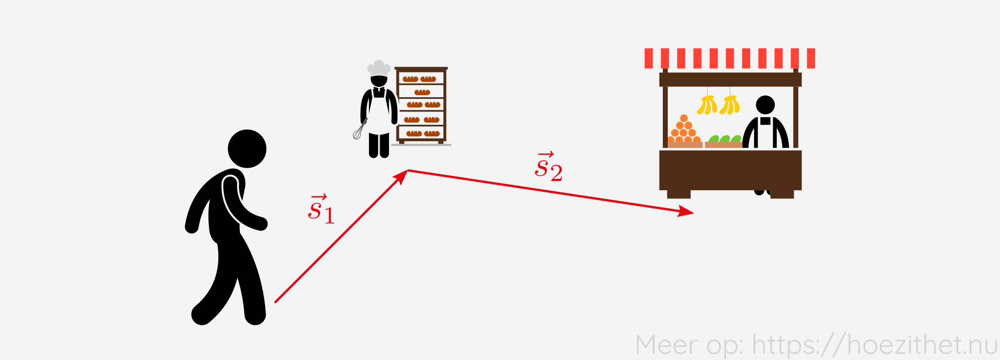
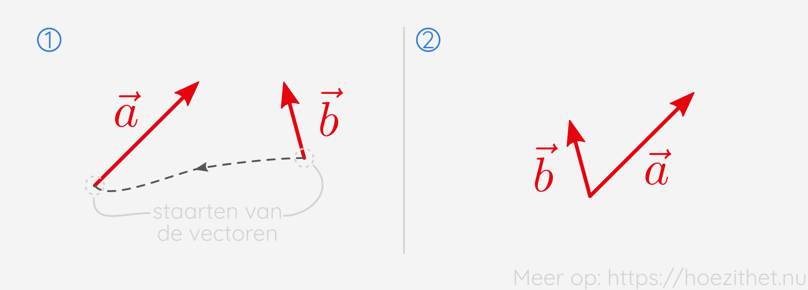
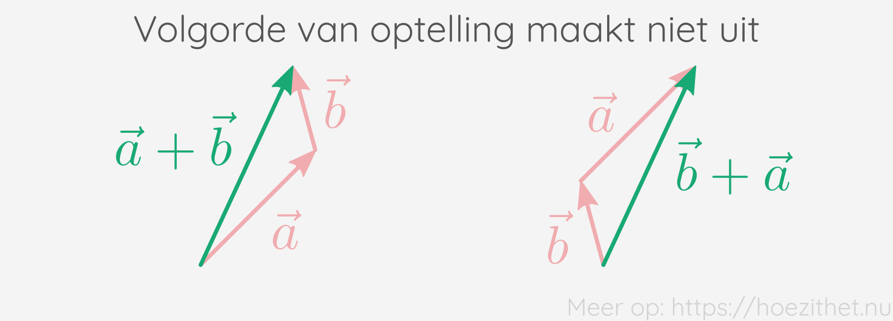
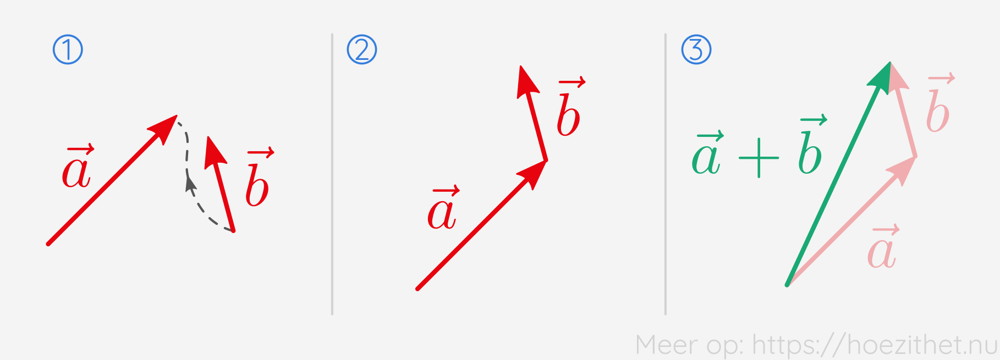

Vectoren kun je, net als getallen, bij elkaar optellen. Maar hoe gaat dat in
zijn werk, zo [pijlen](intro/#een-vector-is-een-pijl) bij elkaar optellen? In
deze les leren we een manier om **vectoren op te tellen via een tekening**.

## Verplaatsingen optellen

We zagen in [een vorige les](vectoriele_grootheden) dat verplaatsing een
vectoriële grootheid is. We zullen daarom eerst kijken wat een logische manier
is om verplaatsingen bij elkaar op te tellen. Die manier zullen we dan
veralgemenen naar alle vectoren.

Stel dat we ons eerst verplaatsen naar de bakker en vervolgens naar de
fruitboer. De eerste verplaatsing stellen we voor met vector $\vec{s}_1$ en de
tweede met vector $\vec{s}_2$.

Aan welke vector is $\vec{s}\_1 + \vec{s}\_2$ dan gelijk? Wel, we kijken **waar
we vertrokken zijn en tekenen een vector naar waar we geëindigd zijn**. Dat is
de som van de eerste verplaatsing en de tweede verplaatsing.

We hoeven ons natuurlijk niet te beperken tot twee verplaatsingen. De som van
vier verplaatsingen $\vec{s}_1 + \vec{s}_2 + \vec{s}_3 + \vec{s}_4$, kunnen we
op dezelfde manier doen. We kijken waar we begonnen zijn en tekenen een vector
naar waar we eindigden.

## Kop-staartmethode

Hierboven zagen we hoe we verplaatsingen kunnen optellen bij elkaar. Dit gaan we
nu **veralgemenen naar alle soorten vectoren**, niet enkel verplaatsingen.

Als we twee vectoren willen optellen, plaatsen we de _staart_ van de tweede
vector aan de _kop_ van de eerste.

Vervolgens tekenen we een vector van de vrije staart naar de vrije kop. Die
vector is de som van de twee vectoren.

Dit kunnen we veralgemenen naar het **optellen van meerdere vectoren**. Eerst
plaatsen we alle vectoren kop-staart-gewijs achter elkaar en vervolgens tekenen
we een vector van de vrije staart naar de vrije kop.

Omdat we bij deze methode altijd een kop en een staart op elkaar leggen, noemen
we dit de **kop-staartmethode**.

## Parallellogram-methode

Het gebeurt vaak dat twee vectoren met de staarten bij elkaar liggen. We zouden
dan een van de vectoren kunnen verleggen naar de kop van de andere om de
kop-staartmethode toe te passen, maar het kan ook eenvoudiger.

Bij de parallellogram-methode, krijgen we de som van twee vectoren door eerst de
**staarten** op elkaar te leggen. Vectoren liggen echter al vaak met de staarten
op elkaar, dus deze stap is niet altijd nodig.

Vervolgens **maken we een parallellogram van de vectoren**. We krijgen de som
van de vectoren door een vector te tekenen die **vertrekt vanuit de staarten en
eindigt in de vrije hoek** van het parallellogram.

Wanneer we meer dan twee vectoren willen optellen met de parallellogram-methode,
moeten we eerst de eerste twee vectoren optellen, vervolgens de uitkomst met de
volgende vector optellen enzovoort. Dat wordt al snel veel werk. De
parallellogram-methode is dus vooral handig wanneer je maar **twee vectoren**
wilt optellen die al met de **staarten bij elkaar** liggen.

## De volgorde van optellen maakt niet uit

Wanneer je vectoren bij elkaar optelt, **maakt het niet uit in welke volgorde je
die optelling doet**. Dit kan het eenvoudigste geïllustreerd worden met de
kop-staartmethode.

Mat andere woorden is het **optellen van vectoren commutatief**.

## Samengevat

<Attention title="Kop-staartmethode">

Bij de kop-staartmethode tekenen we de som van twee vectoren door de **staart
van de ene vector aan de kop van de andere** te leggen. Vervolgens tekenen we
een vector **van de vrije staart naar de vrije kop**.

</Attention>

<Attention title="Parallellogram-methode">

Bij de parallellogram-methode tekenen we de som van twee vectoren door de
**staarten van de vectoren op elkaar te leggen**. Vervolgens maken we een
**parallellogram van de vectoren** en tekenen we een vector **van de staarten
naar de vrije hoek** van het parallellogram.

</Attention>
