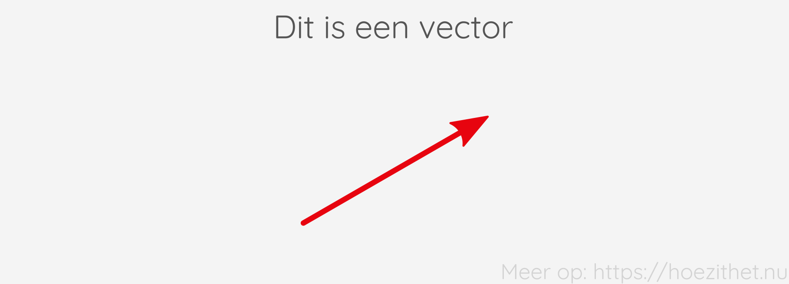
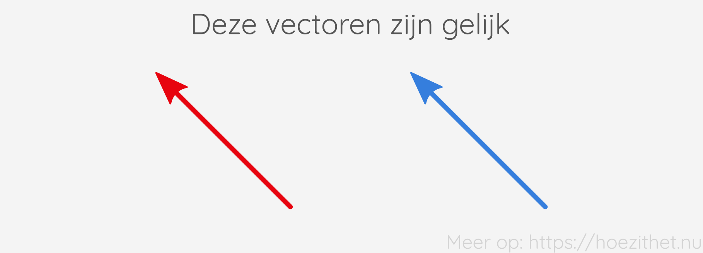
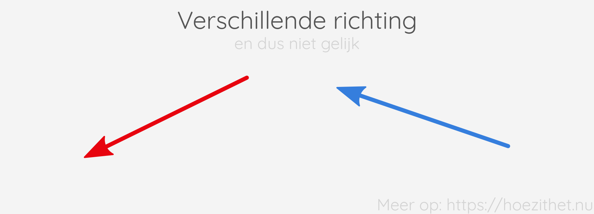
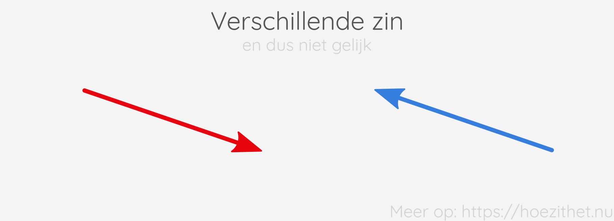

Over cijfers en getallen heb je al heel veel gehoord in je lessen wiskunde. Je
had het misschien niet gedacht, maar wiskunde gaat niet enkel over getallen.
Naast getallen, zijn er bijvoorbeeld ook **vectoren**, en die zijn _minstens_
even belangrijk.

## Een vector is een pijl

Een vector is niet meer dan een **rechte pijl**.

We geven vectoren vaak een naam, zoals vector $\vec{v}$ en vector $\vec{w}$.
Merk op dat we een pijltje zetten boven de naam van een vector.

| Schrijf   | Lees                |
| --------- | ------------------- |
| $\vec{v}$ | De vector $\vec{v}$ |
| $\vec{w}$ | De vector $\vec{w}$ |

## Een vector heeft een grootte, een richting en een zin

Vectoren hebben drie eigenschappen: een grootte, een richting en een zin. Als
twee vectoren **dezelfde grootte, richting en zin** hebben, dan zijn die
vectoren **gelijk**. De volgende twee vectoren, zijn bijvoorbeeld gelijk:

De **grootte** van de vector is **hoe lang** de vector is. De grootte van een
vector is **altijd positief**. We noteren de grootte van een vector $\vec{v}$
als $\norm{\vec{v}}$ of ook wel gewoon als $v$
.

| Schrijf          | Lees                     |
| ---------------- | ------------------------ |
| $\norm{\vec{v}}$ | De grootte van $\vec{v}$ |
| $v$              | De grootte van $\vec{v}$ |

De volgende twee vectoren, hebben een verschillende grootte, en
zijn daarom niet gelijk aan elkaar:

De **richting** van een vector zegt **aan welke rechte de vector evenwijdig
is**. Bijvoorbeeld: _"verticaal"_, of _"horizontaal"_, of _"onder een hoek van
$15\deg$"_. De vectoren in de onderstaande illustratie, hebben een verschillende
richting, en zijn daarom niet gelijk aan elkaar.

De **zin** van een vector zegt **naar welke kant de vector wijst**. Dat kan
bijvoorbeeld _"naar links"_, _"naar rechts"_, of _"naar beneden"_ zijn. De
volgende twee vectoren, hebben een verschillende zin, en zijn daarom niet gelijk
aan elkaar:

Deze figuur toont de drie eigenschappen van een vector samen:

## Waarom toch?

Het is heel normaal als je je op dit moment afvraagt: **"Waarom, in godsnaam,
zijn die pijlen zo belangrijk?"** Er zijn heel veel verschillende redenen waarom
vectoren belangrijk zijn. Een van de meest voor de hand liggende redenen is dat
**veel grootheden in de fysica zich gedragen als vectoren** omdat ze ook een
grootte, een richting en een zin hebben.

Positie, verplaatsing, snelheid, kracht
en versnelling zijn bijvoorbeeld allemaal vectoriële grootheden. In de [volgende
les](vectoriele_grootheden) gaan we iets dieper in op vectoriële grootheden.

Er zijn echter **nog vele andere toepassingsgebieden** van vectoren, maar daar
kunnen we helaas hier niet verder op in gaan. Enkele voorbeelden: special
effects in films, video games, stelsels van vergelijkingen oplossen, artificiële
intelligentie...

## Samengevat



-   Een vector is een pijl en heeft een grootte, een richting en een zin;
-   Wanneer twee vectoren dezelfde grootte, richting en zin hebben, zijn die
    vectoren gelijk;
-   We noteren de naam van een vector als een letter met een pijltje boven,
    bijvoorbeeld $\vec{v}$.


