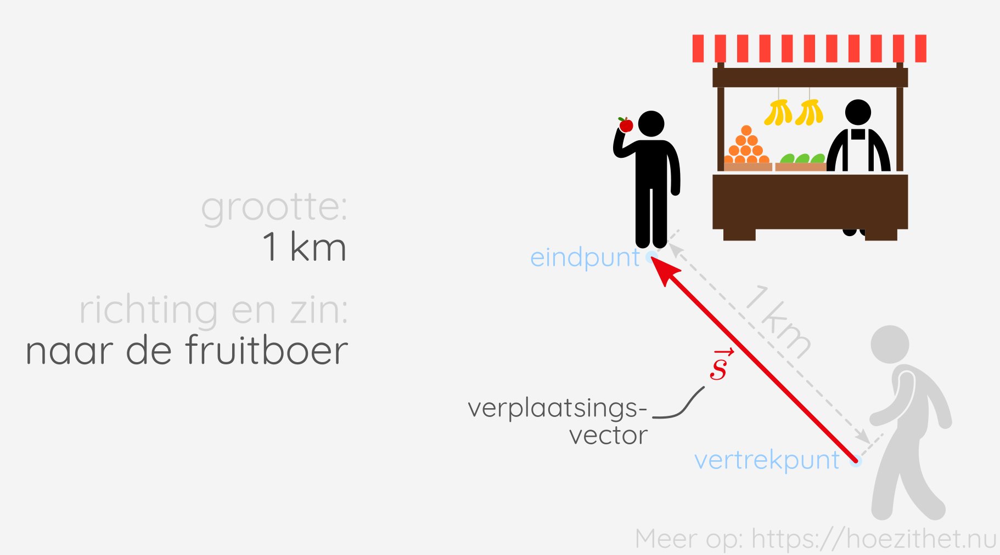

In de [vorige les](intro) leerden we dat vectoren pijlen zijn met een
grootte, een richting en een zin. Na die les ben je misschien nog niet volledig
overtuigd dat vectoren wel degelijk nuttig zijn. Daarom tonen we in deze les een
voorbeeld van hoe vectoren kunnen voorkomen in de echte wereld.

## Vectoriële grootheden hebben een richting en een zin

**Vectoriële grootheid** hebben altijd **een richting** en **een zin**. Verplaatsing,
bijvoorbeeld, is een vectoriële grootheid. Als je alleen de afstand kent die
iemand heeft afgelegd, kan je niet exact weten waar die persoon is geëindigd. Je
moet niet alleen weten hoe ver de persoon is gestapt, je moet ook weten
**waarheen**.

**Hoe ver** de persoon stapte, noemen we de **grootte** van de verplaatsing.
**Waarheen** de persoon stapte, is de **richting** en de **zin** van de verplaatsing.

Andere voorbeelden van vectoriële grootheden zijn o.a. snelheid, versnelling en kracht.

## Scalaire grootheden hebben géén richting

Er zijn natuurlijk ook veel grootheden die geen richting hebben. Hoeveel kilogram je weegt , heeft geen richting. Je kan bijvoorbeeld niet "80 kg naar links" wegen, maar wel gewoon "80 kg". Ook temperatuur heeft geen richting. "20 °C naar boven", bestaat niet, maar gewoon "20 °C" wel.

We noemen temperatuur en massa daarom **scalaire grootheden**. Ze hebben **enkel een getalwaarde** . We kunnen geen vectoren gebruiken om de grootheden te beschrijven.

## Samengevat


**Vectoriële grootheden** zijn grootheden die naast een **grootte** ook een **richting** en een **zin** hebben.

**Scalaire grootheden** hebben **enkel een grootte**.

